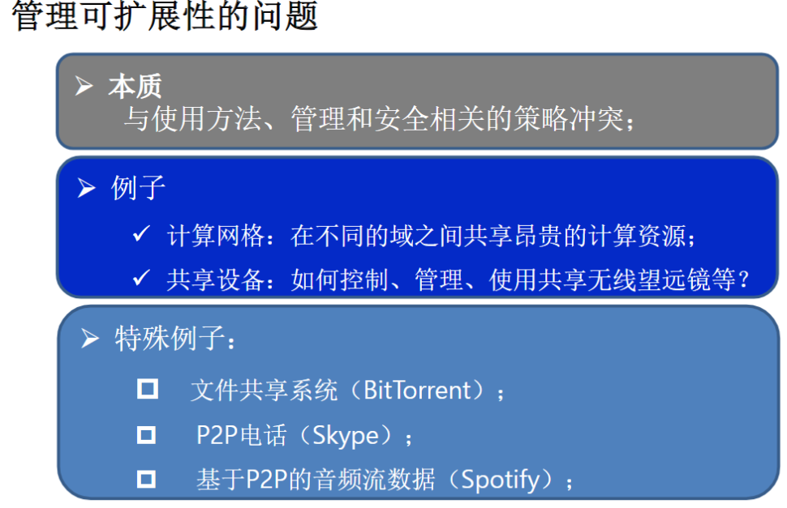
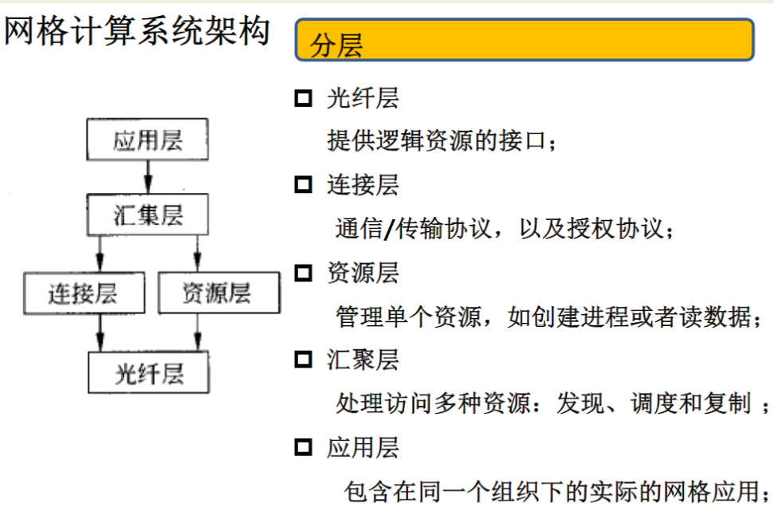

# 分布式系统定义

分布式系统是若干**独立自主计算机**的集合（硬件），这些计算机对于用户来说像是**单个耦合**系统（软件）。

- 自主性：
  - 计算节点硬件或者软件进程是独立的
- 耦合性：
  - 用户或者应用程序感觉系统是一个系统——节点之间需要相互协作

# 分布式系统中的8个谬误

1. The network is reliable : 网络是可靠的
2. Latency is ZERO : 响应延迟为0
3. Bandwidth is infinite : 带宽是无限的
4. The network is secure : 网络是安全的
5. Topology doesn't change : 拓扑关系不发生变化
6. There is one administrator : 仅存在一个管理员
7. Transport costs is ZERO : 传输代价为0
8. The network is homogeneous : 网络是同构的

- 异构：多个不同类型的物体参与完成某一件事情，异构系统的各个组成部分具有自身的自治性，实现数据共享的前提下，仍保留有自己的应用特性，完整特性，安全特性。
- 同构：多个相同类型的物体参与完成某一件事情。

# 分布式系统与其他系统比较

# 自主节点的集合

# 节点之间的组织形式

- 覆盖网络（Overlay Network）
  - 实践表明覆盖网络最为常用；
  - 每个节点仅和邻居节点通信；
  - 邻居节点是动态甚至只能通过查询获得；

- 覆盖网络的类型
  - P2P网络（Peer-to-Peer Network）
  - 结构型的P2P网络
    - 节点之间的连接具有特定规则的结构；
  - 非结构型的P2P网络
    - 节点之间的连接具有随机和任意性；

# 一致（Coherent）系统

**本质**：节点无论在什么地方，用户无论何时访问，节点集合对于用户来讲是一个整体；

# 分布式系统的目标

- **使资源可访问**：让用户方便地访问资源
- **透明性**：隐藏资源在网络上的分布
- **开放性**：访问接口的标准化
- **可扩展性**：系统在规模、地域、管理上的可扩展性

# 透明性

**隐藏进程和资源在多台计算机上分布这一事实**

## 透明的类型

1. **访问**：隐藏数据表示形式的不同以及资源访问形式的不同
2. **位置**：隐藏资源所在位置
3. **迁移**：隐藏资源是否移动到另一个位置
4. **重定位**：隐藏资源是否在使用过程中移动到另一个位置
5. **复制**：隐藏是否对资源进行复制
6. **并发**：隐藏资源是否由相互竞争的用户共享
7. **故障**：隐藏资源的故障和恢复
8. **持久化**：隐藏数据在主存和磁盘这一事实

## 透明度

**完全透明性是不可取的，也是难以实现的**

1. 可能掩盖通信的性能问题；
2. 完全隐藏网络和节点的失效是不可能的；
  - 不能区分失效和性能变慢的节点；
  - 不能确定系统失效之前的操作是什么；
3. 完全的透明性可能牺牲性能，暴露系统分布特征；
4. 保证复制节点与主节点的一致性需要时间（一致性问题）；
5. 为了容错需要立即将内存修改的内容同步到磁盘上；

**暴露系统的分布特征有一定的使用场景**

- 利用基于位置的服务；
- 当与不同时区的用户交互时；
- 当让用户理解系统发生了什么时，如当一台服务器不响应时，报告失效；

# 开放性

## 什么是分布式系统的开放性？

分布式系统的开放性指：**系统根据一系列准则来提供服务，这些准则描述了所提供服务的语法和语义（标准化）**。

## 讨论分布式系统开放性的哪些方面？

- 系统应该具有良好定义的接口；
- 系统应该容易实现互操作性；
- 系统应该支持可移植性；
- 系统应该容易实现可扩展性；

## 开放性之策略与机制

**重点：策略与机制分离**

策略与机制之间分离的越严格，越需要设计合适的机制，这样会导致出现很多配置参数和复杂的管理。

硬编码某些策略可以简化管理，减少复杂性，但是会导致灵活性降低。

## 三个方面的扩展性

- **规模可扩展性**：用户数量和进程数量增加；
  - 最受关注；
  - 解决方案：多个服务器独立并行运行；
- **功能可扩展性**：系统功能的增加；
- **地理可扩展性**：节点之间的最大物理位置；
- **管理可扩展性**：管理域的数量；

### 规模可扩展性

### 地理可扩展性

### 管理可扩展性

### 扩展技术

- **隐藏通信延迟**
  - 基本想法很简单：尽量避免等待远程服务对请求的响应
  - 利用异步通信技术；
  - 设计分离的响应响应处理器（分发）；
  - 将计算从服务端移动到客户端；
- **分布**
  - 在多个机器上划分数据和计算
- **副本**
  - 副本和缓存：在多个不同的机器上创建多个数据副本
  - 复制文件服务器和数据库；
  - Web站点进行镜像；
  - Web缓存（在浏览器或者代理位置）；
  - 文件缓存（在服务器和客户端）；

**副本存在的问题**

  

# 分布式共享内存系统

# 集群计算系统

# 网格计算系统

# 云计算

# 集成应用

**如何集成应用**

- 文件传输
  - 技术实现简单，但是不够灵活；需要了解文件的格式和部署方式，了解文件的管理方法，更新传播和更新通知；
- 共享数据库
  - 更加灵活，但是仍然需要通用的模式，导致出现瓶颈；
- 远程过程调用
  - 当需要执行一系列的行为时非常有效，但是需要caller和callee同时在线；
- 消息传递
  - 允许caller和callee在时间和空间上解耦；

# 分布式普适系统（分布式嵌入系统）

- 普适计算系统
  - 普适、连续计算，与用户连续交互；
- 移动计算系统
  - 普适、计算设备是移动的；
- 传感网络
  - 普适、强调与环境的感知和作用；