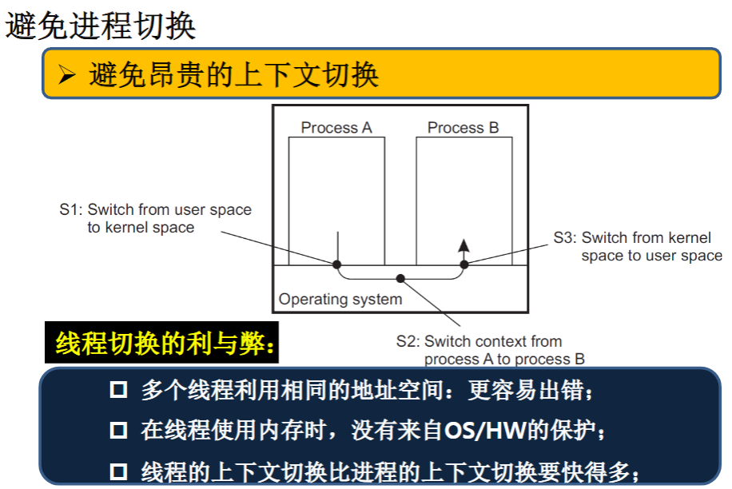
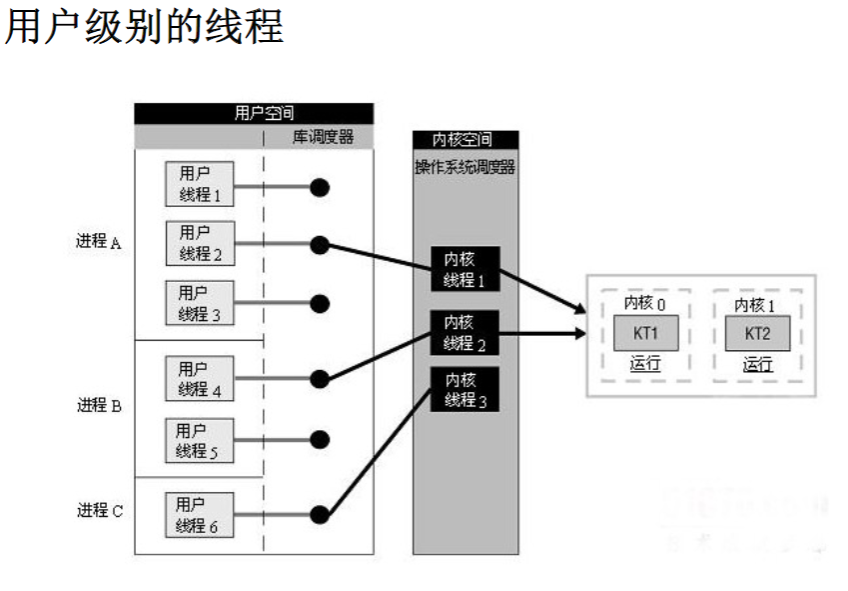
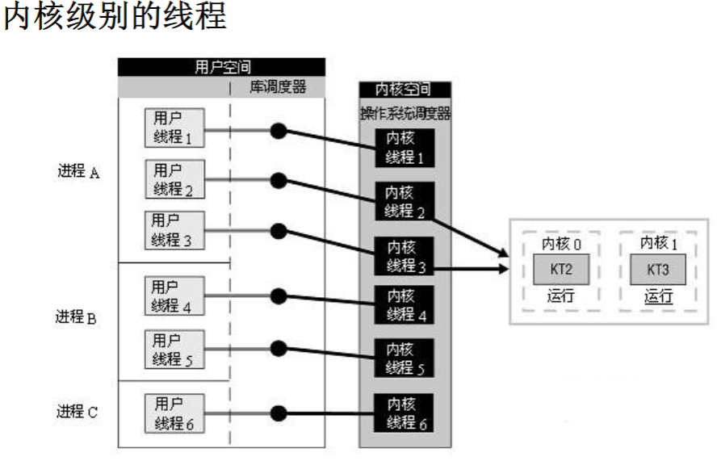
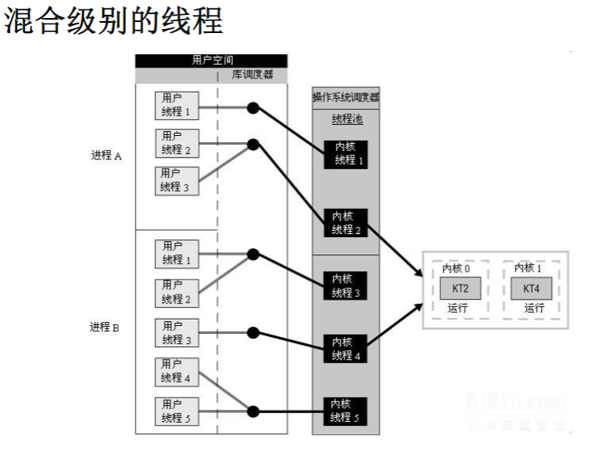
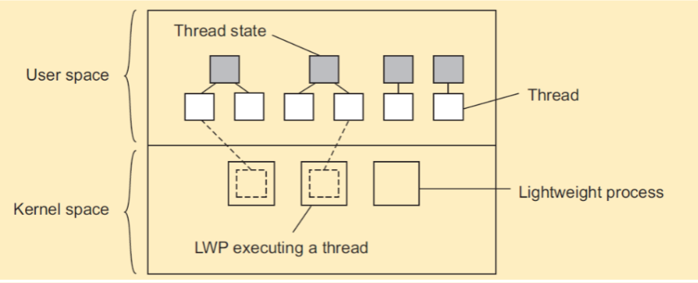
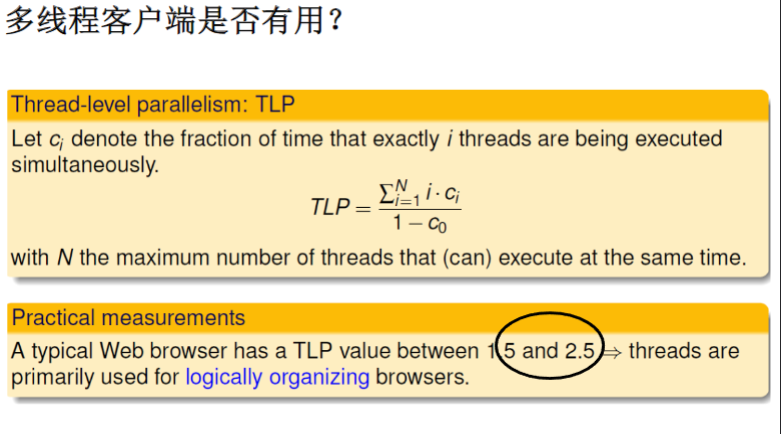
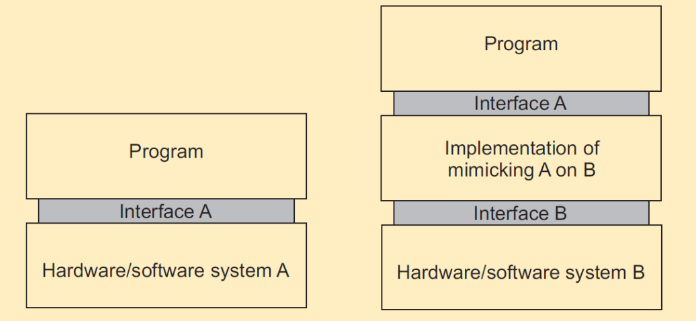

# 分布式系统中的线程

**基本思想**：在物理处理器上用软件创建虚拟处理器

- 处理器：提供和运行一些列指令集合的硬件平台；
- 线程：一个最小的可执行一些列指令的软件处理器。保存线程的上下文意味着终止线程当前的执行，在其他时刻装载保存的线程上下文后，线程可以继续执行；
- 进程：包含多个线程的软件处理单元，线程需要在进程的上下文中执行。

## 上下文切换

**上下文**：系统运行过程中的一系列状态，状态的含义因系统的不同而不同

- **处理器上下文**：处理器用于运行一系列指令的保存在寄存器中的最小数据集合（如：栈指针、地址寄存器、程序寄存器）；
- **线程上下文**：用于执行一系列指令的保存在寄存器和内存中的最小数据集合（如：处理器上下文、状态等）；
- **进程上下文**：用于执行线程的保存在寄存器和内存中的最小的数据集合（线程上下文、MMU寄存器、TLB）。

**观察发现**

- 线程共享相同的地址空间。线程上下文的切换可以独立于操作系统；
- 一般来讲进程之间的切换要更复杂、代价更高，因为要陷入到OS内核才能完成；
- 创建和销毁线程的代价要远远小于对进程的创建和销毁。

## 为什么要利用线程

- **避免不必要的阻塞**：单线程的进程在进行I/O操作的时候会被阻塞；在多线程的进程中，操作系统可以将CPU切换到进程的另外一个线程；
- **更好地发挥并行性**：一个具有多线程的进程可以在多核或者多处理器的CPU上并行执行；
- **避免进程上下文切换**：架构大型应用的时候不是利用多个进程而是多个线程。

## 线程切换的利与弊

- 多个线程利用相同的地址空间：更容易出错；
- 在线程使用内存时，没有来自OS/HW的保护；
- 线程的上下文切换比进程的上下文切换要快得多；

## 上下文切换的代价

考虑简单的时钟中断处理器：

- **直接代价**：用于实际切换和执行中断代理代码的时间；
- **间接代价**：其他代价，比较常见的时cache刷新的时间；

## 线程的实现

**用户级别的线程**

**内核级别的线程**

**混合级别的线程**

## 线程和操作系统

**内核解决方案**：基本的想法是在内核中实现软件包，这也就意味着所有的操作变成系统调用：

- 用于阻塞线程的操作就不再是问题了，内核会在同一个进程中调度另一个可用的线程；
- 处理外部事件也变得简单了：内核（捕捉所有的事件）直接调度与线程相关的事件；
- 存在的问题是效率，因为每个线程操作都需要陷入到内核。

结论：尽可能融合用户级别和内核级别的线程，发挥各自的优势。但是，事实上这种做法带来的性能提升也难以弥补其复杂性带来的困难。

## 轻量级进程（Light Weight Process，LWP）

引入一种两层线程方法：轻量级的进程（LWP）能够执行用户空间的线程；

**主要的操作**

- 用户级的线程执行系统调用 => LWP执行相应的操作，同时该线程被挂起。线程维持绑定在该LWP上；
- 内核调度负责调度另一个LWP，该LWP绑定了一个活跃线程。注意，这个线程可以切换到用户空间中的另外的活跃线程；
- 一个线程调用阻塞用户层的操作 => 上下文切换到一个与运行的线程，并绑定到相同的LWP；
- 当没有线程调用时，LWP保持空闲甚至有可能被内核清除、回收。

## 在客户端使用多线程

## 多线程服务器

**提高性能**

- 启动一个线程远比启动一个进程代价要小很多；
- 单线程服务很难在多处理器系统中实现scale-up（纵向扩展）；
- 与多线程客户端相呼应：通过并行响应请求隐藏网络延迟。

**更好的结构**

- 大部分服务器都具有较高的I/O需求，使用简单容易理解的阻塞调用可以简化整体结构；
- 多线程的程序的代码数量较少，比较容易理解，因为控制流被简化了。

# 虚拟化（Virtualization）

虚拟化（**软硬件的复用**）非常重要：

- 硬件比软件变化的块；
- 需要灵活的可移植性和代码迁移；
- 避免失效和攻击隔离；
- 屏蔽底层软硬件异构性。

主要原理：**模拟接口**

# 模拟接口

# 客户-服务典型结构

# 计算迁移