# 操作系统原理实验报告

- **实验名称**：编译内核/利用已有内核构建OS
- **授课教师**：张青
- **学生姓名**：林隽哲
- **学生学号**：21312450

## 实验要求

- 熟悉现有Linux内核的编译过程和启动过程，并在自行编译内核的基础上构建简单应用并启动；利用精简的Busybox工具集构建简单的OS，熟悉现代操作系统的构建过程。此外，熟悉编译环境、相关工具集，并能实现内核远程调试；

1. 独立完成实验5个部分**环境配置、编译Linux内核、Qemu启动内核并开启远程调试、制作Initramfs和编译并启动Busybox**。
2. 编写实验报告、结合实验过程来谈谈你完成实验的思路和结果，最后需要提供实验的5各部分的运行截屏来证明你完成了实验。
3. 实验不限语言，C/C++/Rust都可以。
4. 实验不限平台，Windows/Linux/MacOS都可以。
5. 实验不限CPU架构，x86/ARM/RISC-V都可以。

## 实验过程

### 环境配置

- 搭建Linux系统环境（Ubuntu 18.04）

在本次实验中，我选择使用VMware搭建Ubuntu 18.04的虚拟机环境。

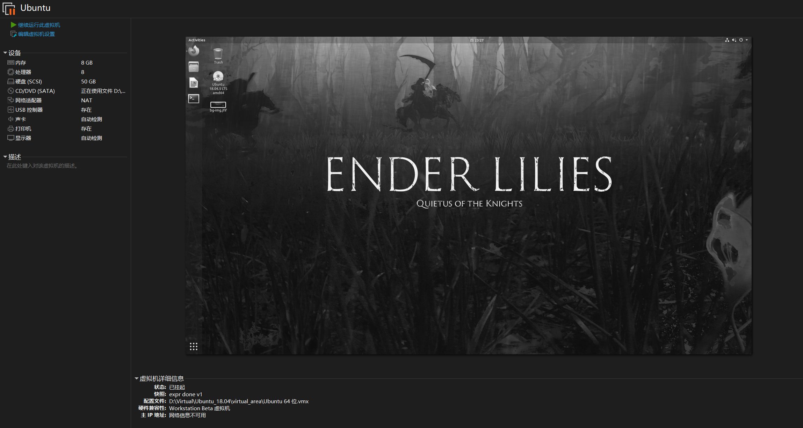

在安装好Ubuntu 18.04后，通过安装VMware Tools来提高虚拟机的体验。

打开终端，输入以下命令：

```shell
sudo apt-get update
sudo apt-get install open-vm-tools-desktop fuse
```

安装完成后，重启虚拟机即可。

- 安装编译所需的工具 

在终端中输入以下命令：

```shell
# GNU Binary Utilities, or (binutils), are a set of programming tools for creating and managing binary programs, object files, libraries, profile data, and assembly source code.
# [GNU Binutils](https://www.gnu.org/software/binutils/)
sudo apt-get install binutils
sudo apt-get install gcc

# check the version of gcc
gcc --version
```

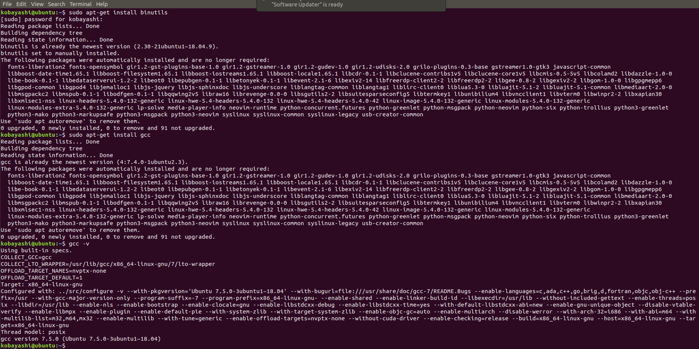

```shell
# Netwide Assembler (NASM) is an assembler and disassembler for the Intel x86 architecture. It can be used to write 16-bit, 32-bit (IA-32) and 64-bit (x86-64) programs.
# [Netwide Assembler](https://www.nasm.us/)
sudo apt-get install nasm

# Quick Emulator (QEMU) is a free and open-source emulator. It emulates a computer's processor through dynamic binary translation and provides a set of different hardware and device models for the machine, enabling it to run a variety of guest operating systems. It can interproperate with Kernel-based Virtual Machine (KVM) to run virtual machines at near-native speed. QUEM can also do emulation for user-level processes, allowing applications compiled for one architecture to run on another.
# QEMU supports the emulation of various architectures, including x86, x86-64, ARM, MIPS, PowerPC, SPARC, and RISC-V, among others.
# [QUEM - Wikipedia](https://en.wikipedia.org/wiki/QEMU)
# [Quick Emulator](https://www.qemu.org/)
sudo apt-get install qemu

sudo apt-get install cmake

# The ncureses library routines are a terminal-independent method of updating character screens with reasonable optimization.
# This package contains the header files, static libraries and symbolic links that developers using ncurses will need.
# [ncurses](https://invisible-island.net/ncurses/)
sudo apt-get install libncurses5-dev

# GNU Bison, commonly known as Bison, is a parser generator that is part of GNU Project.
# [GNU Bison - Wikipedia](https://en.wikipedia.org/wiki/GNU_Bison)
# [GNU Bison](https://www.gnu.org/software/bison/)
sudo apt-get install bison

# Fast lexical analyzer generator (FLEX) is a computer program that generates lexical analyzers (also known as "scanners" or "lexers"). It is frequently used as the lex implementation together with Berkeley Yacc parser generator on BSD-derived operating systems (as both lex and yacc are part of POSIX), or together with GNU bison (a Yacc replacement), on systems that are based on the Linux kernel.
# [Flex - Wikipedia](https://en.wikipedia.org/wiki/Flex_(lexical_analyser_generator))
sudo apt-get install flex

# This package is part of the OpenSSL project's implementation of the SSL and TLS cryptographic protocols for secure communication over the Internet.
# [OpenSSL](https://www.openssl.org/)
sudo apt-get install libssl-dev

# libc is the C library; basically, it contains all of the system functions that most (if not all) programs need to run on Linux.
# libc6 and glibc (GNU C Library) are the same version of libc
# [GNU C Library - Wikipedia](https://en.wikipedia.org/wiki/GNU_C_Library)
# [What's the difference between libc6 and glibc?](https://linux-m68k.org/faq/glibcinfo.html)
sudo apt-get install libc6-dev-i386
```

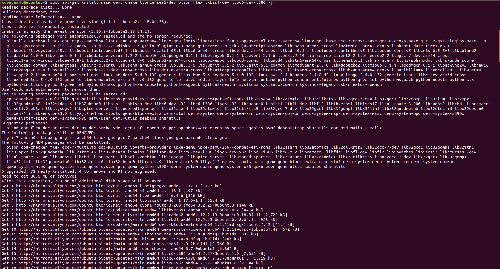


### 编译Linux内核

- 创建实验目录

```shell
mkdir ~/labl && cd ~/labl
```

- 下载内核5.10到实验目录下

```shell
wget https://cdn.kernel.org/pub/linux/kernel/v5.x/linux-5.10.211.tar.xz
```

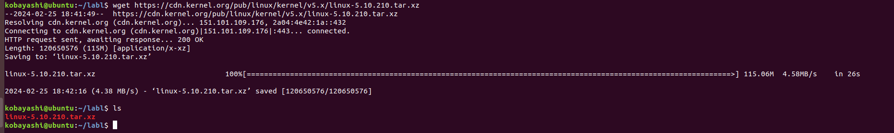

- 解压并进入内核目录

```shell
xz -d linux-5.10.211.tar.xz
tar -xvf linux-5.10.211.tar
cd linux-5.10.211
```

- 编译Linux内核

```shell
make i386_defconfig # generate the default configuration file for the x86 architecture
make menuconfig # configure the kernel
```

在`menuconfig`命令打开的界面中依次选择**Kernel hacking -> Compile-time checks and compiler options**，将**Compile the kernel with debug info**选项打开，保存并退出。该选项打开后，编译内核时将会生成调试信息。

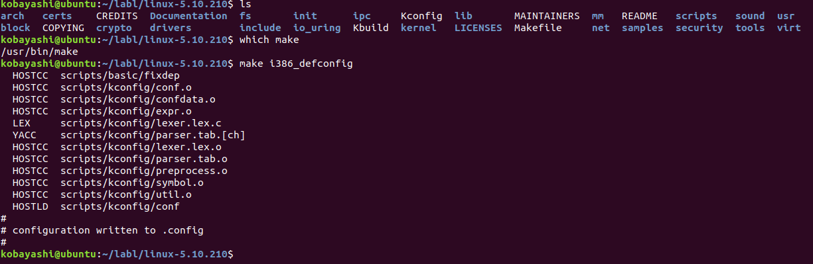

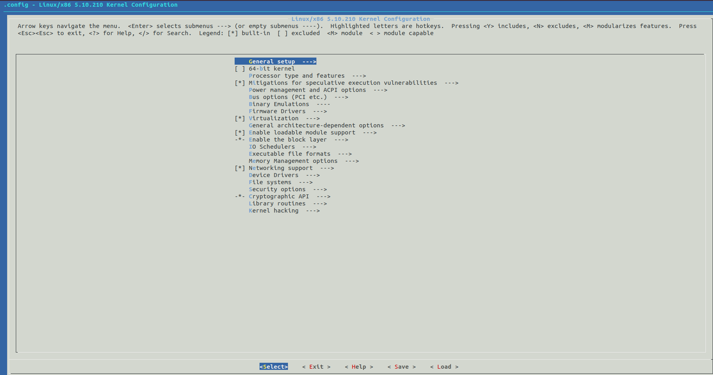

- 编译内核

```shell
make -j4 # compile the kernel
```

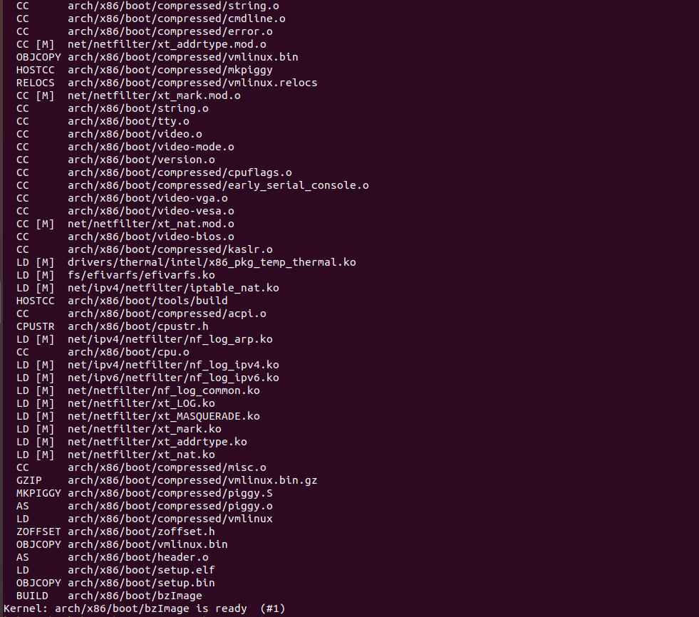

- 编译完成后，检查Linux压缩镜像`linux-5.10.211/arch/x86/boot/bzImage`和符号表`linux-5.10.211/vmlinux`是否生成。


### 启动内核并开启远程调试

- 进入实验目录

```shell
# cd to the experiment directory
cd ~/labl
```

- 使用qemu启动内核并开启远程调试

```shell
qemu-system-i386 -kernel linux-5.10.211/arch/x86/boot/bzImage -s -S -append "console=ttyS0" -nographic
# argument:
# -kernel bzImage
    # Use bzImage as kernel image. The kernel can be either a Linux kernel or in multiboot format.
# -s 
    # Shorthand for -gdb tcp::1234, i.e. open a gdbserver on TCP port 1234 (see the GDB usage cahpter in the System Emulation User's Guide).
# -S
    # Do not start CPU at startup (you must type 'c' in the monitor).
# -append cmdline
    # Use cmdline as kernel command line
# -nographic
    # Normally, if QEMU is compiled wit graphical window support, it displays output such as guest grahics, guest console, and the QEMU monitor in a window. With this option, you can totally disable graphical outpu tso that QEMU is a simple command line application. The emulated serial port is redirected on the console and muxed with the monitor (unless redirected elsewhere explicitly). Therefore, you can still use QEMU to debug a Linux kernel with a serial console. Use C-a h for help on switching between the console and monitor.
# [qemu-system-i386 arguments](https://explainshell.com/explain/1/qemu-system-i386)
```

- 在另一个终端中，使用gdb连接qemu

```shell
gdb # start gdb

# under gdb
file linux-5.10.211/vmlinux # load the kernel symbol file
target remote :1234 # connect to the qemu gdbserver
break start_kernel # set a breakpoint at the start_kernel function
c # continue the execution of the kernel
```

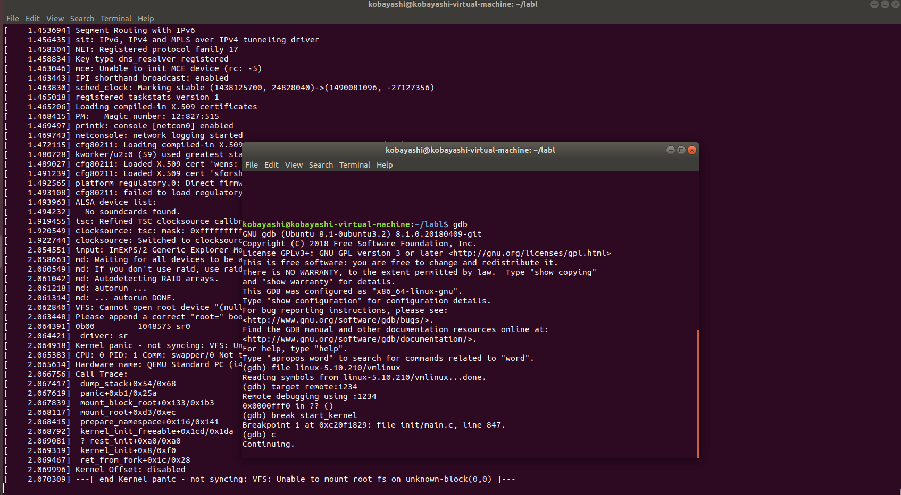


- 在qemu虚拟机中运行的Linux系统能成功启动，并且最终以`Kernel panic`的形式停止。这是因为启动系统的时候只指定了`bzImage (big zImage)`，没有指定`initrd`文件，系统无法`mount`上`initrd (init ram disk)`及其`initramfs (initial ram file system)`。


### 制作Initramfs

- 先来了解一下`initrd`和`initramfs`

`initrd`或者`init ram disk`是指在启动阶段被Linux内核调用的临时文件系统，用于根目录被挂在之前的准备工作。

同其他Unix系统，Linux首先要将内核加载到内存。`initrd`通常被压缩成`gzip`类型，引导时由`bootloader`（如LILO、GRUB）来告知核心`initrd`的位置，使其被核心访问，挂载成一个loop类型文件。

`initramfs`是`initrd`的替代品，它的功能类似`initrd`，但是它基于`CPIO`格式，无需挂载就可以展开成一个文件系统。内核启动时将`initramfs`挂载为`rootfs`，并执行其中的`/init`程序。如果其中没有`/init`程序，则会正常地挂载根文件系统并执行`/sbin/init`。

more about `initrd` and `initramfs` : [https://en.wikipedia.org/wiki/Initial_ramdisk]


- 进入实验文件夹

```shell
cd ~/labl
```

- 编写 Hello world 程序

在前面调试内核中，我们已经准备了一个Linux启动环境，但是缺少一个`initramfs`文件。我们可以做一个最简单的`Hello World initramfs`，来直观地理解initramfs的作用。

```c
#include <stdio.h>

void main() {
    print("lab1:Hellow World!\n");
    fflush(stdout);
    // keep the process in user space after printing 
    while(1);
}
```


上述文件保存在`~/labl/helloworld.c`中，然后将上面代码编译成32位的可执行文件。

```shell
gcc -o helloworld -m32 -static helloworld.c
# argument:
# -o file
    # Place the output into file file. This applies to whatever sort of output is being produced, whether it be an executable file, an object file, an assembler file or preprocessed C code.
# -m32
    # Generate code for a 32-bit environment. The 32-bit environment sets int, long and pointer to 32 bits and generates code that runs on any i386 system.
# -static
    # On systems that support dynamic linking, this prevents linking with the shared libraries. On other systems, this option has no effect.
```

- 加载 initramfs

  - 用cpio打包initramfs。（initramfs基于CPIO格式，无需挂在就可以展开成一个文件系统）
    - `echo helloworld | cpio -o --format=newc > initramfs` 

  - 启动内核，并加载initramfs
    - `qemu-system-i386 -kernel linux-5.10.211/arch/x86/boot/bzImage -initrd initramfs -s -S -append "console=ttyS0" -nographic` 

  - 重复上面的gdb的调试过程，可以看见gdb中输出了`lab1:Hellow World!`，说明initramfs加载成功。

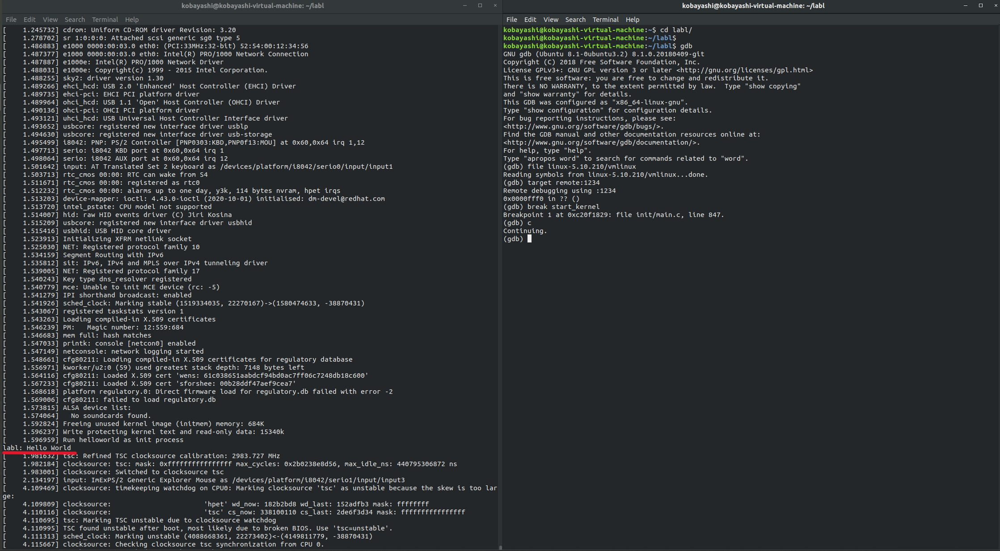


### 编译并启动BusyBox

- 先来了解一下BusyBox

简单来说，BusyBox在单一的可执行文件中提供了精简的Unix工具集。它能够在运行于多款POSIX环境的操作系统，例如Linux（包括Android）、FreeBSD等。由于BusyBox可执行文件的体积很小，因此它非常适合用于嵌入式设备。

- 进入实验目录

```shell
cd ~/labl
```

- 下载BusyBox并解压

```shell
wget https://busybox.net/downloads/busybox-1.33.0.tar.bz2
tar -xvf busybox-1.33.0.tar.bz2
cd busybox-1.33.0
```

- 编译BusyBox

```shell
make defconfig
makde menuconfig
```

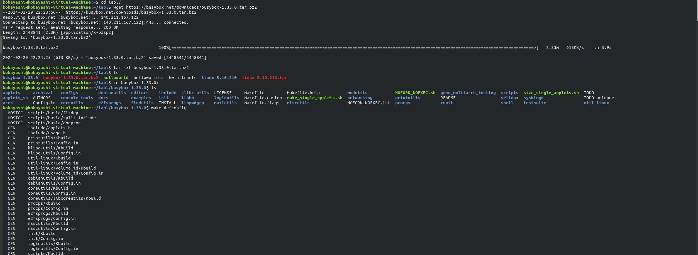

进入settings，然后在`Build BusyBox as a static binary (no shared libs)`选项前打上`*`，然后分别设置`Additional CFLAGS`和`Additional LDFLAGS`为`-m32 -march=i386`和`-m32`，保存并退出。

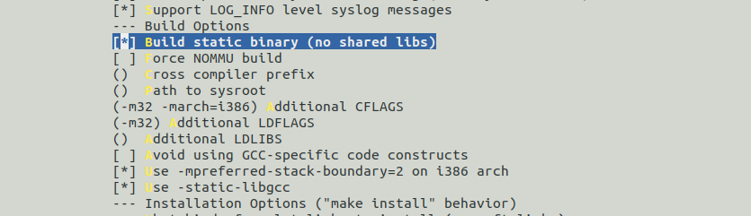

然后运行下列命令编译BusyBox：

```shell
make -j8
make install
```

- 使用BusyBox制作initramfs

1. 先将安装在`_install`目录下的文件移动到一个新的目录：

```shell
# move all the files in the BusyBox installation directory to a new directory
cd ~/labl
mkdir mybusybox
mkdir -pv mybusybox/{bin,sbin,etc,proc,sys,usr/{bin,sbin}}
cp -av busybox-1.33.0/_install/* mybusybox/
cd mybusybox
```

2. 然后需要创建一个`init`文件，这里可以用一个简单地shell脚本作为`init`文件：

```shell
#!/bin/sh
mount -t proc none /proc
mount -t sysfs none /sys
echo -e "\nBoot took $(cut -d' ' -f1 /proc/uptime) seconds\n"
exec /bin/sh
```

3. 给`init`文件添加可执行权限：

```shell
chmod u+x init
```

4. 最后将x86-busybox下面的内容打包归档成cpio文件，以供Linux内核做initramfs启动执行：

```shell
find . -print0 | cpio --null -ov --format=newc | gzip -9 > ~/labl/initramfs-busybox-x86.cpio.gz
```

- 加载busybox

```shell
cd ~/labl
quemu-system-i386 -kernel linux-5.10.211/arch/x86/boot/bzImage -initrd initramfs-busybox-x86.cpio.gz -append "console=ttyS0" -nographic
```

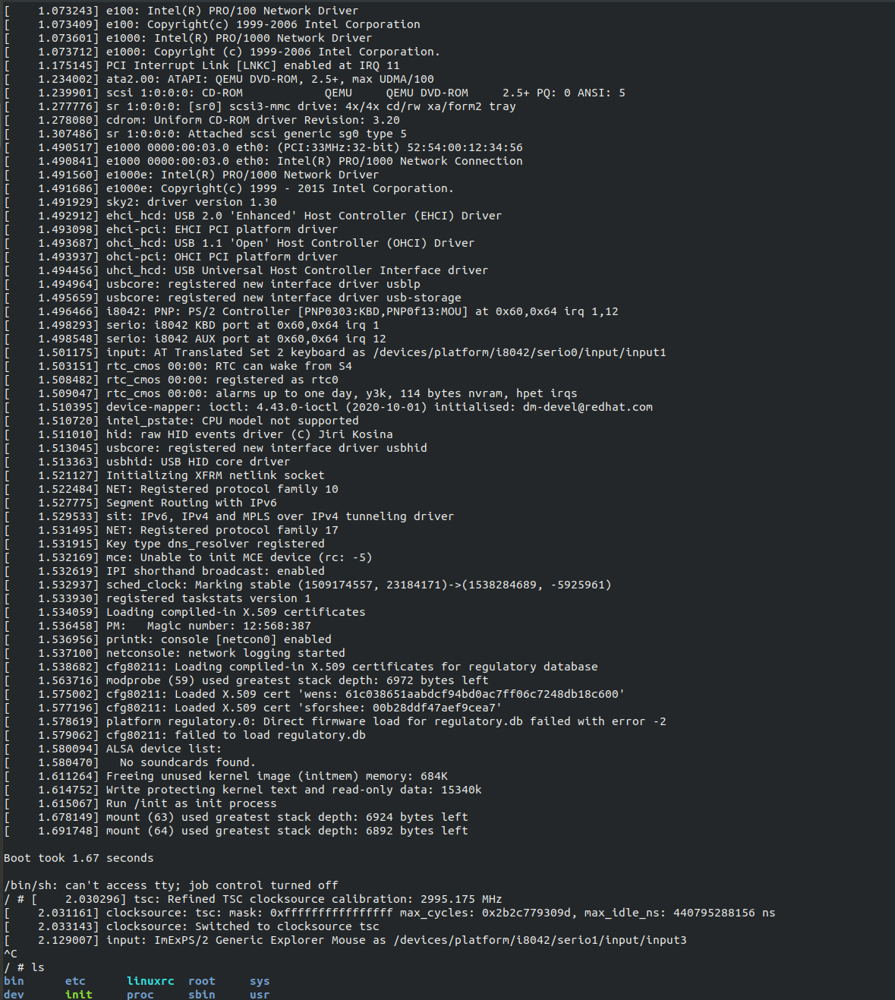


## 实验结果

内核编译成功，启动内核并开启远程调试成功，制作initramfs成功，编译并启动BusyBox成功。

## 总结 

这是一次非常有意义的实验，通过这次实验，我对Linux内核的编译过程有了更加深入的了解，也对Linux内核启动过程有了更加深入的了解。

实验的最终结果大致上是成功的，但仍然存在一些问题，比如最后使用busybox并启动内核后有报错：

```shell
/bin/sh: can't access tty; job control turned off
```

我查阅了一些资料，猜测该问题可能是由启动终端不匹配引起的，但我暂时没有找到解决办法。希望在以后的学习中能够解决这个问题。