# 操作系统原理实验报告

- **实验名称**：实模式和保护模式下的OS启动
- **授课教师**：张青
- **学生姓名**：林隽哲
- **学生学号**：21312450

[toc]

## 实验要求

- 熟悉nasm汇编语言，并能够编写简单的nasm汇编程序。简单的编写mbr引导程序，并启动测试。

## 实验过程

### Assignment 1 MBR

#### 内容

- 1.1 复现Example 1。说说你是怎么做的，并将结果截图。
- 1.2 修改Example 1代码，使得MBR被加载到`0x7c00`后在`(12, 12)`处开始输出你的学号。注意，你的学号显示的前景色和背景色必须和教程中的不同。说说你是怎么做的，并将结果截图。

#### 1.1 实验步骤

- 编写MBR如下：

```asm
; [filename] mbr.asm
org 0x7c00
[bits 16]
xor ax, ax ; clear ax
; initialize segments
mov ds, ax
mov ss, ax
mov es, ax
mov fs, ax
mov gs, ax

; set stack pointer
mov sp, 0x7c00
mov ax, 0xb800
mov gs, ax

mov ah, 0x01 ; blue
mov al, 'H'
mov [gs:2*0], ax

mov al, 'e'
mov [gs:2*1], ax

mov al, 'l'
mov [gs:2*2], ax

mov al, 'l'
mov [gs:2*3], ax

mov al, 'o'
mov [gs:2*4], ax

mov al, ' '
mov [gs:2*5], ax

mov al, 'W'
mov [gs:2*6], ax

mov al, 'o'
mov [gs:2*7], ax

mov al, 'r'
mov [gs:2*8], ax

mov al, 'l'
mov [gs:2*9], ax

mov al, 'd'
mov [gs:2*10], ax

jmp $ ; jump to current address (infinite loop)

; times, an assembly pseudo-instruction, used to repeat the specified number of operations
; $ is the current address, $$ is the start of the current section
; fill the rest of the sector with 0s
times 510-($-$$) db 0  
db 0x55, 0xaa ; boot signature, meaning this is a bootable mbr
```

- 使用nasm汇编器来将代码编译成二进制文件：

```bash
nasm -f bin mbr.asm -o mbr.bin
# -f 指定输出的文件格式
# -o 指定输出的文件名
# mbr.bin 中保存的是机器可以识别的机器指令，可以使用命令xdd查看其中的内容
```

- 生成了mbr.bin文件后，我们将其写入到硬盘的首扇区。我们需要先创建一个虚拟磁盘：

```bash
# qemu-img create filename [size]
qemu-img create hd.img 10M
```

- 然后将mbr.bin写入到hd.img的首扇区：

```bash
dd if=mbr.bin of=hd.img bs=512 count=1 seek=0 conv=notrunc
# if 表示输入文件
# of 表示输出文件
# bs 表示块大小，以字节表示
# count 表示写入的块数
# seek 表示越过输出文件中多少块之后再写入
# conv=notrunc 表示不截断输出文件，如果不加上这个参数，那么硬盘在写入后多余的部分会被截断
```

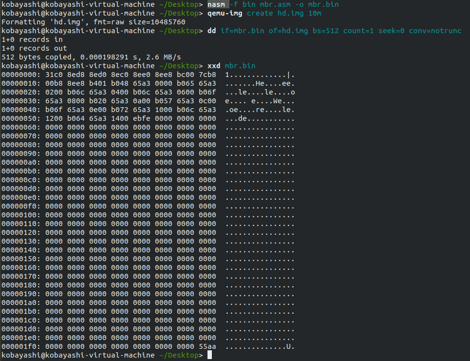

- 最后，我们使用qemu来模拟计算机启动：

```bash
qemu-system-i386 -hda hd.img -serial null -parallel stdio
# -hda hd.img 表示将文件hd.img作为0号磁盘映像。
# -serial dev 表示重定向虚拟串口到指定设备，null表示重定向到空设备。
# -parallel stdio 表示重定向虚拟并口到主机标准输入输出设备中。
```

- 启动后的效果如下。可以看到屏幕的第一行已经输出了`Hello World`。

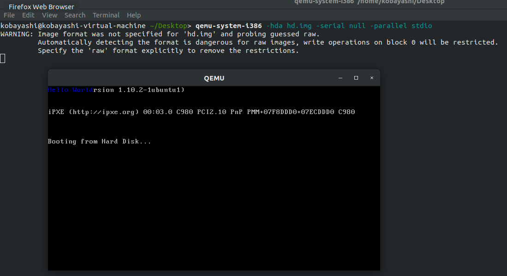


#### 1.2 实验步骤

- 修改mbr.asm如下：

```asm
; mbr_id.asm
[bits 16]
xor ax, ax ; clear ax
; initialize segments
mov ds, ax
mov ss, ax
mov es, ax
mov fs, ax
mov gs, ax

; set stack pointer
mov sp, 0x7c00
mov ax, 0xb800
mov gs, ax

mov ah, 0x14 ; red on blue

mov al, '2'
mov [gs:0x0a*160+0x0c*2], ax
mov al, '1'
mov [gs:0x0a*160+0x0d*2], ax
mov al, '3'
mov [gs:0x0a*160+0x0e*2], ax
mov al, '1'
mov [gs:0x0a*160+0x0f*2], ax
mov al, '2'
mov [gs:0x0a*160+0x10*2], ax
mov al, '4'
mov [gs:0x0a*160+0x11*2], ax
mov al, '5'
mov [gs:0x0a*160+0x12*2], ax
mov al, '0'
mov [gs:0x0a*160+0x13*2], ax

jmp $ ; jump to current address (infinite loop)

; times, an assembly pseudo-instruction, used to repeat the specified number of operations
; $ is the current address, $$ is the start of the current section
; fill the rest of the sector with 0s
times 510-($-$$) db 0  
db 0x55, 0xaa ; boot signature, meaning this is a bootable mbr
```

- 重复1.1中的步骤，最终启动后的效果如下：

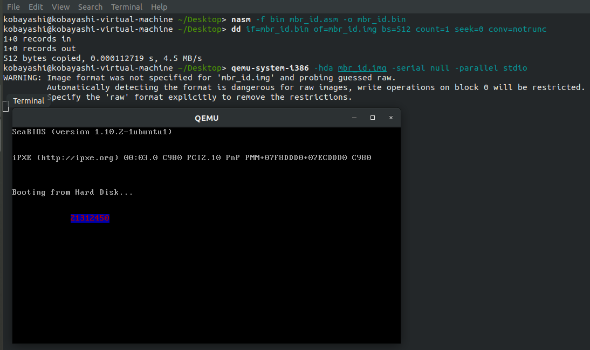


### Assignment 2 实模式中断

#### 内容

- 2.1 请探索实模式下的光标中断，利用中断实现光标的位置获取和光标的移动。说说你是怎么做的，并将结果截图。
- 2.2 请修改1.2的代码，使用实模式下的中断来输出你的学号。说说你是怎么做的，并将结果截图。
- 2.3 请在2.1和2.2的知识的基础上，探索实模式的键盘中断，利用键盘中断实现键盘输入并回显。

#### 2.1 实验步骤

- 编写cursor.asm如下：

```asm
; cursor.asm
[bits 16]
xor ax, ax ; clear ax
; initialize segments
mov ds, ax
mov ss, ax
mov es, ax
mov fs, ax
mov gs, ax

; set stack pointer
mov sp, 0x7c00
mov ax, 0xb800
mov gs, ax

; get the current cursor position 
mov ah, 0x03
int 0x10

; press h, j, k, l to move the cursor
; press q to quit
read_key:

; write down a 'X' 
mov ah, 0x09
mov al, 'X'
mov bh, 0
mov bl, 0x14
mov cx, 1
int 0x10

mov ah, 0
int 0x16
cmp al, 'h'
je move_left
cmp al, 'j'
je move_down
cmp al, 'k'
je move_up
cmp al, 'l'
je move_right
cmp al, 'q'
je quit
jmp read_key

move_left:
mov ah, 0x02
int 0x10
sub dl, 1
mov ah, 0x0c
int 0x10
jmp read_key

move_down:
mov ah, 0x02
int 0x10
add dh, 1
mov ah, 0x0c
int 0x10
jmp read_key

move_up:
mov ah, 0x02
int 0x10
sub dh, 1
mov ah, 0x0c
int 0x10
jmp read_key

move_right:
mov ah, 0x02
int 0x10
add dl, 1
mov ah, 0x0c
int 0x10
jmp read_key

quit:

jmp $ ; jump to current address (infinite loop)

; times, an assembly pseudo-instruction, used to repeat the specified number of operations
; $ is the current address, $$ is the start of the current section
; fill the rest of the sector with 0s
times 510-($-$$) db 0  
db 0x55, 0xaa ; boot signature, meaning this is a bootable mbr
```

该实现中，我通过中段`0x10`的功能获取光变的位置与移动光标，通过中断`0x16`来获取键盘输入。在键盘输入为`h`、`j`、`k`、`l`时，分别移动光标的位置。在键盘输入为`q`时，退出程序。

- 最终启动后的效果如下：

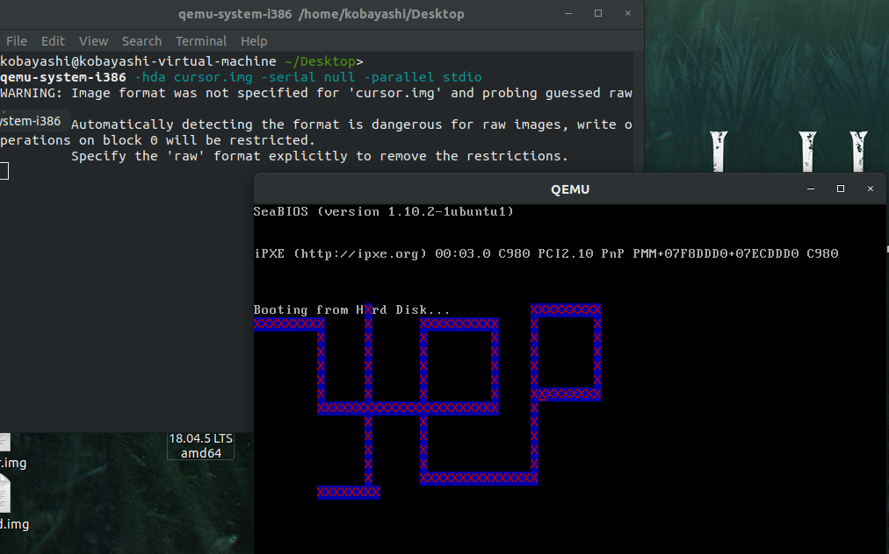


#### 2.2 实验步骤

- 编写output.asm如下所示：

```asm
; output.asm
org 0x7c00 ; origin, the start of the boot sector
[bits 16]

msg db '21312450', 0 ; the string to be output

xor ax, ax ; clear ax
; initialize segments
mov ds, ax
mov ss, ax
mov es, ax
mov fs, ax
mov gs, ax

; set stack pointer
mov sp, 0x7c00
mov ax, 0xb800
mov gs, ax

; init cursor position
mov bh, 0x00 ; page number
mov dh, 0x0c ; row
mov dl, 0x0c ; column

; set cursor position
mov ah, 0x02
int 0x10

; set output attributes
mov bl, 0x14 ; blue color
mov cx, 0x01 ; print one character at a time

mov si, msg ; load the address of the string into si

print_string:
    mov al, [si] ; load the character into al
    or al, al ; check if al is 0
    jz end_print_string ; if al is 0, jump to halt

    mov ah, 0x09 ; print character
    int 0x10 ; call video interrupt

    mov ah, 0x02 ; move cursor to next position
    inc dl ; increment column
    int 0x10 ; call video interrupt

    inc si ; move to next character

    jmp print_string ; repeat the process
end_print_string:

jmp $ ; jump to current address (infinite loop)

; times, an assembly pseudo-instruction, used to repeat the specified number of operations
; $ is the current address, $$ is the start of the current section
; fill the rest of the sector with 0s
times 510-($-$$) db 0  
db 0x55, 0xaa ; boot signature, meaning this is a bootable mbr
```

上示代码中，主要用到了中断`0x10`来设置光标的位置和输出字符。在输出字符时，通过循环来输出字符串中的每一个字符。

- 最终启动后的效果如下：

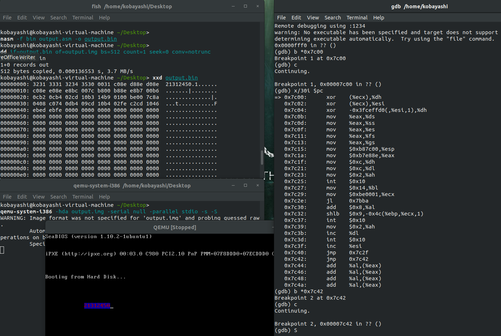


#### 2.3 实验步骤

- 编写input.asm如下：

```asm
; input.asm
[bits 16]
xor ax, ax ; clear ax
; initialize segments
mov ds, ax
mov ss, ax
mov es, ax
mov fs, ax
mov gs, ax

; set stack pointer
mov sp, 0x7c00
mov ax, 0xb800
mov gs, ax

; get the current cursor position 
mov ah, 0x03
int 0x10

; read the keyboard, and output the character to the screen
read_key:
    ; read the key from the keyboard, and store it in al 
    mov ah, 0
    int 0x16

    cmp al, 0x0d ; check if the character is enter
    jz end_read_key 

    ; show the character in al on the screen
    mov ah, 0x0e
    mov al, al
    mov bh, 0
    mov bl, 0x07
    int 0x10
    jmp read_key
end_read_key:

jmp $ ; jump to current address (infinite loop)

times 510-($-$$) db 0  
db 0x55, 0xaa ; boot signature, meaning this is a bootable mbr
```

上述代码主要通过中断先实现键盘的按键读取，然后实现按键的回显。

- 最终启动后的运行效果如下：

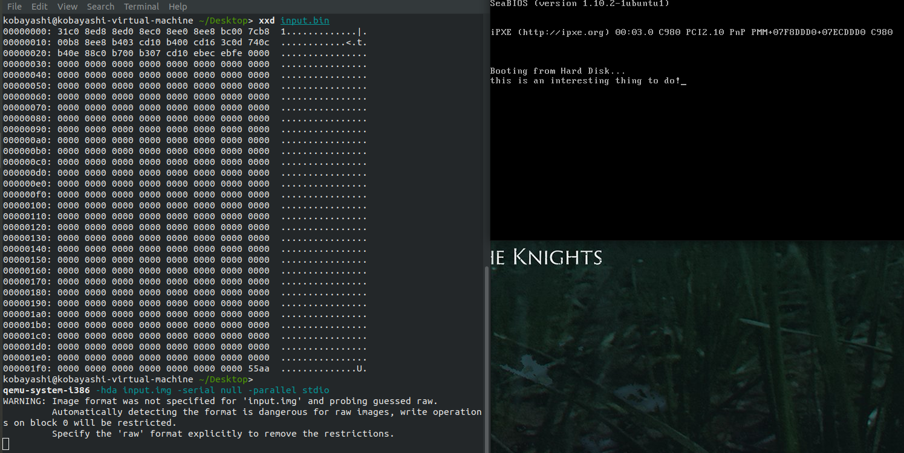


### Assignment 3 汇编

#### 内容

- 3.1 **分支逻辑的实现**。请将下列伪代码转换为汇编代码，并放置在标号`your_if`之后。

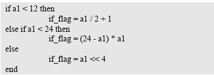

- 3.2 **循环逻辑的实现**。请将下列伪代码转换为汇编代码，并放置在标号`your_while`之后。

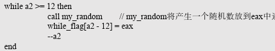

- 3.3 **函数的实现**。请编写函数`your_function`并调用之，函数的内容是遍历字符数组`string`。

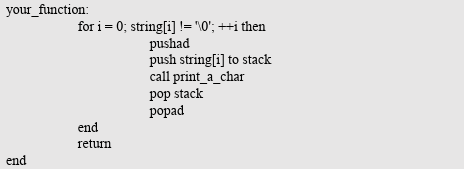


#### 3.1 实验步骤

- 分支逻辑的实现，编写if.asm如下：

```asm
; if.asm
; load the value of a1 into eax
mov eax, [a1]

; if a1 < 12, then goto if1
mov ebx, 12
cmp eax, ebx
jl if1

; else if a1 < 24, then goto if2
mov ebx, 24
cmp eax, ebx
jl if2

; else, if_flag = a1 << 4
shl eax, 4
mov [if_flag], eax
jmp endif

; if1: if_flag = (a1 / 2) + 1
if1:
shr eax, 1
inc eax
mov [if_flag], eax
jmp endif

; if2: if_flag = (24 - a1) * a1
if2:
mov ecx, 24
sub ecx, eax
imul ecx, eax
mov [if_flag], ecx
jmp endif

endif:
```

#### 3.2 实验步骤

- 循环逻辑的实现，编写while.asm如下：

```asm
; while.asm
; load the value of a2 into ebx
mov ebx, [a2]

while_loop:
    ; if a2 < 12, end the loop
    cmp ebx, 12
    jl end_while_loop

    ; push and save ebx
    push ebx
    ; generate a random character and store it in al
    call my_random
    ; pop and restore ebx
    pop ebx

    ; read the value of char array pointer while_flag
    mov edx, [while_flag]
    ; calculate the address of the current character, 
    ; and store the random character in it
    mov [edx + ebx - 12], al

    dec ebx
    mov [a2], ebx
    
    jmp while_loop
end_while_loop:
```

#### 3.3 实验步骤

- 函数的实现，编写function.asm如下：

```asm
; function.asm
mov eax, 0 ; i = 0
mov ebx, [your_string]

print_loop:
    movzx ecx, byte [ebx + eax]
    test ecx, ecx
    jz end_print_loop 

    push eax
    push ebx
    push ecx ; the argument to print_a_char
    call print_a_char
    pop ecx
    pop ebx
    pop eax

    inc eax
    jmp print_loop
end_print_loop:
```

#### 最终测试效果

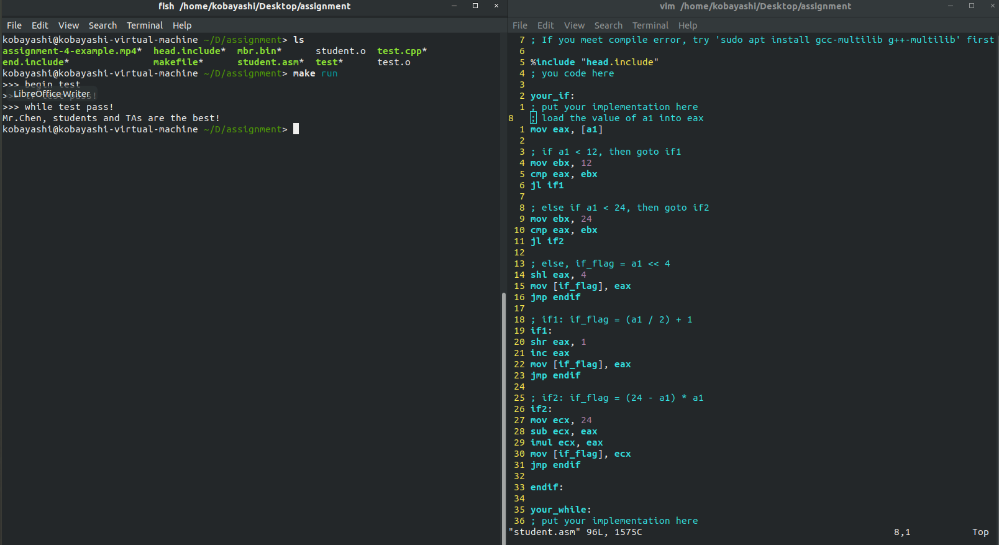

### Assignment 4 汇编小程序

#### 内容

- **字符弹射程序**。请编写一个字符弹射程序，其从点`(2, 0)`处开始向右下角45度开始射出，遇到边界反弹，反弹后按45
度角射出，方向视反弹位置而定。同时，你可以加入一些其他效果，如变色，双向射出等。注意，你的程序应该不
超过510字节，否则无法放入MBR中被加载执行。

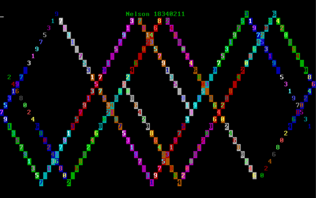

#### 实验步骤

- 编写bounce.asm如下：

```asm
; bounce.asm
org 0x7c00
[bits 16]
; initialize segments
xor ax, ax 
mov ds, ax
mov ss, ax
mov es, ax
mov fs, ax
mov gs, ax

; set stack pointer
mov sp, 0x7c00
mov ax, 0xb800
mov gs, ax

; set cursor position to (2,0)
mov ah, 0x02
mov bh, 0x00
mov dh, 0x02
mov dl, 0x00
int 0x10

; the screen size is 80*25

; I use bl to save the color and the direction at the same time
; 0x01: right up, blue
; 0x02: right down, green
; 0x04: left up, red
; 0x08: left down, yellow

mov bl, 0x02 ; the initial direction is right down

move_loop:
    ; judge the current direction 
    ; and choose the next move
    cmp bl, 0x01
    je move_right_up
    cmp bl, 0x02
    je move_right_down
    cmp bl, 0x04
    je move_left_up
    cmp bl, 0x08
    je move_left_down

move_right_up:
    ; judge if the cursor is at the end of top
    cmp dh, 0x00
    je change_right_down
    ; judge if the cursor is at the end of right
    cmp dl, 0x50
    je change_left_up
    ; move
    mov ah, 0x02
    inc dl
    dec dh
    int 0x10
    jmp move_next

move_right_down:
    ; judge if the cursor is at the end of bottom
    cmp dh, 0x18
    je change_right_up
    ; judge if the cursor is at the end of right 
    cmp dl, 0x50
    je change_left_down
    ; move
    mov ah, 0x02
    inc dl
    inc dh
    int 0x10
    jmp move_next

move_left_up:
    ; judge if the cursor is at the end of top  
    cmp dh, 0x00
    je change_left_down
    ;  judge if the cursor is at the end of left
    cmp dl, 0x00
    je change_right_up
    ; move 
    mov ah, 0x02
    dec dl
    dec dh
    int 0x10
    jmp move_next

move_left_down:
    ; judge if the cursor is at the end of bottom 
    cmp dh, 0x18
    je change_left_up
    ; judge if the cursor is at the end of left 
    cmp dl, 0x00
    je change_right_down
    ; move 
    mov ah, 0x02
    dec dl
    inc dh
    int 0x10
    jmp move_next

move_next:
    ; show the path 
    mov ah, 0x09
    mov al, 'X'
    mov cx, 0x01
    int 0x10

    ; delay 
    push cx
    push dx
    call delay
    pop dx
    pop cx

    jmp move_loop

jmp $ ; jump to current address (infinite loop)

; delay function
delay:
    mov cx, 0x0ff
delay_loop1:
    mov dx, 0x0ffff
delay_loop2:
    dec dx
    jnz delay_loop2
    dec cx
    jnz delay_loop1
    ret

; change direction
change_right_down:
    mov bl, 0x02
    jmp move_right_down
change_left_up:
    mov bl, 0x04
    jmp move_left_up
change_left_down:
    mov bl, 0x08
    jmp move_left_down
change_right_up:
    mov bl, 0x01
    jmp move_right_up

times 510-($-$$) db 0  
db 0x55, 0xaa ; boot signature, meaning this is a bootable mbr
```

- 最终启动后的效果如下：

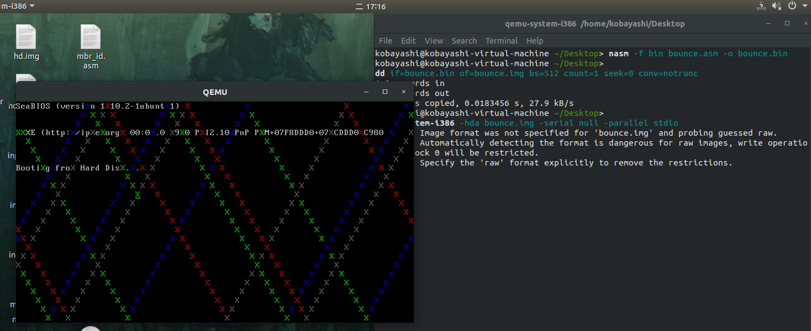

## 总结

通过这次实验我熟悉了汇编的编写以及mbr文件的制作流程，但在本次实验中编写的代码中仍有这许多需要改进的地方，我将会在今后的实验中尝试将代码写得更加简洁、高效。