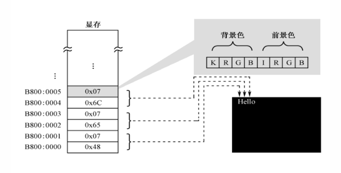
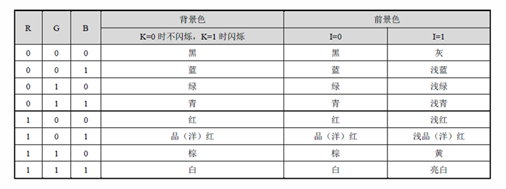

# IA-32

[ref] : # (https://en.wikipedia.org/wiki/IA-32)

## Introduction

英特尔32位架构（`Intel Architecture, 32-bit`），常被称为`i386`或`x86`，由英特尔公司于1985年推出的指令集架构。它是8086架构的延伸版本，可支持32位运算，首次应用在`Intel 80386`芯片中。

对许多编程语言来说，IA-32与i386是同义词。

## Registers

[ref] : # (https://faculty.kfupm.edu.sa/COE/aimane/assembly/pagegen-30.aspx.htm)

### General Purpose Registers

- EAX: Accumulator
- EBX: Base
- ECX: Counter
- EDX: Data
- ESI: Source Index
- EDI: Destination Index
- EBP: Base Pointer
- ESP: Stack Pointer

### Segment Registers

- CS: Code Segment
- DS: Data Segment
- SS: Stack Segment
- ES: Extra Segment
- FS
- GS

### Special Purpose Registers

- EIP: Instruction Pointer
- EFLAGS: Flags

### Usage

- 通用寄存器：
  - 通用寄存器有如下特殊用法：
    - eax在乘法和除法指令中被自动使用，通常称之为扩展累加寄存器。
    - ecs在loop指令中默认为循环计数器
    - esp用于堆栈寻址。**因此，我们绝对不可以随意使用esp**
    - esi和edi通常用于内存数据的高速传送，通常称之为扩展源指针和扩展目的指针寄存器。
    - ebp通常出现在高级语言翻译成的汇编代码中，用来引用函数参数和局部变量。除非用于高级语言的设计技巧中，ebp不应该在算数运算和数据传送中使用。ebp一般被称为扩展帧指针寄存器。

- 段寄存器：
  - 段寄存器用于存放段的基地址，段实际上就是一块连续的内存区域。

- 指令指针：
  - eip用于存放下一条指令的地址。有些机器指令可以改变eip的值，使程序向新的地址转移，如`ret`指令。

- 状态寄存器（标志寄存器）：
  - eflags存放CPU的一些状态标志位。下面提到的标志实际上是eflags寄存器上的某一个位。常用的标志位如下；
    - 进位标志（CF）
    - 溢出标志（OF）
    - 符号标志（SF）
    - 零标志（ZF）

## Operating Modes

- Real Mode
- Protected Mode
- Virtual 8086 Mode
- System Management Mode

我们常用实模式和保护模式。保护模式和实模式最大的不同在于地址总线。实模式使用20位地址总线、16位寄存器；保护模式使用32位地址总线、32位寄存器。因此，实模式的寻址空间为1MB，保护模式的寻址空间为4GB。（这里的地址指的是内存地址）

- 实地址模式（Real Mode）
  - 在实地址模式下，IA-32处理器使用20位的地址线，可以访问1MB的内存，范围是0x00000-0xFFFFF。为了能够在实地址模式下使用16位的寄存器表示20位的地址，IA-32处理器使用**物理地址=段地址<<4+偏移地址**的方式来计算物理地址。因此每个段的最大长度为64KB。
  - 段地址存放在段寄存器中，在编程中我们给出的地址实际上是偏移地址。当我们要进行寻址访问时，CPU会自动根据偏移地址的类型（指令、数据、堆栈）和段寄存器的值来计算物理地址。
  - 段地址寄存器也有约定俗称的规则。一个典型的程序有3个段，数据段、代码段和堆栈段：
    - cs包含16位代码段的基地址
    - ds包含16位数据段的基地址
    - ss包含16位堆栈段的基地址
    - es、fs和gs可以指向其他数据段的基地址

  
# 计算机开机启动过程

- **加电开机** 按下电源的开关，电源马上开始向主板和其他的设备开始供电。此时的电压还不是很稳定，主板上的的芯片组会向CPU发出并保持一个`reset`（重置）信号，让CPU内部自动恢复到初始状态下。当芯片组检测到电源已经开始稳定地供电，芯片组则开始撤去`reset`信号。此时，CPU马上开始从`0xFFFF0`处开始执行指令。这个地址位于系统的BIOS的地址范围内，其实放在这里的只是一条跳转指令，指向BIOS中真正的启动代码的地方。BIOS，即`Basic Input/Output System`，是一组固化到计算机内主板上的一个ROM（`Read-Only Memory`）只读存储器。BIOS保存着计算机中最重要的基本输入输出程序、系统设置信息、开机上电自检程序和系统启动自检程序。
- **BIOS启动** BIOS启动之后，第一件事就是执行POST（`Power-On-self-test`）自检阶段，主要针对系统的一些关键设备是否存在或者功能是否正常，如：内存、显卡等。如果POST过程中系统设备存在致命的问题，BIOS将会发出声音来报告检测过程中出现的错误，声音的长短及次数对应着系统的错误类型。POST过程会非常快速，对用户几乎感觉不出来。
- **加载MBR** BIOS按照设定好的启动顺序，将控制权交给排在第一位的存储设备，即设备的首扇区512字节，称为MBR（`Master Boot Record`，主引导扇区），并且将这512字节复制到放在`0x7c00`的内存地址中运行。存储设备一般分为若干个固定大小的块来访问，这个固定大小的块被称为扇区，而第1个扇区被称为首扇区。但在复制之前，计算机会根据MBR判断设备是不是可启动的，即有无操作系统。判断依据是检查MBR最后两个字节是否为`0x55`、`0xAA`。
- **硬盘启动** MBR只有512字节大小，程序可处理的逻辑有限。因此MBR会从存储设备中加载`bootloader`（启动管理器），bootloader并无大小限制。bootloader的作用是初始化环境，然后从存储设备加载`kernel`（操作系统内核）到内存中。
- **内核启动** kernel加载到内存后，bootloader跳转到kernel处执行。至此，计算机启动完毕。

# IA-32经典字符显示原理

- **显存** 显存是一块专门用于存放图像数据的内存，它的大小和显示器的分辨率有关。在IA-32架构中，显存的地址范围是`0xB8000`到`0xBFFFF`，共32KB。在文本模式中，控制器的最小可控制单位为字符。每一个显示字符自上而下，从左到右依次使用显存中的**2**个字节进行表示，其中一个字节（低字节）用于存放字符的ASCII码，另一个字节（高字节）用于存放字符的颜色属性。如下图所示：

- 字符的颜色属性的字节高4位表示背景色，低4位表示前景色，如下图所示：

