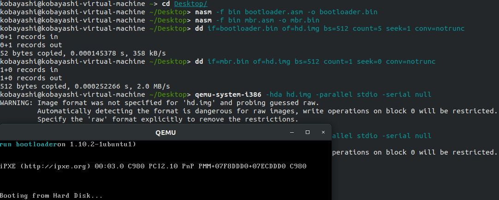

# 操作系统原理实验报告

- **实验名称**：从实模式到保护模式
- **授课教师**：张青
- **学生姓名**：林隽哲
- **学生学号**：21312450

[toc]

## 实验要求

## 实验过程

### Assignment 1

#### 1.1

> 复现Example 1，说说你是怎么做的并提供结果截图，也可以参考Ucore、Xv6等系统源码，实现自己的LBA方式的磁盘访问。

编写`mbr.asm`如下:

```asm
org 0x7c00
[bits 16]
xor ax, ax ; eax = 0
; initialize stack, set all stack values to 0
mov ds, ax
mov ss, ax
mov es, ax
mov fs, ax
mov gs, ax

; initialize stack pointer
mov sp, 0x7c00
mov ax, 1 ; logical sector number 0~15 bits
mov cx, 0 ; logical sector number 16~31 bits
mov bx, 0x7e00 ; storage address of bootloader
load_bootloader:
    call asm_read_hard_disk ; read hard disk
    inc ax
    cmp ax, 5
    jle load_bootloader
jmp 0x0000:0x7e00 ; jump to the bootloader

jmp $ ; infinite loop

asm_read_hard_disk:
; read a sector from hard disk

; arguments:
; ax = logical sector number 0~15 bits
; cx = logical sector number 16~31 bits
; ds:bx = storage address

; return:
; bx = bx + 512

    mov dx, 0x1f3
    out dx, al ; LBA 7~0 bits

    inc dx ; 0x1f4
    mov al, ah
    out dx, al ; LBA 15~8 bits

    mov ax, cx

    inc dx ; 0x1f5
    out dx, al ; LBA 23~16 bits

    inc dx ; 0x1f6
    mov al, ah
    and al, 0x0f
    or al, 0xe0 ; LBA 27~24 bits
    out dx, al

    mov dx, 0x1f2
    mov al, 1 ; read 1 sector
    out dx, al

    mov dx, 0x1f7
    mov al, 0x20 ; read command
    out dx, al

.waits:
    ; wait for the hard disk to be ready
    in al, dx ; dx = 0x1f7
    and al, 0x88
    cmp al, 0x08
    jnz .waits

    ; read 512 bytes from the hard disk to ds:bx
    ; read 2 bytes each time, read 256 times
    mov cx, 256
    mov dx, 0x1f0 ; data port
.readw:
    in ax, dx
    mov [bx], ax
    add bx, 2
    loop .readw

ret

times 510 - ($ - $$) db 0
db 0x55, 0xaa
```

上述代码中，`load_bootloader`函数将会5次调用`asm_read_hard_disk`函数，每次从硬盘中读取一个扇区，读取完成后将跳转到`0x7e00`地址处的`bootloader`中执行。


编写`bootloader.asm`如下：

```asm
org 0x7e00
[bits 16]
mov ax, 0xb800
mov gs, ax
mov ah, 0x03
mov ecx, bootloader_tag_end - bootloader_tag
xor ebx, ebx
mov esi, bootloader_tag
output_bootloader_tag:
    mov al, [esi]
    mov word[gs:bx], ax
    inc esi
    add ebx, 2
    loop output_bootloader_tag
jmp $

bootloader_tag db 'run bootloader'
bootloader_tag_end:
```

上述代码中，`output_bootloader_tag`函数会将`bootloader_tag`字符串输出到屏幕上。


编译两个汇编文件，使用`dd`命令将二进制文件写入磁盘中，然后使用`qemu`启动，可以看到如下效果：


#### 1.2

> 将LBA28读取硬盘的方式换成CHS读取，同时给出逻辑扇区号向CHS的转换公式。最后说说你是怎么做的并提供结果截图。

首先给出从LBA到CHS的转换公式：

C：Cylinder号，即磁道号，从0开始计数
H：Head号，即磁头号，从0开始计数
S：Sector号，即扇区号，从1开始计数
NC：磁道数
NH：磁头数
NS：扇区数
LBA：逻辑扇区号

有以下转换公式：

$$C=\lfloor\lfloor\frac{LBA}{NS}\rfloor \div NH\rfloor$$
$$H=\lfloor\frac{LBA}{NS}\rfloor \mod NH$$
$$S=LBA \mod NS + 1$$

由上公式，我们可以求出我们的bootloader应该在`0C 0H 2-6S`的位置读取。

因此我们在`mbr.asm`新增一个使用CHS方法进行读取的函数，如下：

```asm
asm_read_hard_disk_chs:
    mov al, 0x05 ; number of sectors to read 

    mov dl, 0x80 ; drive: 0x80 = 1st hard disk
    mov ch, 0x00 ; cylinder
    mov dh, 0x00 ; head
    mov cl, 0x02 ; sector

    mov ah, 0x02 ; function: read sectors
    int 0x13
ret
```

修改`load_bootloader`函数如下：

```asm
load_bootloader: ; load sectors 1-5
    call asm_read_hard_disk_chs
```


重复编译、写入以及启动操作，可以看到如下效果：




### Assignment 2

> 复现Example 2，使用gdb或其他debug工具在进入保护模式的4个重要步骤上设置断点，并结合代码、寄存器的内容等来分析这4个步骤，最后附上结果截图。gdb的使用可以参考appendix的“debug with gdb and qemu”部份。

复现Example 2，并使用gdb进行调试如下：


然而，传统的`gdb`界面相对比较简陋，因此我在这里将使用`pwndbg`插件来增强，再次进入调试如下：


在`0x7c00`打下断点，`continue`运行，进入到`mbr.asm`的入口点：


在`0x7e00`打下断点，`continue`运行，进入到`bootloader.asm`的入口点：


`ni`继续运行，来到将各段描述符加载进GDT的步骤：


继续往下运行，来到初始化描述符表寄存器GDTR的步骤：


继续往下运行，打开第21条地址线，并设置PE位：


最后远跳转进入保护模式：


结束：


### Assignment 3

> 改造“Lab2-Assignment 4”为32位代码，即在保护模式后执行自定义的汇编程序。

将`Lab2-Assignment 4`的代码改造为32位代码，并将其写入`protect_mode_begin`后，如下：

```asm
[bits 32]
protect_mode_begin:

; Define constants
_DR equ 1
_UR equ 2
_UL equ 3
_DL equ 4
delay equ 200
ddelay equ 100

; Start of code segment
START:
mov eax, DATA_SELECTOR
mov ds, eax
mov gs, eax
mov eax, STACK_SELECTOR
mov ss, eax
mov eax, VIDEO_SELECTOR
mov es, eax
mov esi, 0
mov edi, 0

; Print loop
PRINT:
    mov ebx, msg
    mov al, [ebx+esi]
    cmp al, 0
    jz LOOP
    mov ebx, 52
    mov byte [es:ebx+edi], al
    mov byte [es:ebx+edi+1], 1
    inc esi
    add edi, 2
    jmp PRINT

; Delay loop
LOOP:
    dec dword [count]
    jnz LOOP

    mov dword [count], delay
    dec dword [dcount]
    jnz LOOP

    mov dword [count], delay
    mov dword [dcount], ddelay

    mov al, 1
    cmp al, byte [rdul]
    jz DnRt

    mov al, 2
    cmp al, byte [rdul]
    jz UpRt

    mov al, 3
    cmp al, byte [rdul]
    jz UpLt

    mov al, 4
    cmp al, byte [rdul]
    jz DnLt

    jmp $

; Movement and collision detection logic for DnRt, UpRt, UpLt, DnLt

; Move Down-Right (DnRt)
DnRt:
    inc dword [x]
    inc dword [y]
    mov ebx, dword [x]
    mov eax, 25
    sub eax, ebx
    jz dr2ur  ; If at right boundary, change direction to Up-Right

    mov ebx, dword [y]
    mov eax, 80
    sub eax, ebx
    jz dr2dl  ; If at bottom boundary, change direction to Down-Left

    jmp show

dr2ur:
    mov dword [x], 23
    mov byte [rdul], _UR
    jmp show

dr2dl:
    mov dword [y], 78
    mov byte [rdul], _DL
    jmp show

; Move Up-Right (UpRt)
UpRt:
    dec dword [x]
    inc dword [y]
    mov ebx, dword [y]
    mov eax, 80
    sub eax, ebx
    jz ur2ul  ; If at top boundary, change direction to Up-Left

    mov ebx, dword [x]
    mov eax, 0
    sub eax, ebx
    jz ur2dr  ; If at right boundary, change direction to Down-Right

    jmp show

ur2ul:
    mov dword [y], 78
    mov byte [rdul], _UL
    jmp show

ur2dr:
    mov dword [x], 1
    mov byte [rdul], _DR
    jmp show

; Move Up-Left (UpLt)
UpLt:
    dec dword [x]
    dec dword [y]
    mov ebx, dword [x]
    mov eax, 0
    sub eax, ebx
    jz ul2dl  ; If at left boundary, change direction to Down-Left

    mov ebx, dword [y]
    mov eax, 0
    sub eax, ebx
    jz ul2ur  ; If at top boundary, change direction to Up-Right

    jmp show

ul2dl:
    mov dword [x], 1
    mov byte [rdul], _DL
    jmp show

ul2ur:
    mov dword [y], 1
    mov byte [rdul], _UR
    jmp show

; Move Down-Left (DnLt)
DnLt:
    inc dword [x]
    dec dword [y]
    mov ebx, dword [y]
    mov eax, 0
    sub eax, ebx
    jz dl2dr  ; If at bottom boundary, change direction to Down-Right

    mov ebx, dword [x]
    mov eax, 25
    sub eax, ebx
    jz dl2ul  ; If at left boundary, change direction to Up-Left

    jmp show

dl2dr:
    mov dword [y], 1
    mov byte [rdul], _DR
    jmp show

dl2ul:
    mov dword [x], 23
    mov byte [rdul], _UL
    jmp show

; Show character on screen
show:
    xor eax, eax
    mov eax, dword [x]
    mov ebx, 80
    mul ebx
    add eax, dword [y]
    mov ebx, 2
    mul ebx
    mov ebx, eax
    mov ah, byte [color]
    mov al, byte [char]
    mov [es:ebx], eax

    inc byte [char]
    cmp byte [char], 'z' + 1
    jnz keep
    mov byte [char], '0'

keep:
    inc byte [color]
    cmp byte [color], 0x10
    jnz LOOP
    mov byte [color], 0x40
    jmp LOOP

end:
    jmp $

; Data definitions
count dd delay
dcount dd ddelay
rdul db _DR
color db 0x02
x dd 0
y dd 0
char db 'A'
msg db 'KOBAYASHI', 0
```

编译运行，效果如下：


## 总结

通过本次实验，我学习到了从实模式到保护模式的一些基础知识以及如何使用`gdb`进行调试。在实验过程中，我遇到了一些问题，如下：

在参考文档中，我们假设`bootloader`不会超过5个扇区，并且在编译写入`bootloader.asm`的过程中，我们为`dd`指令指定了参数`count=5`，即给`bootloader`分配了5个扇区的空间。

然而十分有意思的是，这在我使用LBA方式进行磁盘读取的时候，并没有出现问题。然而，在使用CHS方式进行磁盘读取的时候，空的扇区并无法成功读取，这将导致程序在读取第一个扇区后会一直卡死在读取检测的`.waits`循环中。更有意思的是，这个现象只出现在了VMware中运行的Ubuntu18.04虚拟机中，而我在本地的Manjaro Linux系统，以及WSL2的Ubuntu虚拟机以及Kali虚拟机中均没有出现这个问题。希望在之后能有机会找到问题的根源。

另外，在实验过程中，我使用了`pwndbg`插件来增强`gdb`的使用体验。`pwndbg`是我个人一直以来比较喜欢的功能强化插件，在之后的实验中我也会继续使用。