# 操作系统原理实验报告

- **实验名称**：中断
- **授课教师**：张青
- **学生姓名**：林隽哲
- **学生学号**：21312450

[toc]

## 实验要求

## 实验过程

### Assignment 1 混合编程的基本思路

> 复现Example 1，结合具体的代码说明C代码调用汇编函数的语法和汇编代码调用C函数的语法。例如，结合代码说明global、extern关键字的作用，为什么C++的函数前需要加上extern "C"等，结果截图并说说你是怎么做的。同时，学习make的使用，并用make来构建Example 1，结果截图并说说你是怎么做的。

首先来说明各个关键词的作用：

- `global`：在汇编中告诉编译器，该关键字后面的符号是一个全局可见的符号。该符号可以是一个变量，也可以是一个函数。
- `extern`：在进行编译时，该关键字告诉编译器它后面的符号是一个外部符号，即在其他模块中定义的符号，而不在当前模块中定义，但可以在当前模块或文件中使用。同样的，该符号可以是一个变量或是一个函数。
- `extern "C"`：这句话告诉编译器词语块按 C 的特性编译和链接。由于 C++ 支持函数重载，因而函数在符号表中的名字与 C 中的函数不同（更详细的说，C++ 中的函数签名将会从函数名、参数类型表等信息结合变换而来）。为了能让 C 代码调用此函数，需要在声明函数时加上此语句。

接下来看一个简单的示例：

编写`c_func.c`：

```c
#include <stdio.h>

void function_from_C() {
    printf("This is a function from C.\n");
}
```

编写`cpp_func.cpp`：

```cpp
#include <iostream>

extern "C" void function_from_CPP() {
    std::cout << "This is a function from C++." << std::endl;
}
```

编写`asm_func.asm`： 

```asm
[bits 32]
global function_from_asm
extern function_from_C
extern function_from_CPP

function_from_asm:
    call function_from_C
    call function_from_CPP
    ret
```

编写`main.cpp`：

```cpp
#include <iostream>

extern "C" void function_from_asm();

int main() {
    std::cout << "Call function from assembly." << std::endl;
    function_from_asm();
    std::cout << "Done." << std::endl;
}
```

来理一下上述代码。
- 在`c_func.c`与`cpp_func.cpp`文件中我们分别定义了函数`function_from_C`与`function_from_CPP`函数。特别的，`function_from_CPP`函数前面加上了`extern "C"`关键字，告诉编译器这是一个 C 的函数。
- 然后，我们在`asm_func.asm`文件首先声明了两个外部符号`function_from_C`与`function_from_CPP`，使得汇编代码可以调用这两个函数。在`function_from_asm`函数中，我们调用了上述两个函数。并且，我们通过`global`关键字将`function_from_asm`声明为全局符号。
- 最后，我们在`main.cpp`中使用`extern "C"`声明了`function_from_asm`函数，然后调用这个函数。

编写makefile，并使用`make`指令进行编译链接运行，得到结果如下：

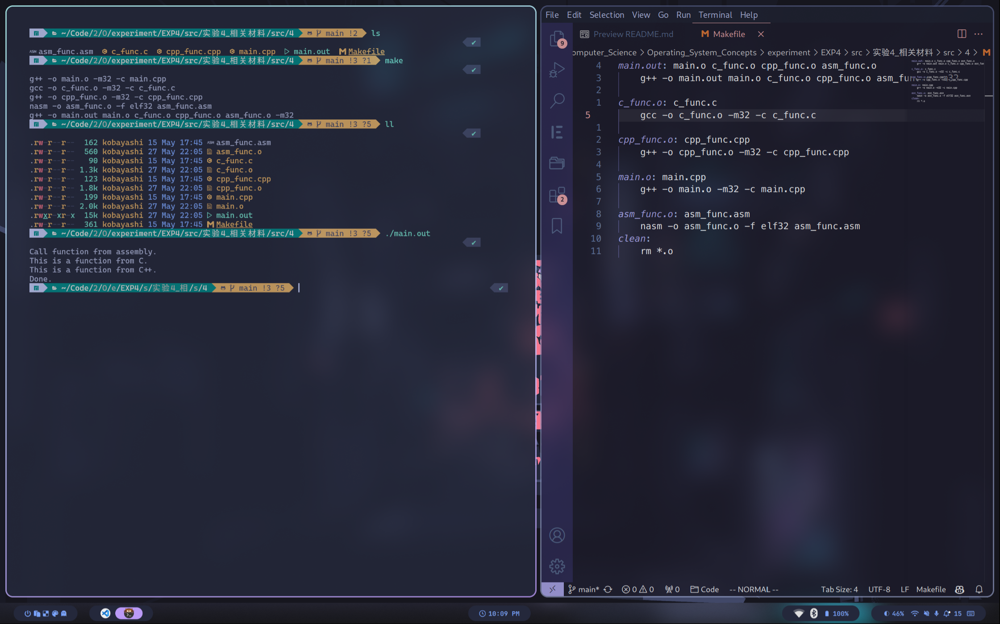


### Assignment 2 使用C/C++来编写内核

> 复现Example 2，在进入setup_kernel函数后，将输出 Hello World 改为输出你的学号，结果截图并说说你是怎么做的。

复现Example 2，运行效果如下：

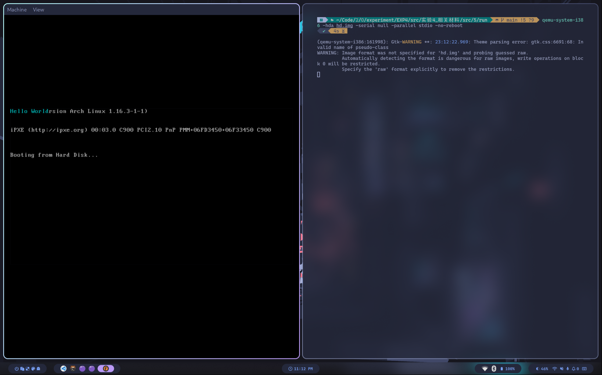

要将`Hello World`改为输出学号，只需要修改`asm_utils.asm`中`message`中的内容即可：

```asm
section .data
    message db '21312450 KOBAYASHI', 0  ; Define the message and a null terminator
```

启动gdb调试，在`setup_kernel`函数处打断点，然后运行程序：

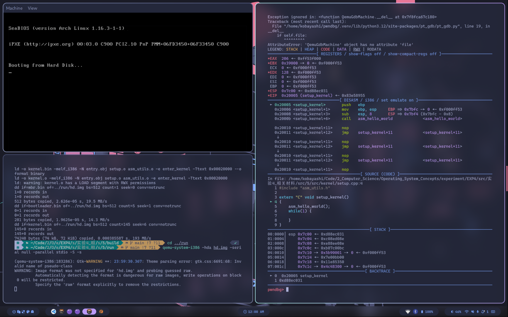

`si`步进`asm_say_hello`函数中，可以看到`message`的偏移地址被读入`esi`寄存器中：

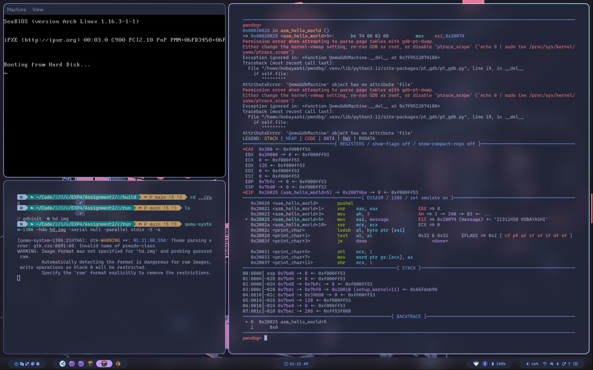

最后的运行效果如下：

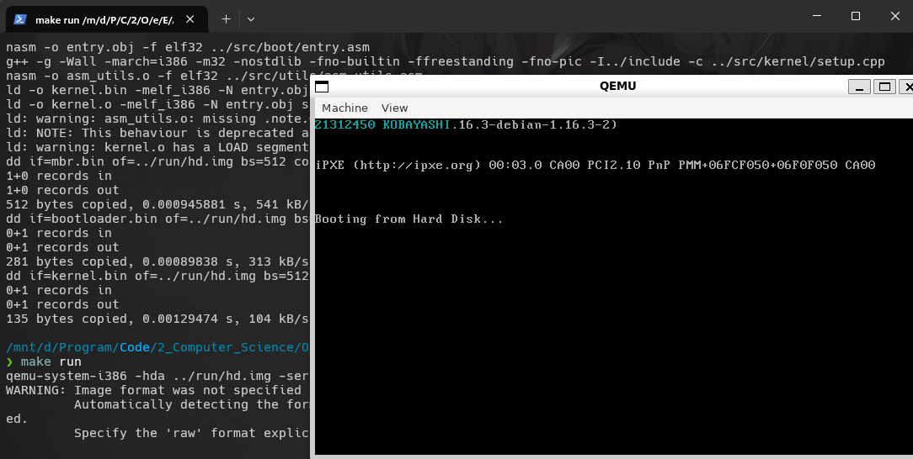


### Assignment 3 中断的处理

> 复现Example 3，你可以更改Example中默认的中断处理函数为你编写的函数，然后触发之，结果截图并说说你是怎么做的。

复现Example 3，启动gdb调试，在`setup_kernel`函数处打断点，然后运行程序。同时，使用`x/256gx 0x8880`查看初始化前的默认中断描述符。如下：

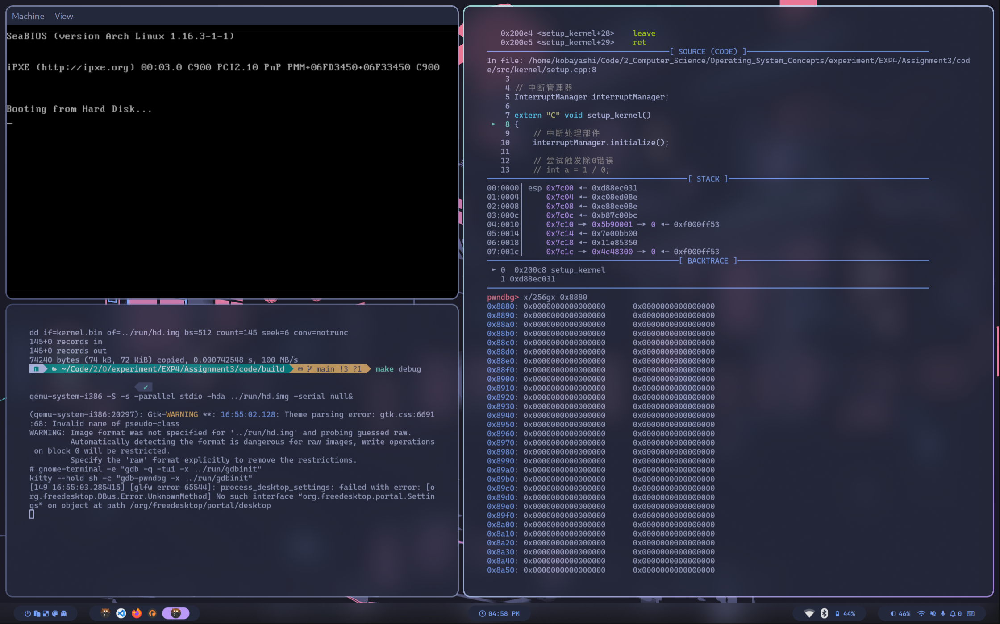

继续运行，执行完`interruptManager.initialize()`后，可以看到默认中断IDT已经被修改：

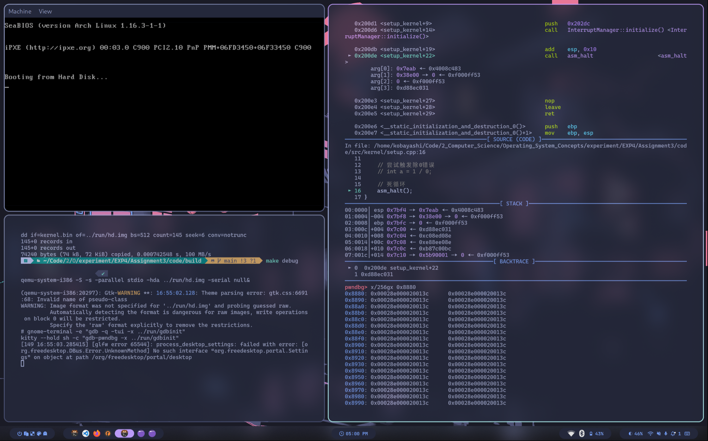

最后，我们尝试触发0异常来验证`asm_unhandled_interrupt`是否可以可以正常工作：

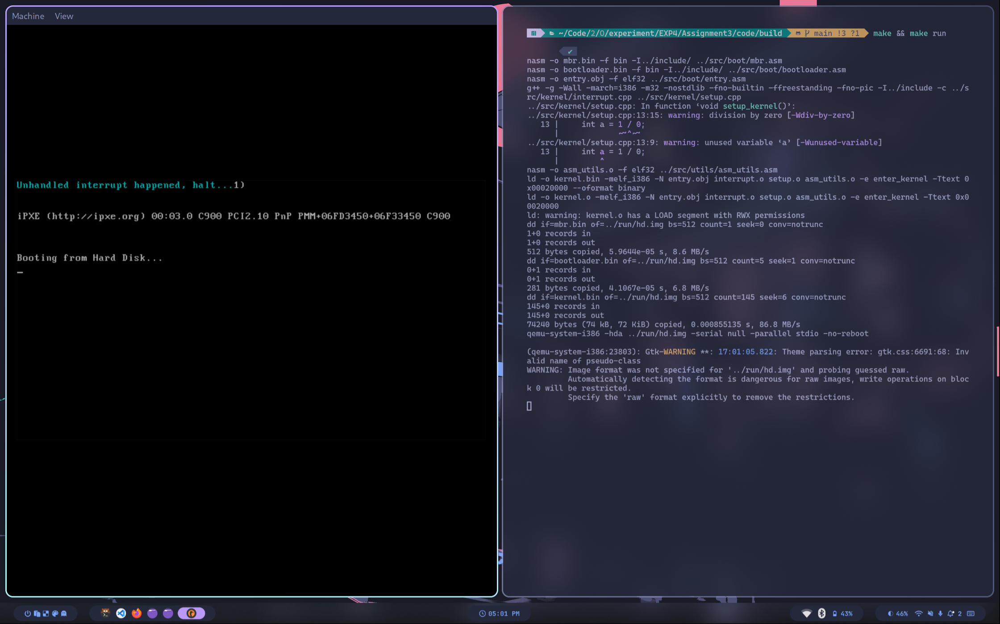

最终结果符合预期。

### Assignment 4 时钟中断

> 复现Example 4，仿照Example中使用C语言来实现时钟中断的例子，利用C/C++、 InterruptManager、STDIO和你自己封装的类来实现你的时钟中断处理过程，结果截图并说说你是怎么做的。注意，不可以使用纯汇编的方式来实现。(例如，通过时钟中断，你可以在屏幕的第一行实现一个跑马灯。跑马灯显示自己学号和英文名，即类似于LED屏幕显示的效果。)

复现Example 4，运行效果如下：

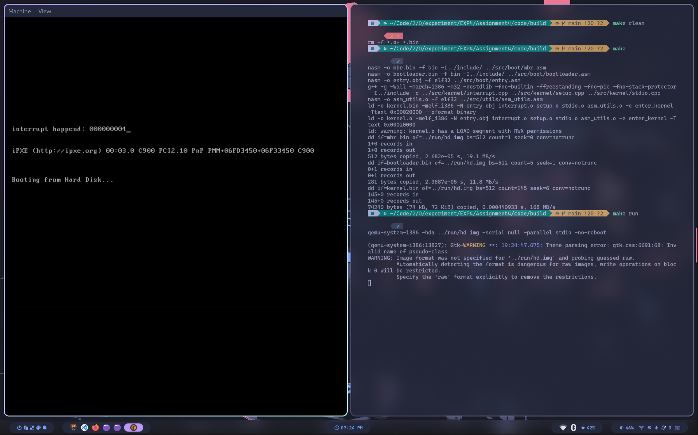

要通过时间中断实现一个跑马灯程序，只需要修改`interrupt.cpp`文件中的`c_time_interrupt_handler()`函数，如下：

```cpp
// interrupt handler
extern "C" void c_time_interrupt_handler()
{
    // clear screen 
    for (int i = 0; i < 80; ++i)
    {
        stdio.print(0, i, ' ', 0x07);
    }

    times += 1;

    char msg[] = "21312450 LinJunZhe";

    // move cursor to (0, times % 80)
    stdio.moveCursor(times % 80);
    // print msg
    for (int i = 0; msg[i]; ++i)
    {
        if (i == 80 - times % 80) {
            stdio.moveCursor(0);
        }
        stdio.print(msg[i], times % 80);
    }
}
```

运行效果如下：

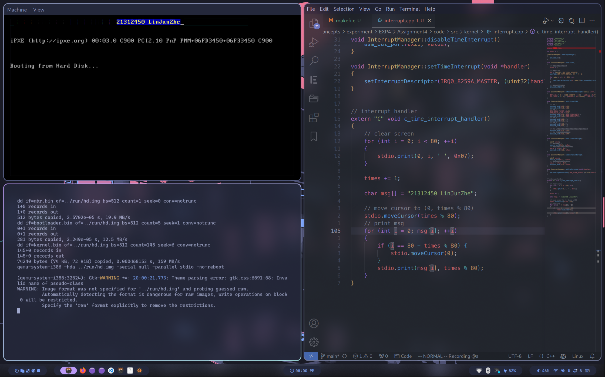


## 总结

通过本次实验，我学习到了混合编程以及中断的基本实现方式。在实验过程中，我有遇到一些问题，如下：

从这次实验开始，我将实验从VMware虚拟机转为了WSL虚拟机与Manjaro本地环境，这将意味着参考文件所给出的`makefile`文件并不适用于我的实验环境。因此我需要简单地修改`makefile`文件，使得它能够在我的环境下编译运行。

**WSL2 KALI**

```sh
debug:
    qemu-system-i386 -S -s -parallel stdio -hda $(RUNDIR)/hd.img -serial null&
	@sleep 1
    fish -c "gdb -x $(RUNDIR)/gdbinit"
```

**Manjaro Linux**

```sh
...

CXX_COMPLIER_FLAGS = -g -Wall -march=i386 -m32 -nostdlib -fno-builtin -ffreestanding -fno-pic -fno-stack-protector

...

debug:
	qemu-system-i386 -S -s -parallel stdio -hda $(RUNDIR)/hd.img -serial null&
	@sleep 1
	kitty --hold sh -c "gdb-pwndbg -x $(RUNDIR)/gdbinit"
```

其中，`-fno-stack-protector`是为了避免栈保护机制。若不添加这个选项，则又可能会出现以下错误：

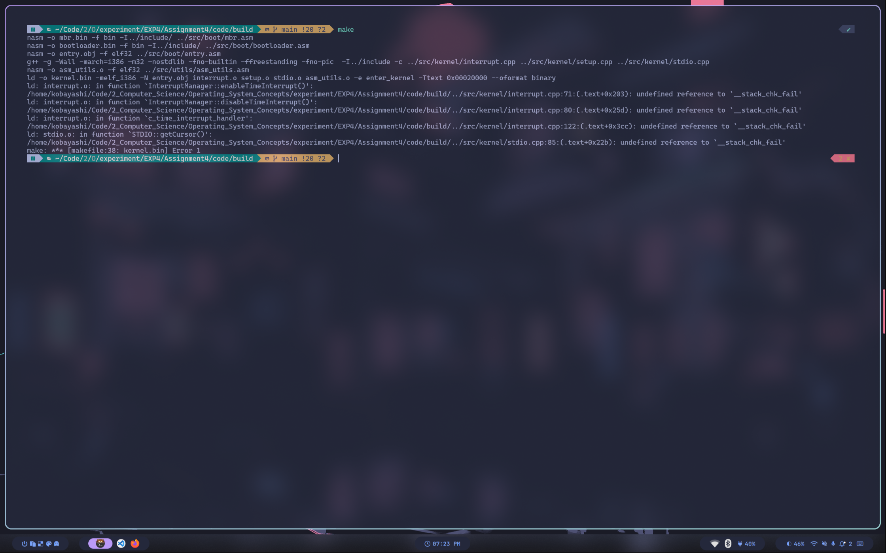
