# 操作系统原理实验报告

- **实验名称**：内核线程
- **授课教师**：张青
- **学生姓名**：林隽哲
- **学生学号**：21312450

[toc]

## 实验要求

## 实验过程

### Assignment 1 printf的实现

> 学习可变参数机制，然后实现printf，你可以在材料中的printf上进行改进，或者从头开始实现自己的printf函数。结果截图并说说你是怎么做的。

首先来尝试一下头文件`stdarg.h`中的可变参数机制，如下：

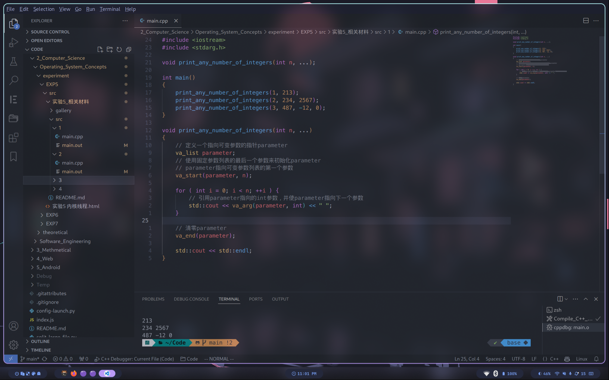

然后，根据可变参数的实现原理，实现自己的可变参数机制，编写运行如下：

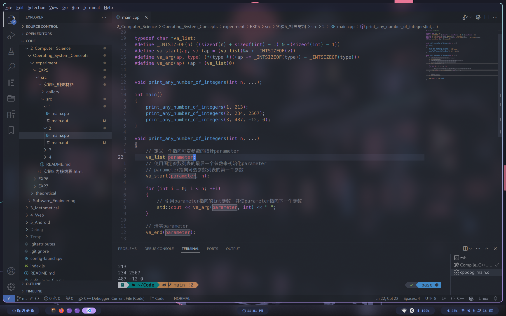

接下来，先根据参考材料中给出的样例实现一个`printf`函数，运行效果如下：

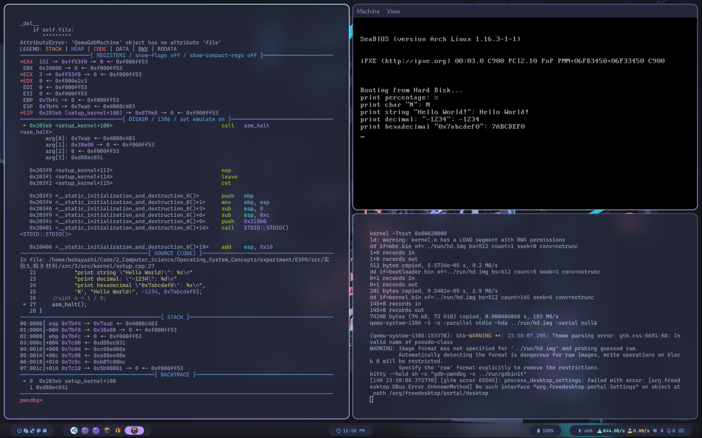

我在原样例的基础上，重新修改了`STDIO`类的一些实现逻辑，如下：

首先来看修改后的`stdio.h`文件：

```cpp
#ifndef STDIO_H
#define STDIO_H

#include "os_type.h"

class STDIO
{
private:
    uint8 *screen;

public:
    STDIO();
    // 初始化函数
    void initialize();
    // 打印字符c，颜色color到位置(x,y)
    void print(uint x, uint y, uint8 c, uint8 color);
    // 打印字符c，颜色color到光标位置
    void print(uint8 c, uint8 color);
    // 打印字符c，颜色默认到光标位置
    void print(uint8 c);
    // 打印字符串，颜色默认
    int print(const char *const str);
    // 移动光标到一维位置
    void moveCursor(uint position);
    // 移动光标到二维位置
    void moveCursor(uint x, uint y);
    // 获取光标位置
    uint getCursor();

private:
    // 滚屏
    void rollUp();
};

int printf(const char *const fmt, ...);

#endif
```

相对于原来的实现，我将`STDIO::print(uint x, uint y, uint8 character, uint8 color)`函数作为最低层的函数，我认为这样的逻辑能更方便我对函数功能的增加进行管理。接下来我们来看具体的实现：

修改后的`stdio.cpp`:

```cpp
#include "stdio.h"
#include "os_type.h"
#include "asm_utils.h"
#include "os_modules.h"
#include "stdarg.h"
#include "stdlib.h"

STDIO::STDIO() {
    initialize();
}

void STDIO::initialize() {
    screen = (uint8 *)(0xb8000);
}

void STDIO::print(uint8 character, uint8 color) {
    uint cursor_pos = getCursor();
    uint cur_x = cursor_pos / 80;
    uint cur_y = cursor_pos % 80;
    print(cur_x, cur_y, character, color);
}

void STDIO::print(uint x, uint y, uint8 character, uint8 color) {

    if (x >= 25 || y >= 80) {
        return ;
    }

    switch (character) {
    case '\n':
        print_backslash_n();
        return ;
    case '\t':
        print_backslash_t();
        return ;
    case '\b':
        print_backslash_b();
        return ;
    }
  
    uint cursor_pos = x * 80 + y;
    screen[2 * cursor_pos] = character;
    screen[2 * cursor_pos + 1] = color;

    if (++cursor_pos == 25 * 80) {
        rollUp();
        cursor_pos = 24 * 80;
    }
    moveCursor(cursor_pos);
}

int STDIO::print(const char* str, uint8 color) {
    int i = 0;
    while (str[i]) {
        print(str[i], color);
        i++;
    }
    return i;
}

int STDIO::print(uint x, uint y, const char *const str, uint8 color) {
    uint cur_pos = getCursor();
    moveCursor(x, y);
    int i = 0;
    while (str[i]) {
        print(str[i], color);
        i++;
    }
    moveCursor(cur_pos);
    return i;
}

void STDIO::moveCursor(uint position) {

    if (position >= 80 * 25) {
        return ;
    }

    uint8 high = (position >> 8) & 0xFF;
    uint8 low = position & 0xFF;

    asm_out_port(0x3D4, 0x0E);
    asm_out_port(0x3D5, high);
    asm_out_port(0x3D4, 0x0F);
    asm_out_port(0x3D5, low);
}

void STDIO::moveCursor(uint x, uint y) {
    if (x >= 25 || y >= 80) {
        return ;
    }
    moveCursor(x * 80 + y);
}

uint STDIO::getCursor() {
    uint pos = 0;
    uint8 temp;

    // Get the high byte of the cursor's position
    asm_out_port(0x3D4, 0x0E);
    asm_in_port(0x3D5, &temp);
    pos = ((uint)temp) << 8;
    // Get the low byte of the cursor's position
    asm_out_port(0x3D4, 0x0F);
    asm_in_port(0x3D5, &temp);
    pos |= (uint)temp;
    
    return pos;
}

void STDIO::rollUp() {
    uint length = 25 * 80;
    for (uint i = 80; i < length; ++i) {
        screen[2 * (i - 80)] = screen[2 * i];
        screen[2 * (i - 80) + 1] = screen[2 * i + 1];
    }
    for (uint i = 24 * 80; i < length; ++i) {
        screen[2 * i] = ' ';
        screen[2 * i + 1] = 0x07;
    }
}

void STDIO::print_backslash_n() {
    uint row = getCursor() / 80;
    if (row == 24) {
        rollUp();
    } else {
        ++row;
    }
    moveCursor(row * 80);
}

void STDIO::print_backslash_t() {
    // Assuming tab size of 4 spaces for simplicity
    int space_indent = 4 - getCursor() % 4;
    for (int i = 0; i < space_indent; ++i) {
        print(' ');
    }
}

void STDIO::print_backslash_b() {
    uint cursor_pos = getCursor();
    if (cursor_pos == 0) {
        return ;
    }
    moveCursor(--cursor_pos);
}

int printf_add_to_buffer(char *buffer, char character, int &idx, const int BUF_LEN)
{
    int counter = 0;

    buffer[idx] = character;
    ++idx;

    if (idx == BUF_LEN)
    {
        buffer[idx] = '\0';
        counter = stdio.print(buffer);
        idx = 0;
    }

    return counter;
}

int printf(const char *const fmt, ...)
{
    const int BUF_LEN = 32;

    char buffer[BUF_LEN + 1];
    char number[33];

    int idx, counter;
    va_list ap;

    va_start(ap, fmt);
    idx = 0;
    counter = 0;

    for (int i = 0; fmt[i]; ++i)
    {
        if (fmt[i] != '%')
        {
            counter += printf_add_to_buffer(buffer, fmt[i], idx, BUF_LEN);
        }
        else
        {
            i++;
            if (fmt[i] == '\0')
            {
                break;
            }

            switch (fmt[i])
            {
            case '%':
                counter += printf_add_to_buffer(buffer, fmt[i], idx, BUF_LEN);
                break;

            case 'c':
                counter += printf_add_to_buffer(buffer, va_arg(ap, char), idx, BUF_LEN);
                break;

            case 's':
                buffer[idx] = '\0';
                idx = 0;
                counter += stdio.print(buffer);
                counter += stdio.print(va_arg(ap, const char *));
                break;

            case 'd':
            case 'x':
                int temp = va_arg(ap, int);

                if (temp < 0 && fmt[i] == 'd')
                {
                    counter += printf_add_to_buffer(buffer, '-', idx, BUF_LEN);
                    temp = -temp;
                }

                itos(number, temp, (fmt[i] == 'd' ? 10 : 16));

                for (int j = 0; number[j]; ++j)
                {
                    counter += printf_add_to_buffer(buffer, number[j], idx, BUF_LEN);
                }
                break;
            }
        }
    }

    buffer[idx] = '\0';
    counter += stdio.print(buffer);

    return counter;
}
```

相比于原来的样例，我还增添了对`\t`的支持等功能。接下来我们来看一下测试的效果：

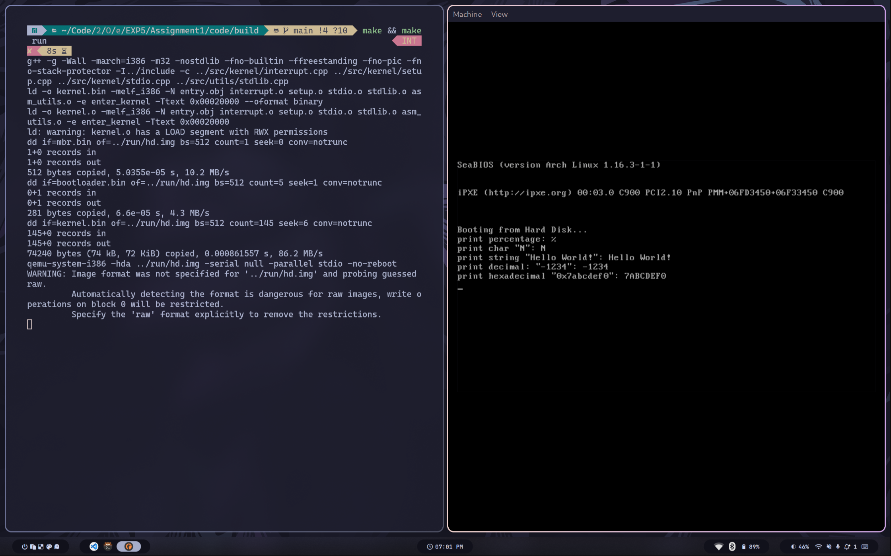

可见最终运行结果符合预期。


### Assignment 2 线程的实现

> 自行设计PCB，可以添加更多的属性，如优先级等，然后根据你的PCB来实现线程，演示执行结果。

首先按照参考样例的PCB样例进行编写，运行效果如下：

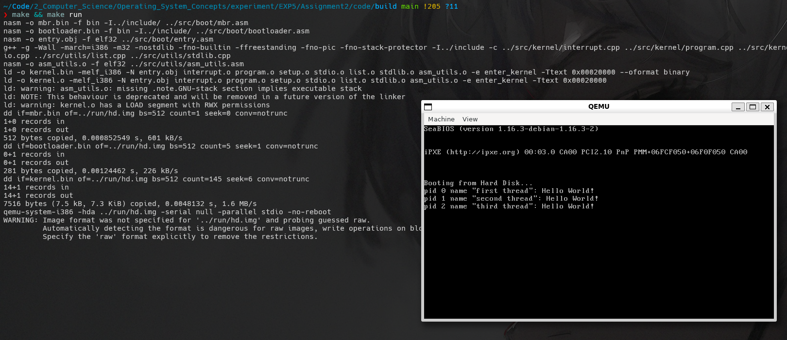

样例中的PCB信息已经很详细了，我在这里只简单的尝试添加一项**线程信息**，如下：

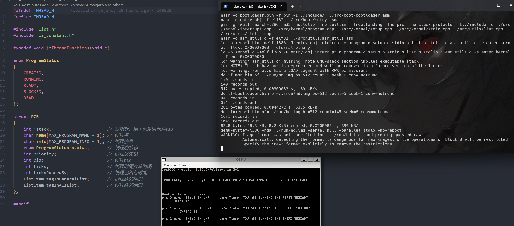


### Assignment 3 线程调度切换的秘密

> 操作系统的线程能够并发执行的秘密在于我们需要中断线程的执行，保存当前线程的状态，然后调度下一个线程上处理机，最后使被调度上处理机的线程从之前被中断点处恢复执行。现在，同学们可以亲手揭开这个秘密。
> 
> 编写若干个线程函数，使用gdb跟踪c_time_interrupt_handler、asm_switch_thread等函数，观察线程切换前后栈、寄存器、PC等变化，结合gdb、材料中“线程的调度”的内容来跟踪并说明下面两个过程。
> 
> - 一个新创建的线程是如何被调度然后开始执行的。
> - 一个正在执行的线程是如何被中断然后被换下处理器的，以及换上处理机后又是如何从被中断点开始执行的。
> 
> 通过上面这个练习，同学们应该能够进一步理解操作系统是如何实现线程的并发执行的。

首先进入gdb调试环境，并分别在`c_time_interrupt_handler`、`schedule`、`executeThread`和`asm_switch_thread`四个函数起始处设置断点，如下：

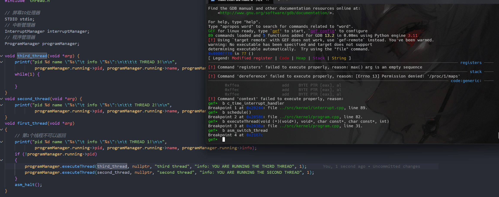

`continue`运行程序，`setup_kernel`函数中将会调用`executeThread`函数来创建第一个线程，断点此时停在`executeThread`中，继续运行到程序创建第一个线程的PCB表，并将线程信息保存到其中之后，我们将它打印出来，如下：

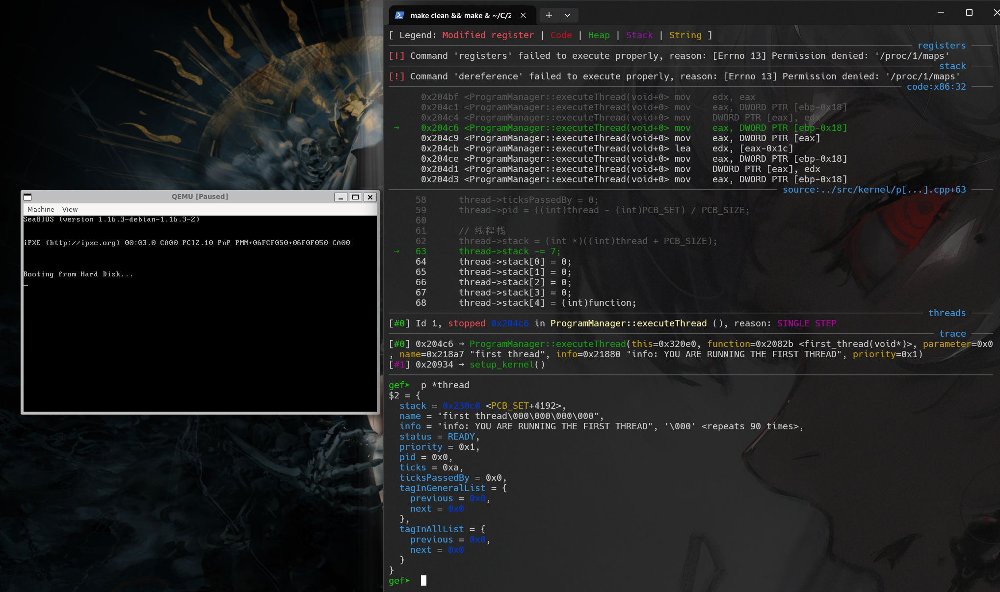

接下来，在初始化线程栈之前，我们先将线程栈初始化之前的状态打印出来，方便我们稍后对比，如下：

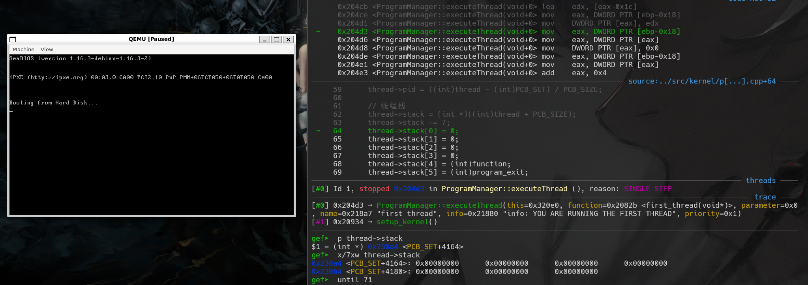

在完成线程栈的初始化之后，我们再次打印线程栈的状态如下。可以看到，此时`function`（也即是函数`first_thread`）、`program_exit`函数以及`function`的参数`parameter`都已经被正确地保存到线程栈中。

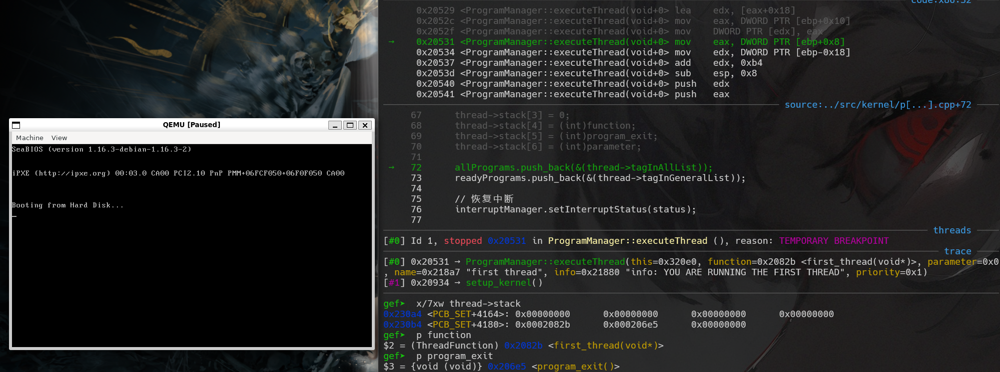

运行到`executeThread`的末尾，并且打印此时的`allPrograms`队列以及`readyPrograms`队列的状态，注意此时两个队列的`previous`指针分别指向了PCB表`thread`中的`tagInGeneralList`项与`tagInAllList`项，如下：

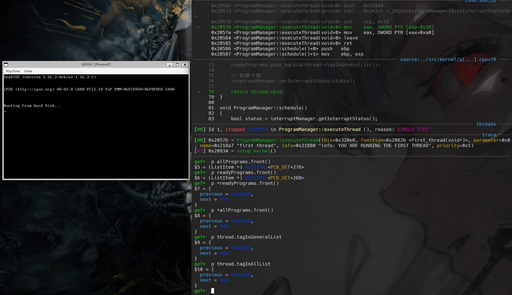

随后在`c_time_interrupt_handler`被时钟中断调用后，由于是首个线程，我们刚刚创建的PCB将会直接通过`schedule`函数调度并执行，为了避免后续重复，这里先略过中间的调度过程。最终第一个线程的创建以及执行效果如下，可以看见此时第一个线程已经开始执行并在中断中输出了执行信息，同时第二第三个线程也由第一个线程通过`executeThread`进行创建并加入到了线程队列中，创建过程与上述相同，不再赘述。

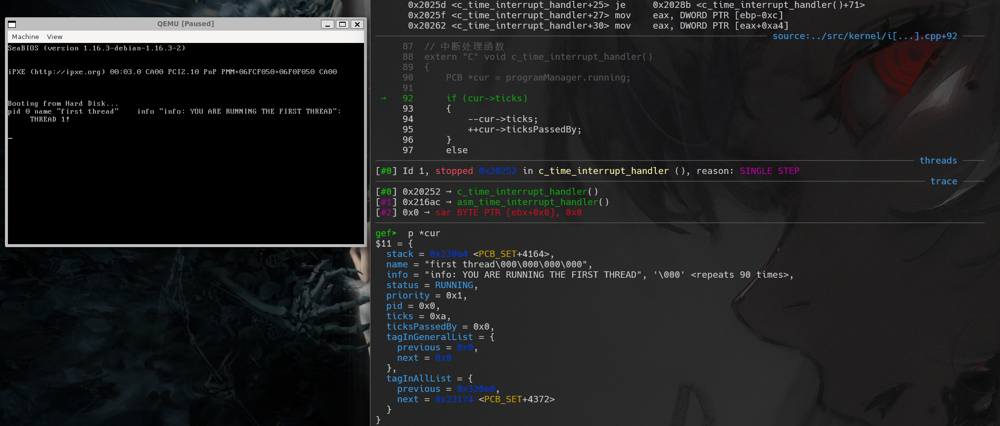

由于我们使用的为RR调度，每一次时间中断调用后，线程PCB中的时间片计数将会减1，而在当前运行的线程所持有的时间片归0时，调度器`schedule`将会被触发，线程将会被调度。这里就回答了一个正在执行的线程是如何被中断然后被换下处理器的问题。如下：

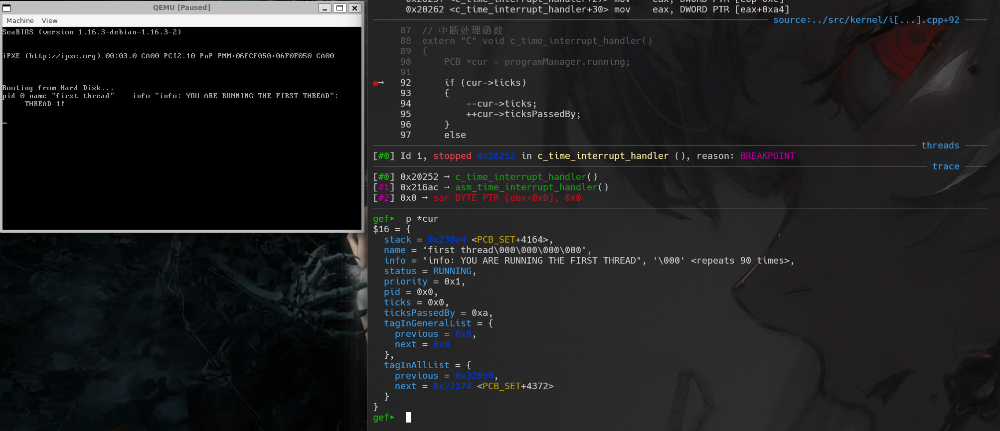

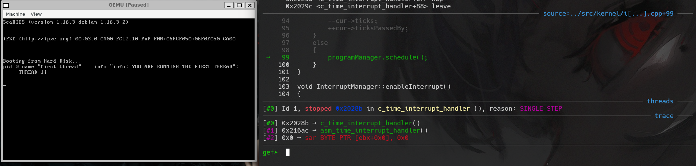

此时我们查看准备队列的大小，可以看到由第一个线程创建的第二第三个线程已经被加入到了准备队列中：

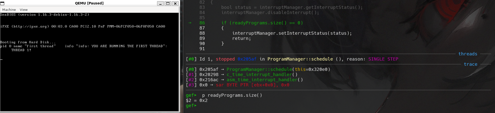

随后进入到`schedule`调度函数中，我们获取下一个要执行的线程的PCB与当前正在执行的线程的PCB，并分别将用`next`指针和`cur`指针指向它们。随后，若`cur`指针指向的PCB状态为`running`，则`cur`指向的PCB的状态将会被设为`READY`，并且被加入到准备队列的尾部；而`next`指向的PCB的状态将会被设为`RUNNING`，线程管理器的`running`指针将会指向`next`所指向的PCB。打印变化之后的`next`指针与`cur`指针分别指向的PCB表信息如下：

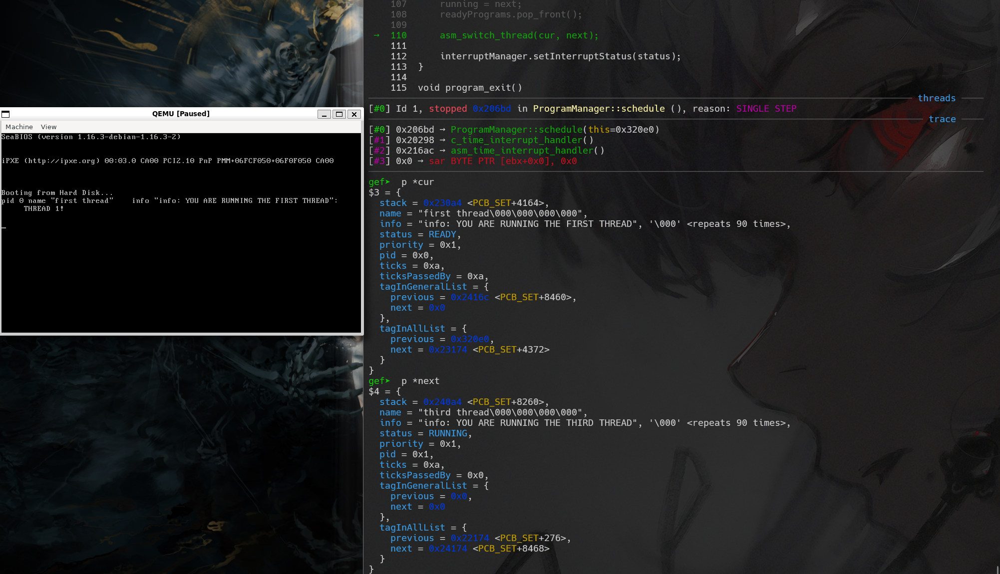

随后程序进入到汇编函数`asm_switch_thread`中，线程的切换将会在该函数内完成。函数首先会将当前的`esp`信息保存到当前线程的PCB中，如下：

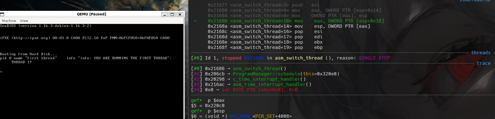

然后，下一个要执行的线程的PCB内保存的`esp`信息将会被加载到`eax`寄存器中，然后存入到`esp`寄存器中，如下：

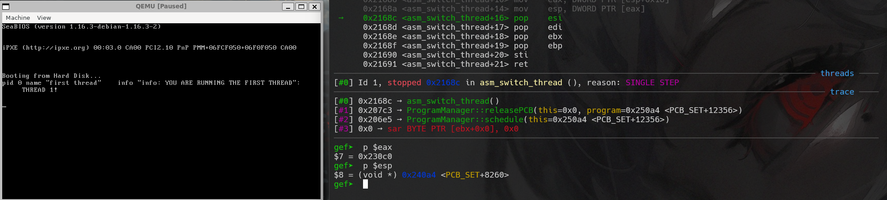

`esp`寄存器中的内容将会指向线程的栈顶，当`asm_switch_thred`执行`ret`指令返回后，分两种情况讨论：1. 对于一个刚创建的线程，预先放在PCB中的4个0值将会依次存放到`esi`、`edi`、`ebx`、`ebp`中，随后线程要执行的函数地址`function`、线程的返回地址`exit_program`以及线程的参数`parameter`将会依次被加载。其中`funciton`被加载入`eip`寄存器中，从而使得CPU跳转到线程要执行的函数地址中执行；2. 对于一个在执行过程中被中断的线程，其原理与上述相同，只是被载入`eip`的内容变为了函数被中断的地址。如此便回答了一个新创建的线程是如何被调度然后开始执行的问题与一个被中断线程换上处理机后又是如何从被中断点开始执行的的问题。最终的执行效果如下：

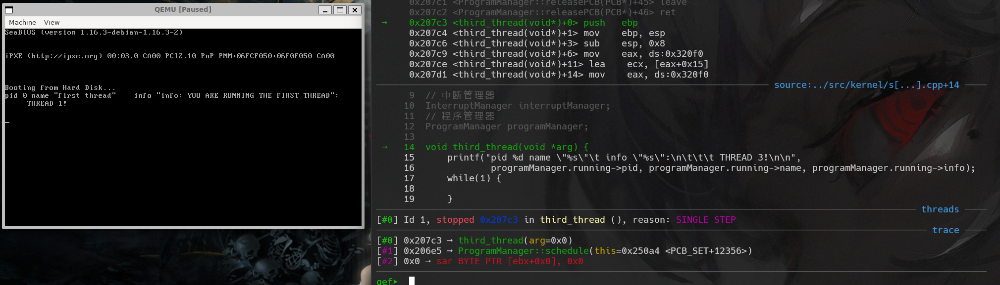

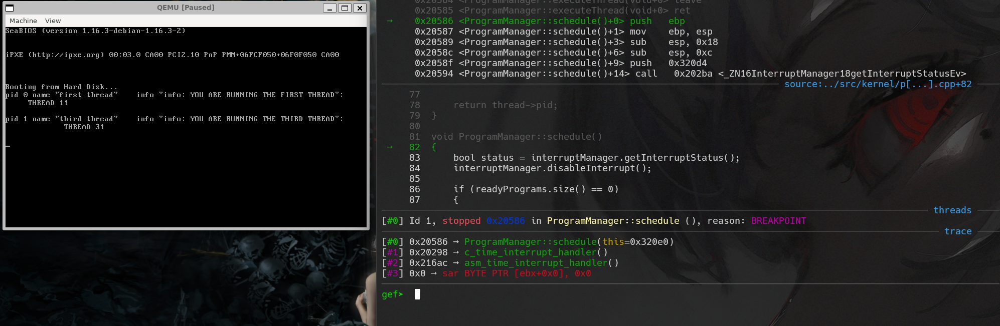


### Assignment 4 调度算法的实现

> 在材料中，我们已经学习了如何使用时间片轮转算法来实现线程调度。但线程调度算法不止一种，例如
>
> - 先来先到服务。
> - 最短作业（进程）优先。
> - 响应比最高者优先算法。
> - 优先级调度算法。
> - 多级反馈队列调度算法。
>
> 此外，我们的调度算法还可以是抢占式的。
> 现在，同学们需要将线程调度算法修改为上面提到的算法或者是同学们自己设计的算法。然后，同学们需要自行编写测试样例来呈现你的算法实现的正确性和基本逻辑。最后，将结果截图并说说你是怎么做的。

我分别实现了先来先到服务以及优先级调度算法。两个算法的实现都是通过对时钟中断触发的处理函数以及线程管理器的调度函数进行修改。

先来先到服务算法的实现如下：

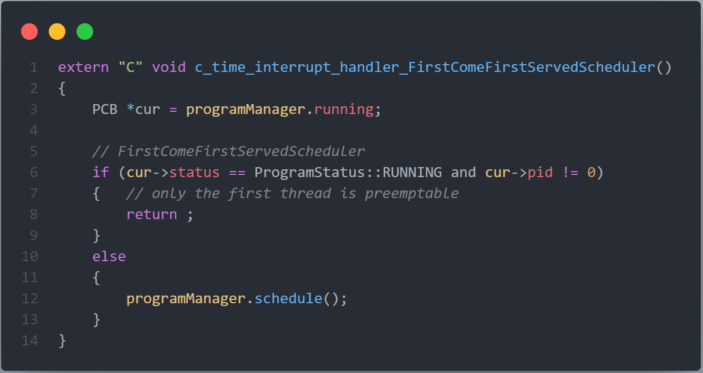

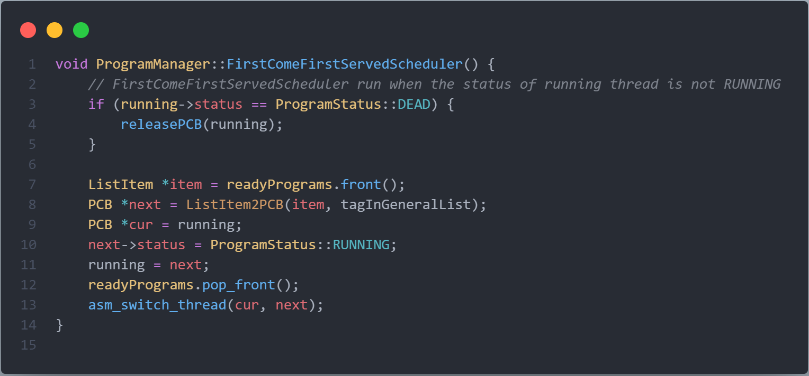

先来先到服务算法的运行效果如下：

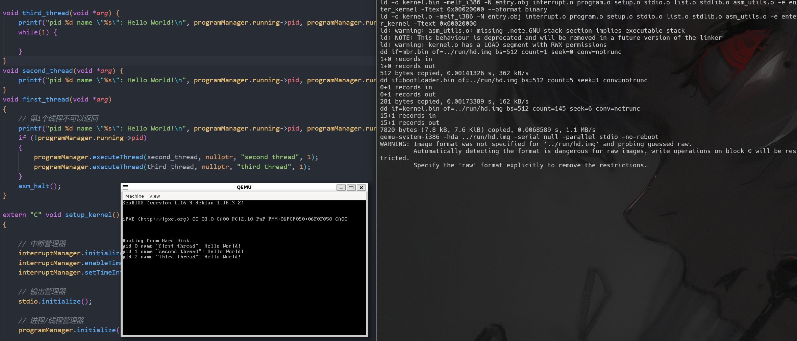

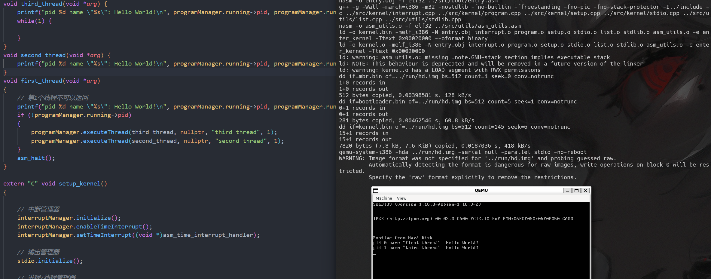

可以看到，先来先到服务于线程的创建顺序有关。若先创建的线程卡死，则后创建的线程将会一直等待。

优先级调度算法的实现如下：

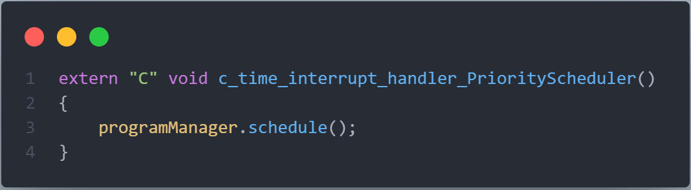

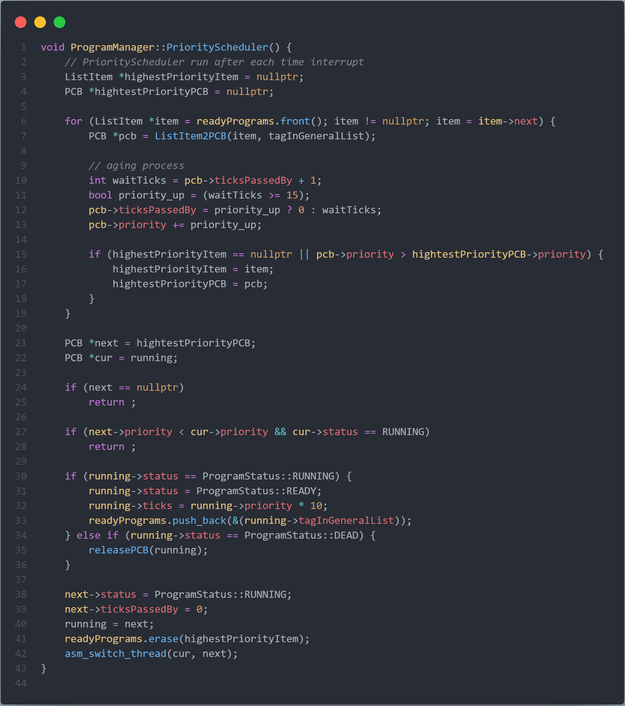

优先级调度算法的运行效果如下：

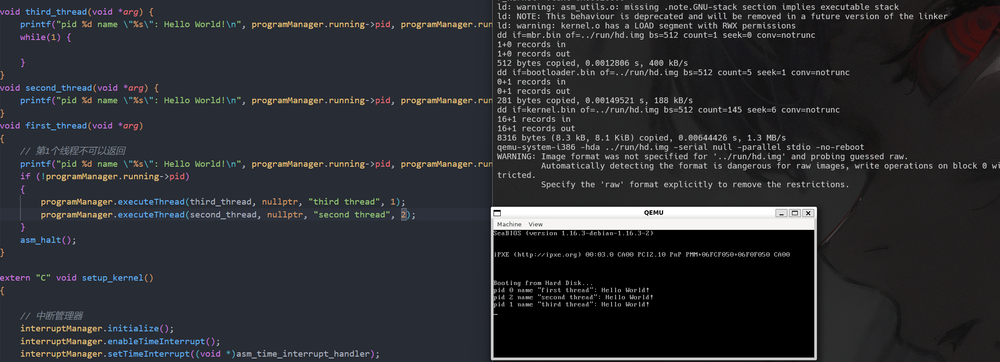

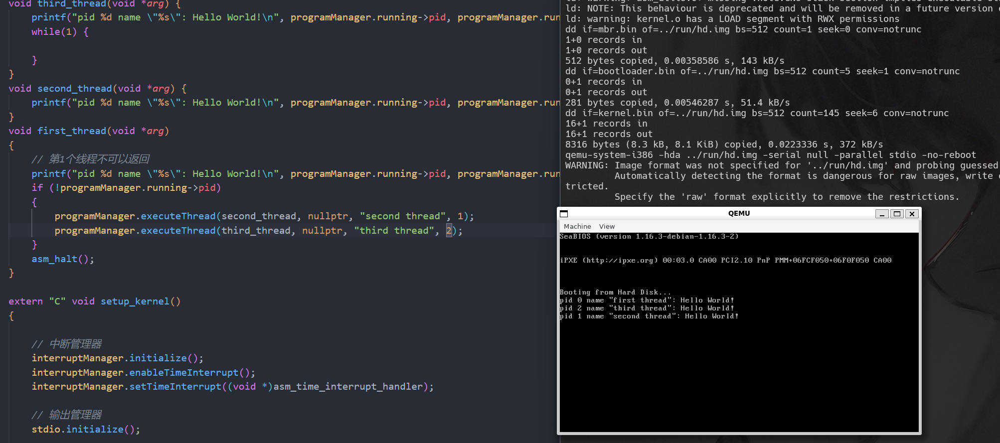

可以看到，优先级调度算法于线程的优先级有关。优先级高的线程将会优先被调度或抢占低优先级的线程。同时我在此处实现了老化算法，即线程的优先级每隔一段时间就会降低一级，以防止线程饥饿。


## 总结

在本次的实验中，我学习到了有关线程调度以及线程时如何并行执行的相关知识。样例中给出的线程调度的实现十分巧妙，虽然比较难以理解，但也相当有趣。