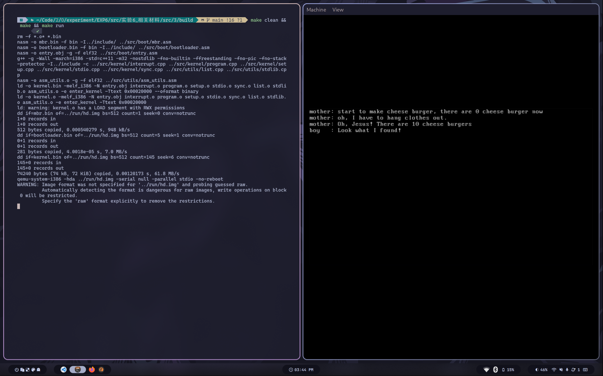

# 操作系统原理实验报告

- **实验名称**：并发与锁机制
- **授课教师**：张青
- **学生姓名**：林隽哲
- **学生学号**：21312450

[toc]

## 实验要求

## 实验过程

### Assignment 1 代码复现

#### A.1.1 代码复现

> 在本章中，我们已经实现了自旋锁和信号量机制。现在，同学们需要复现教程中的自旋锁和信号量的实现方法，并用分别使用二者解决一个同步互斥问题，如消失的芝士汉堡问题。最后，将结果截图并说说你是怎么做的。

首先来复现消失的芝士汉堡问题，如下：

可以看出，共享变量`cheese_burger`在被`a_mother`线程或得后并没有被保护，因而其值会在其仍在被`a_mother`线程使用的时候被`a_naughty_boy`线程修改。

接下来复现自旋锁的解决方法，效果如下：

可以看出，此时的共享变量`cheese_burger`成功被自旋锁保护。

接下来复现信号量的解决方法，效果如下：

可以看出，此时的共享变量`cheese_burger`成功被信号量保护。

#### A.1.2 锁机制的实现

> 我们使用了原子指令xchg来实现自旋锁。但是，这种方法并不是唯一的。例如，x86指令中提供了另外一个原子指令bts和lock前缀等，这些指令也可以用来实现锁机制。现在，同学们需要结合自己所学的知识，实现一个与本教程的实现方式不完全相同的锁机制。最后，测试你实现的锁机制，将结果截图并说说你是怎么做的。

先来解释`bts`与`lock`：

- `bts` instruction: is used to set a bit at the specified operand and store the original value of that bit in the CF flag.
- `lock` prefix: is used to lock the execution of an instruction, ensuring atomicity in a multi-processor environment.

接下来，通过原子指令`bts`与`lock`前缀来实现锁机制，如下：

编写汇编函数`void asm_atomic_test_and_set(uint32 *memory)`如下：

修改自旋锁的实现方法如下：

实现比较简单，具体解释可以看其中的代码注释，这里不再赘述。

最后来看运行效果，如下：

可见最后的运行效果符合预期。

### Assignment 2 生产者-消费者问题

#### A.2.1 Race Condition

> 同学们可以任取一个生产者-消费者问题，然后在本教程的代码环境下创建多个线程来模拟这个问题。在2.1中，我们不会使用任何同步互斥的工具。因此，这些线程可能会产生冲突，进而无法产生我们预期的结果。此时，同学们需要将这个产生错误的场景呈现出来。最后，将结果截图并说说你是怎么做的。

在`setup.cpp`中创建一个简单的生产者-消费者问题模型，如下：

比较简单，`producer_thread`将会生产资源`source`，`consumer_thread`将会消耗资源`source`。

可见此时的资源`source`是没有被保护的，这将意味着出于各种不可控因素，最终的`source`结果将不可预测（但它理想情况下应该是0），如下：

#### A.2.2 信号量解决方法

> 使用信号量解决上述你提出的生产者-消费者问题。最后，将结果截图并说说你是怎么做的。

我们分别为生产者与消费者增加信号量，如下：

最终运行效果如下，可以到最终`source`的结果为0：

### Assignmet 3 线程调度切换的秘密

> 假设有 5 个哲学家，他们的生活只是思考和吃饭。这些哲学家共用一个圆桌，每位都有一把椅子。在桌子中央有一碗米饭，在桌子上放着 5 根筷子。
>
> 当一位哲学家思考时，他与其他同事不交流。时而，他会感到饥饿，并试图拿起与他相近的两根筷子（筷子在他和他的左或右邻居之间）。一个哲学家一次只能拿起一根筷子。显然，他不能从其他哲学家手里拿走筷子。当一个饥饿的哲学家同时拥有两根筷子时，他就能吃。在吃完后，他会放下两根筷子，并开始思考。

#### A.3.1 初步解决方法

> 同学们需要在本教程的代码环境下，创建多个线程来模拟哲学家就餐的场景。然后，同学们需要结合信号量来实现理论课教材中给出的关于哲学家就餐问题的方法。最后，将结果截图并说说你是怎么做的。

首先使用线程模拟一个哲学家就餐的场景，并引入信号量，如下：

运行效果如下（此处可能看上去有点奇怪，毕竟一直只有一个哲学家在吃。这主要是因为我延长了哲学家就餐的过程，这样做是为了方便下面构建死锁环境）：

#### A.3.2 死锁解决方法

> 虽然3.1的解决方案保证两个邻居不能同时进食，但是它可能导致死锁。现在，同学们需要想办法将死锁的场景演示出来。然后，提出一种解决死锁的方法并实现之。最后，将结果截图并说说你是怎么做的。

首先，尝试死锁的场景，代码如下：

运行效果如下：

可见，此时5个哲学家分别都拿起了其左手边的筷子，导致死锁。

要解决死锁问题，我们可以简单通过添加条件“只有当一个哲学家能够同时拿起两根筷子时，才允许他同时拿起两根筷子”。具体实现如下：

运行效果如下：

可以看出，此时死锁问题得到了解决。

## 总结

通过本次实验，我更加深入地了解了资源的保护与互斥，以及信号量与自旋锁的实现方法。同时，我也学习到了死锁的概念以及解决死锁问题的方法。