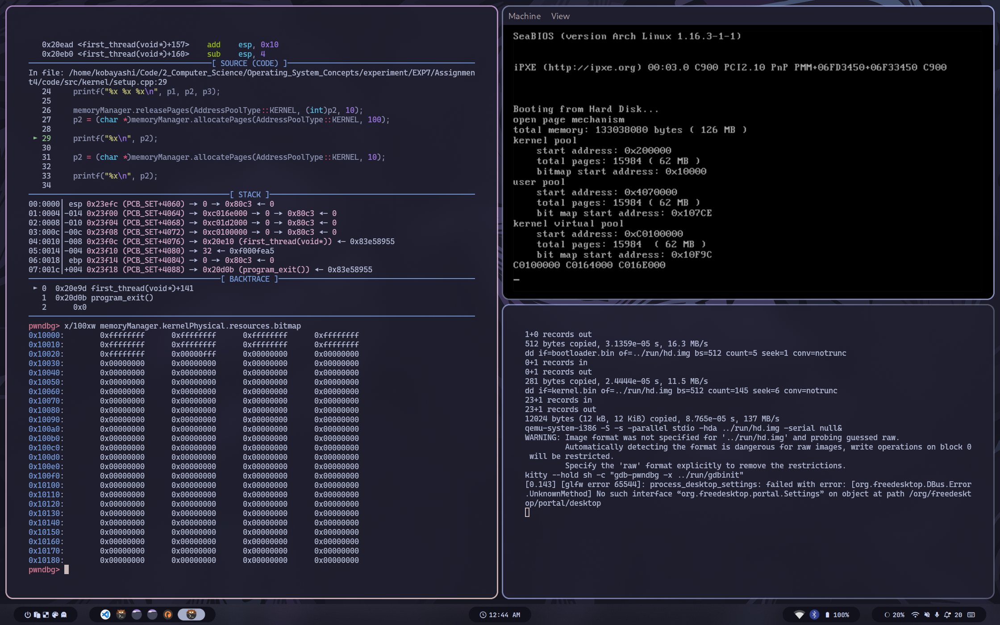

# 操作系统原理实验报告

- **实验名称**：内存管理
- **授课教师**：张青
- **学生姓名**：林隽哲
- **学生学号**：21312450

[toc]

## 实验要求

## 实验过程

### Assignment 1 实现二级分页机制

> 复现参考代码，实现二级分页机制，并能够在虚拟机地址空间中进行内存管理，包括内存的申请和释放等，截图并给出过程解释。

首先来根据参考代码，查看我们可以管理的内存大小，如下：


可见，我们可以管理的内存大小为126MB。得到了内存的大小后，接下来依次复现位图（bitmap）、地址池（address pool）、物理页管理、二级分页机制与虚拟页内存管理。

开始时，内存管理器首先需要运行函数`openPageMechanism`开启CPU的二级分页机制。开启过程主要分为三步：

1. 规划好页目录表和页表在内存中的位置并写入内容。
2. 将页目录表的地址写入cr3。cr3寄存器保存的是页目录表的地址，使得CPU的MMU能够找到页目录表的地址，然后自动地将线性地址转换为物理地址。cr3又被称为页目录表的基址寄存器PDBR。
3. 将cr0的PG位置1，开启分页机制。启动分页机制的开关是将控制寄存器cr0的PG位置1，PG位是cr0寄存器的第31位，PG为1后便进入了内存分页运行机制。

具体如下：


随后，在进行物理内存管理之前，我们需要进行初始化，从而划分出内核物理地址空间和用户物理地址空间，以及划分存放位图、内核、页表等的内存空间。具体如下：


当要分配内存时，我们调用`allocatePages`函数，并指定需要分配的页数：


进入`allocatePages`函数后，需要依次创建一块虚拟页与一块物理页，创建的过程实际上是内存管理池通过bitmap标记空闲项的过程。如下：


在成功创建虚拟页与物理页后，我们需要通过`connectPysicalVirtualPage`函数将虚拟页映射到物理页。映射通过在页表中写入页表项来实现。如下：


最后，如果要释放内存，我们调用`releasePages`函数，并指定需要释放的页数。其过程相当于分配过程的逆过程，不再赘述。如下：


### Assignment 2 实现动态分区算法 

> 参照理论课上的学习的物理内存分配算法如first-fit, best-fit等实现动态分区算法等，或者自行提出自己的算法。

我分别实现了`first-fit`与`best-fit`算法。它们都可以简单地通过`BitMap`实现，如下：

**first-fit算法**


**best-fit算法**


在`setup.cpp`中添加如下所示测试代码：

```cpp
void first_thread(void *arg)
{
    char *p1 = (char *)memoryManager.allocatePages(AddressPoolType::KERNEL, 100);
    char *p2 = (char *)memoryManager.allocatePages(AddressPoolType::KERNEL, 10);
    char *p3 = (char *)memoryManager.allocatePages(AddressPoolType::KERNEL, 100);

    printf("%x %x %x\n", p1, p2, p3);

    memoryManager.releasePages(AddressPoolType::KERNEL, (int)p2, 10);
    p2 = (char *)memoryManager.allocatePages(AddressPoolType::KERNEL, 100);

    printf("%x\n", p2);

    p2 = (char *)memoryManager.allocatePages(AddressPoolType::KERNEL, 10);
    
    printf("%x\n", p2);

    asm_halt();
}
```

最终`first-fit`算法的运行效果如下：


而`best-fit`算法的运行效果如下：


可见，对于`best-fit`算法，分配内存时会选择大于所需内存的最小空闲孔，而对于`first-fit`算法，分配内存时会选择第一个满足条件的空闲孔。


### Assignment 3 实现页面置换算法

> 参照理论课上虚拟内存管理的页面置换算法如FIFO、LRU等，实现页面置换，也可以提出自己的算法。

我在这里实现了FIFO页面置换算法。

方便起见，我选择直接在`MemoryManager::initialize()`中预先分配好FIFO队列所用的内存，如下：


然后，为了实现FIFO页面置换，我需要对`MemoryManager::allocatePages`与`MemoryManager::releasePages`进行简单的修改，如下：


代码并不复杂，主要是增添了在分配内存时对FIFO队列的操作以及一些简单的页置换操作。需要提到的是，为了方便我之后的观察，若在`allocatePages`中分配了连续的页，那么在置换时这连续分配的页会被同时置换掉。这样能够简化后续的置换操作，方便调试。

随后在`setup.cpp`中编写测试代码如下：

```cpp
void first_thread(void *arg)
{
    char *p1 = (char *)memoryManager.allocatePages(AddressPoolType::KERNEL, 15900);
    char *p2 = (char *)memoryManager.allocatePages(AddressPoolType::KERNEL, 10);
    char *p3 = (char *)memoryManager.allocatePages(AddressPoolType::KERNEL, 100);

    printf("%x %x %x\n", p1, p2, p3);

    memoryManager.releasePages(AddressPoolType::KERNEL, (int)p2, 10);
    p2 = (char *)memoryManager.allocatePages(AddressPoolType::KERNEL, 100);

    printf("%x\n", p2);

    p2 = (char *)memoryManager.allocatePages(AddressPoolType::KERNEL, 10);
    
    printf("%x\n", p2);

    asm_halt();
}
```

当进行完了p1与p2的分配后，此时的内存余量已经不足以分配p3，如下：


此时，`memoryManager`将会将先前最先分配的p1置换下来，进而再分配p3，如下：


换下p1:


分配p3：


### Assignment 4 实现虚拟页内存管理

> 复现“虚拟页内存管理”一节的代码，完成如下要求:
>
> - 结合代码分析虚拟页内存分配的三步过程和虚拟页内存释放。
> - 构造测试例子来分析虚拟页内存管理的实现是否存在bug。如果存在，则尝试修复并再次测试。否则，结合测例简要分析虚拟页内存管理的实现的正确性。\
> - （不做要求，对评分没有影响）如果你有想法，可以在自己的理解的基础上，参考ucore，《操作系统真象还原》，《一个操作系统的实现》等资料来实现自己的虚拟页内存管理。在完成之后，你需要指明相比较于本教程，你的实现的虚拟页内存管理的特点所在。

**结合代码分析虚拟内存分配的三步过程和虚拟页内存释放**

首先说明虚拟页内存分配是哪三步：

- 从虚拟地址池中分配若干连续的虚拟页。
- 对每一个虚拟页，从物理页中分配1页。
- 为虚拟页建立页目录项和页表项，使虚拟页内的地址经过分页机制变换到物理页内。

其中第一步与第二步我已经在Assignment1中过了一遍流程，这里只需要看一下第三步的建立页表项的过程（此处使用与Assignment3相同的测试代码）：

这里直接用p1、p2、p3代表分配页的过程。

下面代码是分配p1的过程，此前程序已经通过`allocateVirtualPages`分配了足够的虚拟内存，并且已经分配了767个物理页。键入命令查看此时的页表与内核部分的位图：


通过`allocatePhysicalPages`分配了1页物理页，并通过`connectPhysicalVirtualPage`建立了页表项，如下：


在进行下一个物理页的分配之前，我们注意到当前的页表已经满了，因此在下一次执行`connectPhysicalVirtualPage`时，程序会先分配一个新的页表，将其初始化并将其地址放入页目录表中，然后再进行页表项的建立。如下：


内存释放时，程序会通过`releaseVirtualPages`释放虚拟页，通过`releasePhysicalPages`释放物理页，并清空相应的页表项（注意，这样做并不会回收之前分配的页表，你可以通过下面的内存值看出）。页的释放过程实际上为清除位图中对应标志位的过程，如下：


**结合测例简要分析虚拟页内存管理的实现的正确性**

这里使用Assignment2中的测试代码来测试虚拟页内存管理的实现是否正确。

这里直接用p1、p2、p3代表对应的页。

分配p1，大小为100：


分配p2，大小为10:


分配p3，大小为100:


完全释放p2，再分配p2，大小为100:



继续分配给p2，大小为10：


从上可见测试结果符合预期。


## 总结

本次实验主要是对操作系统原理的一些知识点进行实践，包括二级分页机制、动态分区算法、页面置换算法、虚拟页内存管理等。通过实践，我对操作系统原理有了更深入的理解，也对操作系统的实现有了更深入的认识。
