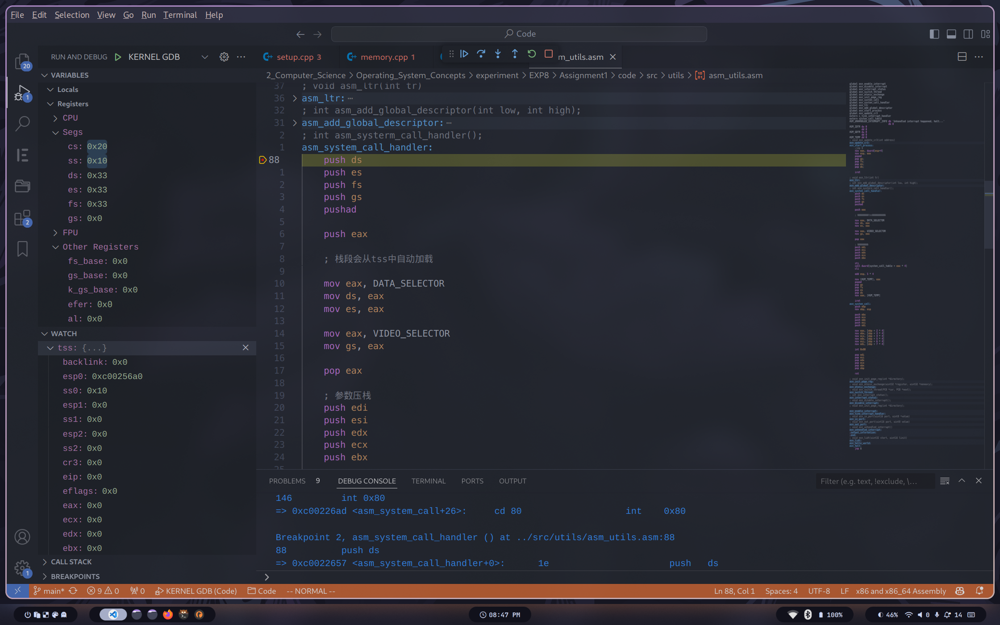
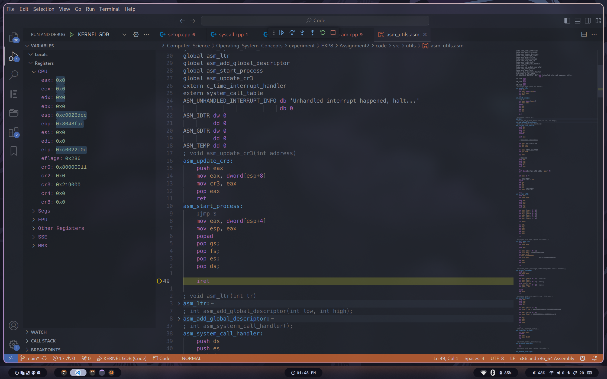
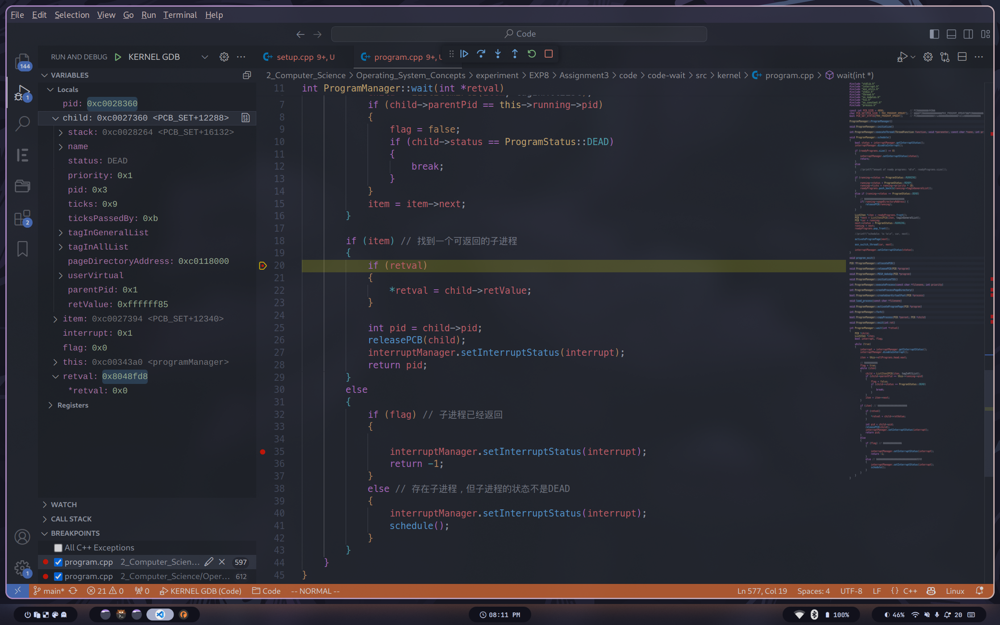
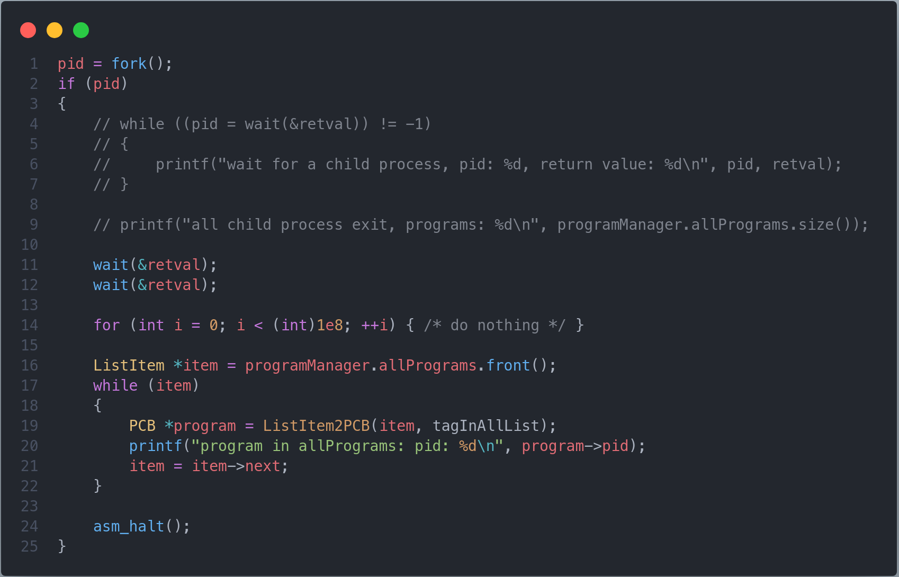

# 操作系统原理实验报告

- **实验名称**：从内核态到用户态
- **授课教师**：张青
- **学生姓名**：林隽哲
- **学生学号**：21312450

[toc]

## 实验要求

## 实验过程

### Assignment 1 系统调用

> 编写一个系统调用，然后在进程中调用之，根据结果回答以下问题。
>
> - 展现系统调用执行结果的正确性，结果截图并并说说你的实现思路。
> - 请根据gdb来分析执行系统调用后的栈的变化情况。
> - 请根据gdb来说明TSS在系统调用执行过程中的作用。

#### 1.1

**展现系统调用执行结果的正确性，结果截图并并说说你的实现思路**

实现思路：简单来说，我们事先初始化一个`system_call_table`用于存放系统调用处理函数的地址。随后我们编写汇编函数`asm_system_call`以及汇编中断处理函数`asm_system_call_handler`。用户态进程通过给`asm_system_call`指定调用号与参数列表（这些参数将会由寄存器传递），然后`asm_system_call`中将会通过使用`int 0x80`指令将用户态3特权级转换为内核态0特权级，然后`call`指令根据调用号调用`system_call_table`中对应的系统调用处理函数。

复现参考文档中的实现，运行结果如下：


在这个基础上，要再实现一个自己的系统调用并不困难，如下：


运行效果如下：


最终结果均符合预期。


#### 1.2

**请根据gdb来分析执行系统调用后的栈的变化情况**

首先初始化TSS：


执行`ProgramManager::executeProcess`函数创建进程：


随后执行`asm_start_process`函数启动进程：


随后进入到函数`first_process`中，通过函数`asm_system_call`执行0号中断的调用：

记下此时段寄存器的值以及tss中对应段寄存器位置的值。


将中断号以及中断参数列表放入对应寄存器后，执行`0x80`中断，跳入到`asm_system_call_handler`中：


注意到在执行`int 0x80`指令后，段寄存器`cs`与`ss`的值均已经变为了`TSS::esp0`与`TSS::ss0`的值，也即此时的用户态的特权级3的栈段选择子已经变成了特权级0下的栈段选择子。



随后函数继续将其余段值写入段寄存器中，并将对应的中断参数压栈后，根据系统调用号调用对应的系统调用处理函数，最终执行效果如下：


#### 1.3

从1.2的分析中可以看出，在本次的实验中，TSS的作用是为CPU提供0特权级栈所在的地址和段选择子。


### Assignment 2 Fork的奥秘 

> 实现fork函数，并回答以下问题。
>
> - 请根据代码逻辑和执行结果来分析fork实现的基本思路。
> - 从子进程第一次被调度执行时开始，逐步跟踪子进程的执行流程一直到子进程从fork返回，根据gdb来分析子进程的跳转地址、数据寄存器和段寄存器的变化。同时，比较上述过程和父进程执行完ProgramManager::fork后的返回过程的异同。
> - 请根据代码逻辑和gdb来解释fork是如何保证子进程的fork返回值是0，而父进程的fork返回值是子进程的pid。

#### 2.1 

**请根据代码逻辑和执行结果来分析fork实现的基本思路**

简单来说，`fork`函数在执行时，首先会通过`InterruptManager::executeProcess`函数创建一个子进程。然后通过`copyProcess`函数将父进程的0级栈、虚拟地址表、物理地址表、页目录表等复制到子进程的内存空间中。最后，父进程和子进程都返回。通过从父进程中复制到的信息中，子进程可以找到与父进程相同的返回地址（也即是fork函数的下一条指令），并继续执行。

#### 2.2

**从子进程第一次被调度执行时开始，逐步跟踪子进程的执行流程一直到子进程从fork返回，根据gdb来分析子进程的跳转地址、数据寄存器和段寄存器的变化。同时，比较上述过程和父进程执行完ProgramManager::fork后的返回过程的异同**

在`ProgramManager::schedule`中断住子进程第一次被调度执行，如下：


随后执行`asm_switch_thread`函数：


子进程的PCB的`function`字段被设置为了`asm_start_process`的地址，因此当`asm_switch_thread`执行`ret`返回后，CPU将会跳转到`asm_start_process`中执行。随后，函数将子进程从父进程中复制得到的`ProgramStartStack`栈顶地址送入`esp`寄存器，并`pop`出基础寄存器以及除`ss`与`cs`之外的段寄存器值：



`iret`指令将会将`ProgramStartStack`中的剩余的`eip`、`cs`、`ss`、`esp`等字段恢复到寄存器中，其中的`eip`的值复制于父进程，其指向`asm_system_call_handler`的返回地址，也即是`asm_system_call`中`int 0x80`指令后的下一条指令，随后子进程从`eip`出开始执行：


由于子进程的`esp`字段的值同样复制于父进程，这将意味着，此时的`esp`寄存器指向了与父进程在执行`asm_system_call`函数中的`int 0x80`指令返回之后，相同栈地址。也就是说，子进程在`asm_system_call`最后执行`ret`返回时，将返回到与父进程相同的位置，也即是最初调用`fork`函数的位置：


这里顺便给出父进程在`int 0x80`返回后的执行流程，便于进行比较：


同时根据上述的流程图也可以看出，在父子进程从`fork`函数返回后，父进程的`eax`寄存器的值为子进程的pid，而子进程的`eax`寄存器的值则为0。而`esp`等基础寄存器以及段寄存器的值则与父进程相同，符合预期。

#### 2.3

**请根据代码逻辑和gdb来解释fork是如何保证子进程的fork返回值是0，而父进程的fork返回值是子进程的pid**

对于子进程的返回值，我们实际上是在复制0级栈，也即是复制`ProcessStartStack`的过程中赋予的：

```cpp
bool ProgramManager::copyProcess(PCB *parent, PCB *child) 
{
    ...

    // 复制进程0级栈
    ProcessStartStack *childpss =
        (ProcessStartStack *)((int)child + PAGE_SIZE - sizeof(ProcessStartStack));
    ProcessStartStack *parentpss =
        (ProcessStartStack *)((int)parent + PAGE_SIZE - sizeof(ProcessStartStack));
    memcpy(parentpss, childpss, sizeof(ProcessStartStack));
    // 设置子进程的返回值为0
    childpps->eax = 0;

    ...
}
```

此后`eax`的值将会被一直传递，直至作为`fork`函数的返回值返回。

而父进程的返回值则是直接在`fork`函数中返回的，作为由于子进程是由父进程创建的一个新进程，这部分的代码与子进程并无关系。如下：

```cpp
int ProgramManager::fork()
{
    ...
    return pid;
}
```


### Assignment 3 哼哈二将 wait & exit

> 实现wait函数和exit函数，并回答以下问题。
>
> - 请结合代码逻辑和具体的实例来分析exit的执行过程。
> - 请分析进程退出后能够隐式地调用exit和此时的exit返回值是0的原因。
> - 请结合代码逻辑和具体的实例来分析wait的执行过程。
> - 如果一个父进程先于子进程退出，那么子进程在退出之前会被称为孤儿进程。子进程在退出后，从状态被标记为DEAD开始到被回收，子进程会被称为僵尸进程。请对代码做出修改，实现回收僵尸进程的有效方法。

#### 3.1

**请结合代码逻辑和具体的实例来分析exit的执行过程**

进程调用`exit`函数，程序依次通过调用进入`programManager.exit`：


关中断。随后，标记PCB状态为`DEAD`，并放入返回值。如果PCB标识是进程，则释放进程所占用的物理页、页表、页目录表和虚拟地址池bitmap的空间：


开中断，并立即执行线程/进程调度：


最后由`schedule`函数清除PCB，并调度下一个线程/进程：


#### 3.2

**请分析进程退出后能够隐式地调用exit和此时的exit返回值是0的原因**

由于我们将`exit`函数地址放入了进程PCB中的`program_exit`字段，因此当进程函数执行完毕后，将会跳转到`program_exit`地址，并执行`exit`函数。如下：


而此时的`exit`函数的参数值`ret`在跳转时并没有相应的寄存器被设置，因而为0。

    
#### 3.3

**请结合代码逻辑和具体的实例来分析wait的执行过程**

掠过调用过程，直接进入`ProgramManager::wait`函数：

函数试图在`allPrograms`中找到一个状态为`DEAD`的子进程。若存在子进程但子进程的状态不是DEAD，我们将执行调度，并重新进行搜索，直到找到一个状态为`DEAD`的子进程。若没有找到子进程，则返回-1。

当找到了一个可回收的子进程，如下图所示。当retval不为nullptr时，取出子进程的返回值放入到retval指向的变量中。然后取出子进程的pid，调用releasePCB来回收子进程的PCB，最后返回子进程的pid。
    



然而此时的`wait`函数的返回值不为-1，这说明仍有子进程未退出，重新来到`wait`函数中。

我们直接跳到所有的子进程均退出。可以看到，此时`wait`函数找不到子进程，返回-1，如下：
    


最终程序的运行结果如下：


#### 3.4

**如果一个父进程先于子进程退出，那么子进程在退出之前会被称为孤儿进程。子进程在退出后，从状态被标记为DEAD开始到被回收，子进程会被称为僵尸进程。请对代码做出修改，实现回收僵尸进程的有效方法。**

我首先创建一个测试场景，如下：



此时由于`wait`调用了两次，子进程均被回收，因此可以看到最终在`allPrograms`中没有任何子进程。


若将两个`wait`调用删去，则子进程不会被回收，如下：


从上面两个测试例我们很容易想到，若在父进程卡死，子进程已经退出并标记为`DEAD`的情况下，若只把子进程的回收交付给父进程，则僵尸进程将会一直存在。因而这里最简单的解决方法，就是将子进程的回收从父进程抽离，交给调度函数进行处理，如下：

修改`ProgramManager::wait`如下：


修改`ProgramManager::schedule`如下：


再次运行测试场景，可以看见僵尸进程已经被回收，如下：


## 实验总结

本次实验我学习到了操作系统的一些基本概念，包括进程、线程、中断、系统调用、fork、wait、exit等。其中，fork函数的实现尤为精妙，同时也比较难以理解。通过本次实验，我对操作系统的一些基本实现有了更为深入的理解。

另外需要提一下的是，在本次实验中，我为了方便调试，将gdb与vscode相结合，这将意味这参考代码中提供的makefile文件需要更改。我对其作出修改如下：

```makefile
...
DEBUG_PATH = $(HOME)/Code/Debug
...
vscode-debug:
	cp kernel.o $(DEBUG_PATH)
	qemu-system-i386 -S -s -parallel stdio -hda $(RUNDIR)/hd.img -serial null&
...
```

同时，给出vscode的launch.json文件的相应配置：


