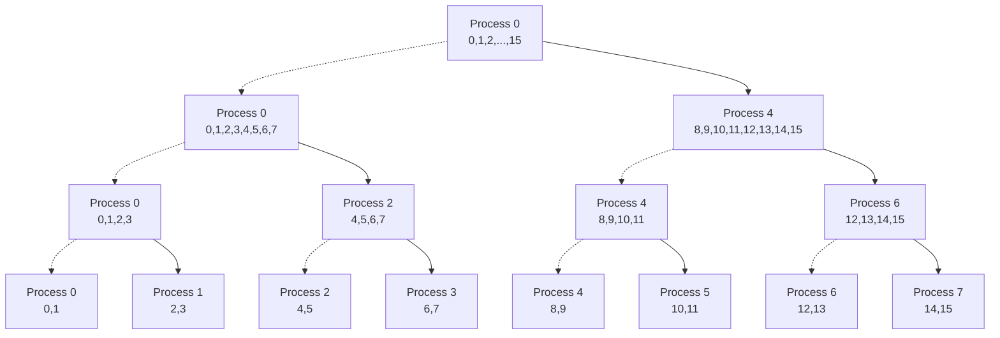
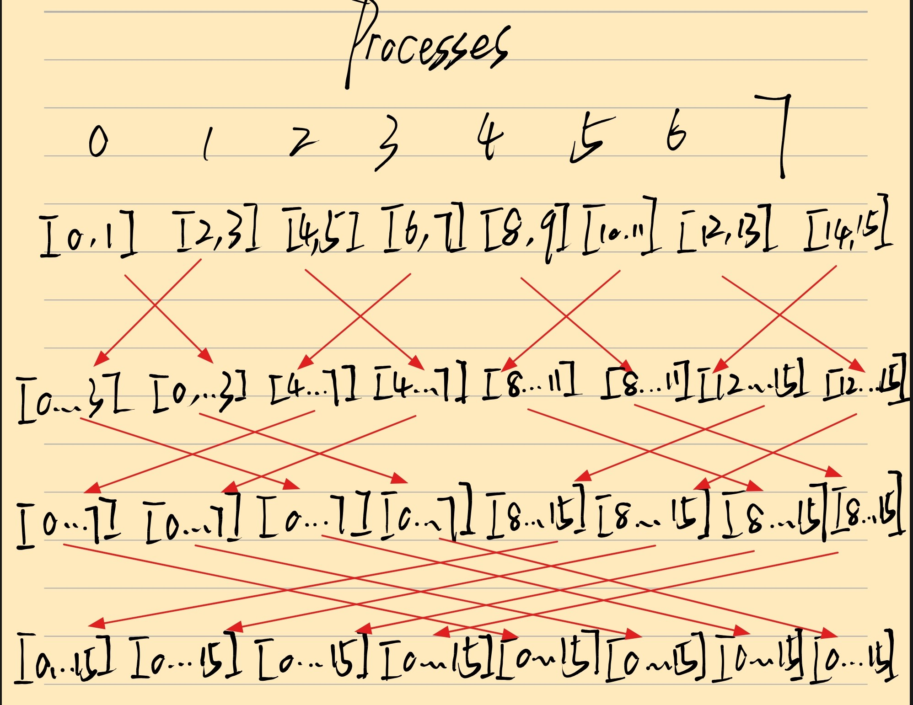

# Problem 1.1

- 错误的。
- 解释：MPI标准并不保证来自不同源的消息按照发送顺序到达。实际上是否按照顺序到达取决于用户具体的实现。

# Problem 1.2

- 问题：多个进程同时调用`printf`导致输出混乱或缓冲区溢出。
- 解决方案：仅允许 Rank 0 进程输出，或者使用`MPI_Barrier`同步输出。

# Problem 1.3

- 通信子用于定义进程组和通信上下文。当通信子中仅含有一个进程时（这里假设root参数为有效进程号，即该唯一进程）：
  - `MPI_Bcast`：将输入缓冲区直接复制到输出缓冲区（自己发给自己）。
  - `MPI_Scatter`：
    - 对于`MPI_Scatter`来说：
      - 输入缓冲区（sendbuf）：在根进程上包含要分发给所有进程的完整数据。被分成多个数据块，每个数据块大小通常相等。
      - 输出缓冲区（recvbuf）：在每个进程上用于接收从根进程分发来的属于该进程的数据块。
    - 当通信子仅含有一个进程时，只处理一个数据块，将输入缓冲区的第一个元素复制到输出缓冲区。
  - `MPI_Gather`：
    - 对于`MPI_Gather`来说：
      - 输入缓冲区（sendbuf）：在每个进程上包含该进程要贡献的局部数据。
      - 输出缓冲区（recvbuf）：仅在根进程上有意义，用于存储从所有进程收集来的数据，按进程编号顺序排序。
    - 当通信子仅含有一个进程时，将输入缓冲区的数据复制到输出缓冲区的第一个位置。

# Problem 2.1

- `sort2`更容易充分并行化。
  - `sort1`（冒泡排序）：
    - 每一轮的比较-交换操作是顺序依赖的，即每次比较-交换都需要等待前一次操作的结果。
    - 无法同时进行多个比较-交换操作。
  - `sort2`（奇偶转置排序）：
    - 所有比较-交换操作是独立的。
    - 这些操作可以同时进行，无需等待其他操作的完成。

- 最小通信次数复杂度为$O(n)$。

# Problem 2.2

- 不安全。这样实现将可能形成环形依赖导致死锁。例如：所有进程同时执行`MPI_Send`并且`MPI_Send`为阻塞式，将导致所有进程都阻塞在`MPI_Recv`。
- 可以使用`MPI_Sendrecv`，将`MPI_Send`和`MPI_Recv`合并为一个原子操作，从而避免死锁。

# Problem 2.3

- 应该使用墙上时间（wall clock time）：CPU时间只反映程序在CPU上运行的时间，不包含通信开销。当n和p足够大时，通信开销将不可忽略，因此应该使用墙上时间进行测量。
- 应该多次测量取平均值。相较于串行程序，并行程序运行过程中存在更多不确定因素，多次测量取平均值可以更加准确地反映程序的运行时间。

# Problem 3.1: Tree-based Scatter Operation

# Problem 3.2: Butterfly-based Gather Operation

