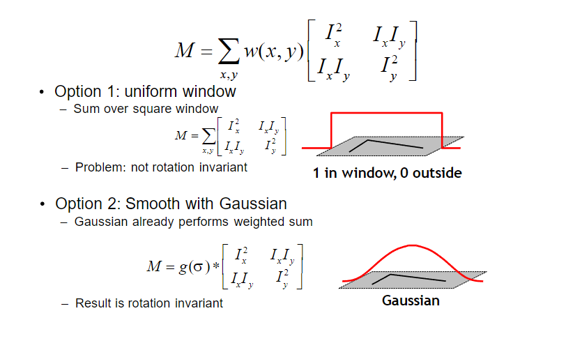
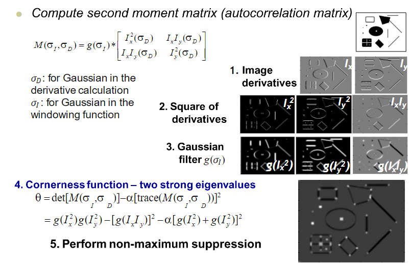
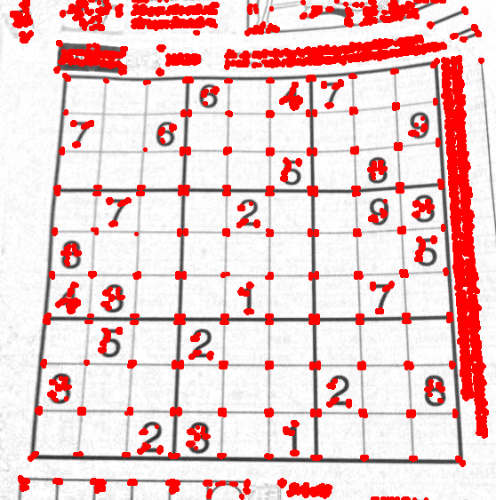
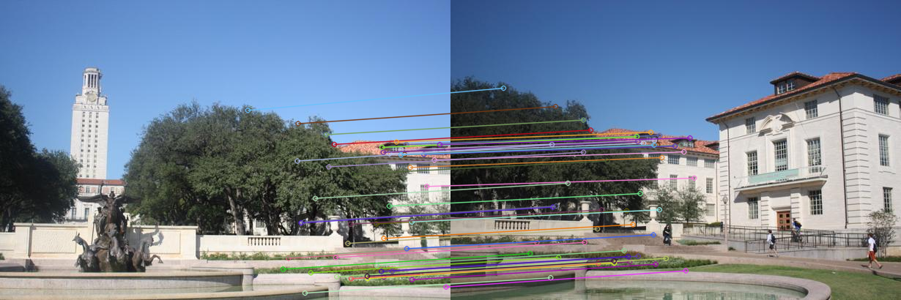
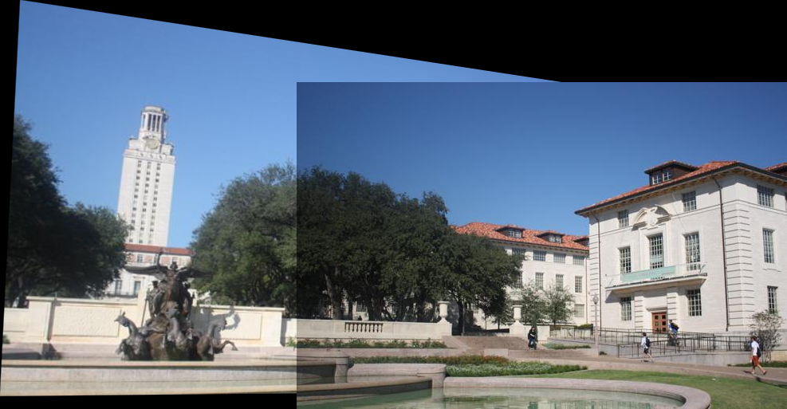
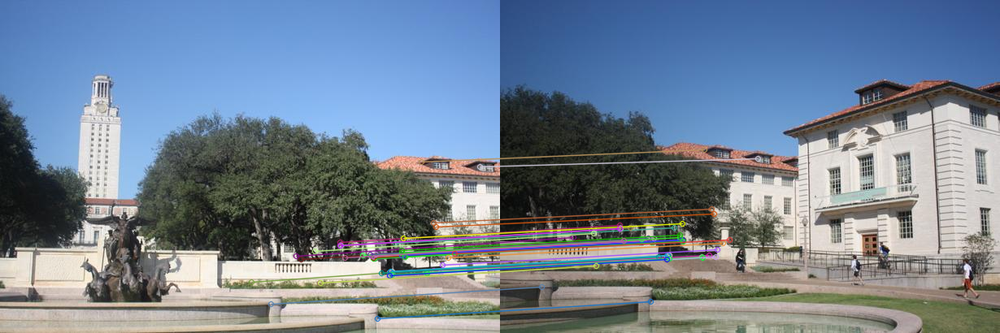
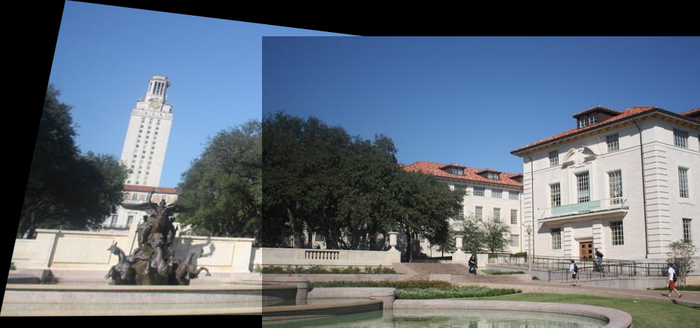
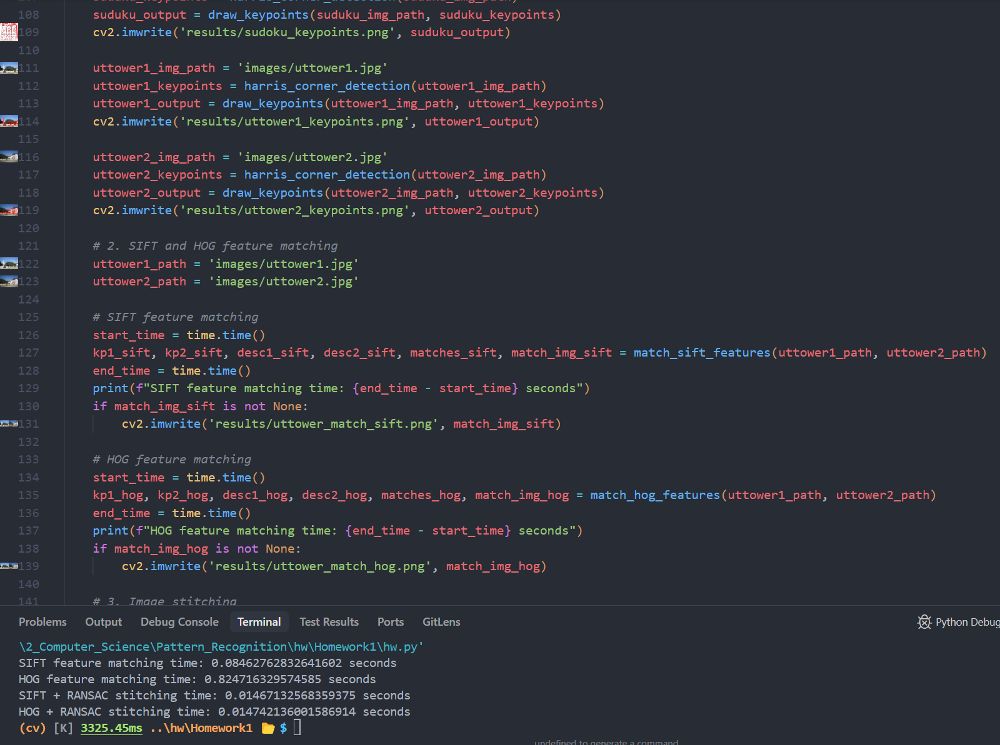
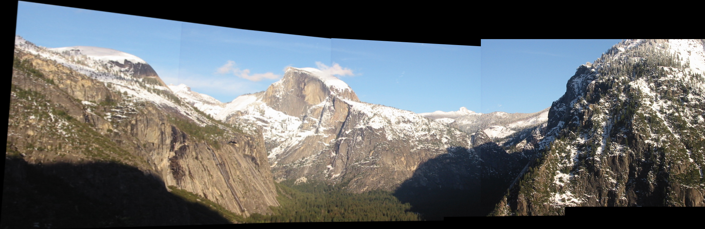

# 全景图拼接

## 实验目的

1. 熟悉 Harris 角点检测器的原理和基本使用
2. 熟悉 RANSAC 抽样一致方法的使用场景
3. 熟悉 HOG 描述子的基本原理

## 实验要求

1. 提交实验报告，要求有适当步骤说明和结果分析、对比
2. 将代码和结果打包提交
3. 实验可以使用现有的特征描述子实现

## 实验内容

1. 使用 Harris 角点检测器寻找关键点。
2. 构建描述算子来描述图中的每个关键点，比较两幅图像的两组描述子，并进行匹配。
3. 根据一组匹配关键点，使用 RANSAC 进行仿射变化矩阵的计算。
4. 将第二幅图变换过来并覆盖在第一幅图上，拼接形成一个全景图像。
5. 实现不同的描述子，并得到不同的拼接效果。

## 实验过程

### Harris 角点算法

Harris 角点算法的原理如下：





下面是 Harris 角点检测的代码实现：

- Harris 算法只需要处理亮度信息，因此我们读取图像后将其转换为灰度图。

```python
img = cv2.imread(img_path)
gray = cv2.cvtColor(img, cv2.COLOR_BGR2GRAY)
```

- 使用3x3的Sobel算子计算x方向以及y方向的梯度。

```python
Ix = cv2.Sobel(gray, cv2.CV_64F, 1, 0, ksize=3)
Iy = cv2.Sobel(gray, cv2.CV_64F, 0, 1, ksize=3)
```

- 分别计算$I_x^2$、$I_y^2$、$I_{xy}$，并使用高斯函数进行平滑处理。

```python
window_size = 3
Ix2 = cv2.GaussianBlur(Ix**2, (window_size, window_size), 0)
Iy2 = cv2.GaussianBlur(Iy**2, (window_size, window_size), 0)
Ixy = cv2.GaussianBlur(Ix * Iy, (window_size, window_size), 0)
```

- 计算Harris响应函数$R = \det(M) - \alpha \cdot \text{trace}(M)^2$。

```python
k = 0.04 # Harris parameter α
det = Ix2 * Iy2 - Ixy**2
trace = Ix2 + Iy2
R = det - k * trace**2
```

- 设置自适应阈值，这里取$R$的最大值的0.01倍，用于过滤弱响应点。然后应用阈值，将小于阈值的点置为0，保留强响应点。

```python
threshold = 0.01 * R.max()
R[R < threshold] = 0
```

- 对响应图进行膨胀操作，将强响应点连接起来。

```python
R = cv2.dilate(R, None)
```

- 最后，获取强响应点的坐标。

```python
keypoints = np.argwhere(R > 0)
```

完整的函数实现如下：

```python
def harris_corner_detection(img_path):
    img = cv2.imread(img_path)
    gray = cv2.cvtColor(img, cv2.COLOR_BGR2GRAY)

    Ix = cv2.Sobel(gray, cv2.CV_64F, 1, 0, ksize=3)
    Iy = cv2.Sobel(gray, cv2.CV_64F, 0, 1, ksize=3)

    window_size = 3
    k = 0.04 # Harris parameter α

    Ix2 = cv2.GaussianBlur(Ix**2, (window_size, window_size), 0)
    Iy2 = cv2.GaussianBlur(Iy**2, (window_size, window_size), 0)
    Ixy = cv2.GaussianBlur(Ix * Iy, (window_size, window_size), 0)

    det = Ix2 * Iy2 - Ixy**2
    trace = Ix2 + Iy2
    R = det - k * trace**2

    threshold = 0.01 * R.max()
    R[R < threshold] = 0
    R = cv2.dilate(R, None)
    keypoints = np.argwhere(R > 0)
    return keypoints
```

处理sudoku.png效果如下：



### 关键点描述与匹配

#### SIFT 描述子

SIFT 描述子的实现如下（具体含义见代码注释）：

```python
def match_sift_features(img1_path, img2_path):
    # 读取图像，并将图像转换为灰度图
    img1 = cv2.imread(img1_path)
    img2 = cv2.imread(img2_path)
    gray1 = cv2.cvtColor(img1, cv2.COLOR_BGR2GRAY)
    gray2 = cv2.cvtColor(img2, cv2.COLOR_BGR2GRAY)
    
    # 使用OpenCV内置的SIFT检测器，检测关键点并计算描述子
    sift = cv2.SIFT_create()
    keypoints1, descriptors1 = sift.detectAndCompute(gray1, None)
    keypoints2, descriptors2 = sift.detectAndCompute(gray2, None)
    
    # 使用暴力匹配器进行特征匹配
    bf = cv2.BFMatcher(cv2.NORM_L2, crossCheck=True)
    matches = bf.match(descriptors1, descriptors2)
    
    # 按照距离排序
    matches = sorted(matches, key=lambda x: x.distance)
    
    # 绘制前50个最佳匹配
    match_img = cv2.drawMatches(img1, keypoints1, img2, keypoints2, matches[:50], None, 
                               flags=cv2.DrawMatchesFlags_NOT_DRAW_SINGLE_POINTS)
    
    return keypoints1, keypoints2, descriptors1, descriptors2, matches, match_img
```

#### HOG 描述子

HOG 描述子的实现如下（具体含义见代码注释）：

```python
def match_hog_features(img1_path, img2_path):
    # 读取图像，并将图像转换为灰度图
    img1 = cv2.imread(img1_path)
    img2 = cv2.imread(img2_path)
    gray1 = cv2.cvtColor(img1, cv2.COLOR_BGR2GRAY)
    gray2 = cv2.cvtColor(img2, cv2.COLOR_BGR2GRAY)
    
    # 使用OpenCV内置的SIFT检测器，检测关键点并计算描述子
    # （虽然这里用我实现的Harris检测器也可以，但可惜我的实现比cv2中SIFT的实现运行速度差了一大截，
    # 为了方便后续做运行时间对比，这里使用cv2中的SIFT检测器）
    # detector = cv2.SIFT_create(nfeatures=100)
    detector = cv2.SIFT_create()
    keypoints1 = detector.detect(gray1, None)
    keypoints2 = detector.detect(gray2, None)
    
    hog_params = dict(orientations=8, pixels_per_cell=(4, 4), cells_per_block=(2, 2), visualize=False)

    # 计算HOG描述子
    def compute_hog_descriptors(image, keypoints, params):
        descriptors = []
        valid_kps = []
        for kp in keypoints:
            x, y = int(kp.pt[0]), int(kp.pt[1])
            if 8 <= x < image.shape[1]-8 and 8 <= y < image.shape[0]-8:
                window = image[y-8:y+8, x-8:x+8]
                desc = hog(window, **params)
                descriptors.append(desc)
                valid_kps.append(kp)
        return np.array(descriptors, dtype=np.float32), valid_kps
    
    descriptors1, valid_keypoints1 = compute_hog_descriptors(gray1, keypoints1, hog_params)
    descriptors2, valid_keypoints2 = compute_hog_descriptors(gray2, keypoints2, hog_params)
    
    # 使用暴力匹配器进行特征匹配
    bf = cv2.BFMatcher(cv2.NORM_L2, crossCheck=True)
    matches = bf.match(descriptors1, descriptors2)
    
    # 按照距离排序
    matches = sorted(matches, key=lambda x: x.distance)
    
    # 绘制前50个最佳匹配
    match_img = cv2.drawMatches(img1, valid_keypoints1, img2, valid_keypoints2, 
                               matches[:50], None, 
                               flags=cv2.DrawMatchesFlags_NOT_DRAW_SINGLE_POINTS)
    
    return valid_keypoints1, valid_keypoints2, descriptors1, descriptors2, matches, match_img
```

#### 使用 RANSAC 求解仿射变换矩阵，并实现图像拼接

在实现了 SIFT 和 HOG 描述子后，我们就可以使用 RANSAC 算法求解仿射变换矩阵，并实现图像拼接。

```python
def stitch_images_with_ransac(img1, keypoints1, img2, keypoints2, matches):
    # 获取匹配点坐标
    src_pts = np.float32([keypoints1[m.queryIdx].pt for m in matches]).reshape(-1, 1, 2)
    dst_pts = np.float32([keypoints2[m.trainIdx].pt for m in matches]).reshape(-1, 1, 2)
    
    # 使用RANSAC方法估计单应性矩阵
    M, mask = cv2.findHomography(src_pts, dst_pts, cv2.RANSAC, 5.0)
    
    # 获取图像尺寸
    h1, w1 = img1.shape[:2]
    h2, w2 = img2.shape[:2]
    
    # 计算变换后的图像边界
    pts = np.float32([[0, 0], [0, h1-1], [w1-1, h1-1], [w1-1, 0]]).reshape(-1, 1, 2)
    dst = cv2.perspectiveTransform(pts, M)
    
    # 计算拼接图像的尺寸
    min_x = min(0, dst[0][0][0], dst[1][0][0], dst[2][0][0], dst[3][0][0])
    min_y = min(0, dst[0][0][1], dst[1][0][1], dst[2][0][1], dst[3][0][1])
    max_x = max(w2, dst[0][0][0], dst[1][0][0], dst[2][0][0], dst[3][0][0])
    max_y = max(h2, dst[0][0][1], dst[1][0][1], dst[2][0][1], dst[3][0][1])
    
    # 调整变换矩阵以适应新的图像尺寸
    translation_matrix = np.array([
        [1, 0, -min_x],
        [0, 1, -min_y],
        [0, 0, 1]
    ])
    M_translated = translation_matrix.dot(M)
    
    # 创建拼接图像
    stitched_width = int(max_x - min_x)
    stitched_height = int(max_y - min_y)
    stitched_img = np.zeros((stitched_height, stitched_width, 3), dtype=np.uint8)
    
    # 将第一张图像变换到拼接图像上
    cv2.warpPerspective(img1, M_translated, (stitched_width, stitched_height), stitched_img)
    
    # 将第二张图像添加到拼接图像上
    stitched_img[-int(min_y):h2-int(min_y), -int(min_x):w2-int(min_x)] = img2
    
    return stitched_img
```

最终实现的拼接效果如下：

##### **SIFT匹配效果**





##### **HOG匹配效果**





##### **SIFT与HOG特征匹配效果对比分析**

通过对比SIFT与HOG特征匹配的结果，可以发现：

1. SIFT特征匹配生成了更多的有效匹配点，且分布更加均匀；HOG特征匹配的点数较少，主要集中在图像的高对比度区域。
2. SIFT特征匹配表现出了更好的视角不变性，即使图像有一定的角度变化，仍然能够找到正确的匹配。
3. 使用SIFT特征的拼接结果更加平滑自然，边缘过渡更加连贯。


理论情况下，HOG特征匹配的计算复杂度更低，然而实际运行时，我发现SIFT特征匹配的计算时间更短。这或许与我实现的HOG的匹配不如cv2中集成的SIFT匹配效果好有关，我尝试通过减少特征点数量来提高匹配速度，但这样将会导致HOG的匹配准确率大幅降低。具体运行时间见下：




#### 实现基于 SIFT+RANSAC 的多图像拼接

```python
def stitch_multiple_images(image_paths):
    # 读取第一张图像作为初始结果
    result = cv2.imread(image_paths[0])
    
    # 逐一拼接后续图像
    for i in range(1, len(image_paths)):
        img = cv2.imread(image_paths[i])
        
        # 使用SIFT提取特征
        sift = cv2.SIFT_create()
        
        # 转换为灰度图并计算特征
        gray_result = cv2.cvtColor(result, cv2.COLOR_BGR2GRAY)
        gray_img = cv2.cvtColor(img, cv2.COLOR_BGR2GRAY)
        
        keypoints1, descriptors1 = sift.detectAndCompute(gray_result, None)
        keypoints2, descriptors2 = sift.detectAndCompute(gray_img, None)
        
        # 使用FLANN匹配器进行特征匹配
        FLANN_INDEX_KDTREE = 1
        index_params = dict(algorithm=FLANN_INDEX_KDTREE, trees=5)
        search_params = dict(checks=50)
        flann = cv2.FlannBasedMatcher(index_params, search_params)
        
        matches = flann.knnMatch(descriptors1, descriptors2, k=2)
        
        # 应用比率测试筛选优质匹配
        good_matches = []
        for m, n in matches:
            if m.distance < 0.7 * n.distance:
                good_matches.append(m)
        
        # 如果有足够的匹配点，执行拼接
        if len(good_matches) > 10:
            # 获取匹配点坐标
            src_pts = np.float32([keypoints1[m.queryIdx].pt for m in good_matches]).reshape(-1, 1, 2)
            dst_pts = np.float32([keypoints2[m.trainIdx].pt for m in good_matches]).reshape(-1, 1, 2)
            
            # 使用RANSAC方法估计单应性矩阵
            M, mask = cv2.findHomography(src_pts, dst_pts, cv2.RANSAC, 5.0)
            
            # 获取图像尺寸
            h1, w1 = result.shape[:2]
            h2, w2 = img.shape[:2]
            
            # 计算变换后的图像边界
            pts = np.float32([[0, 0], [0, h1-1], [w1-1, h1-1], [w1-1, 0]]).reshape(-1, 1, 2)
            dst = cv2.perspectiveTransform(pts, M)
            
            # 计算拼接图像的尺寸
            min_x = min(0, dst[0][0][0], dst[1][0][0], dst[2][0][0], dst[3][0][0])
            min_y = min(0, dst[0][0][1], dst[1][0][1], dst[2][0][1], dst[3][0][1])
            max_x = max(w2, dst[0][0][0], dst[1][0][0], dst[2][0][0], dst[3][0][0])
            max_y = max(h2, dst[0][0][1], dst[1][0][1], dst[2][0][1], dst[3][0][1])
            
            # 调整变换矩阵以适应新的图像尺寸
            translation_matrix = np.array([
                [1, 0, -min_x],
                [0, 1, -min_y],
                [0, 0, 1]
            ])
            M_translated = translation_matrix.dot(M)
            
            # 创建拼接图像
            stitched_width = int(max_x - min_x)
            stitched_height = int(max_y - min_y)
            stitched_img = np.zeros((stitched_height, stitched_width, 3), dtype=np.uint8)
            
            # 将当前结果变换到拼接图像上
            cv2.warpPerspective(result, M_translated, (stitched_width, stitched_height), stitched_img)
            
            # 将新图像添加到拼接图像上
            stitched_img[-int(min_y):h2-int(min_y), -int(min_x):w2-int(min_x)] = img
            
            # 更新结果
            result = stitched_img
            
    return result
```

上面实际上就是之前步骤的拼接，这里不再重复，直接贴效果：


