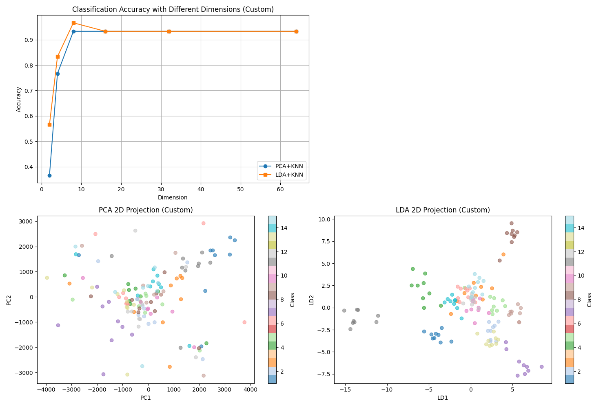

# 基于 PCA/LDA 和 KNN 的人脸识别

## 实验目的

1. 熟悉并掌握 PCA、LDA 的基本原理，并应用 PCA 和 LDA 实现数据降维 
2. 熟悉利用 KNN 分类器对样本进行分类 

## 实验要求

1. 提交实验报告，要求有适当步骤说明和结果分析、对比
2. 将代码和结果打包提交
3. 不能直接调用现有的库函数提供的 PCA、LDA、KNN 接口 

## 实验内容

1. 自己实现 PCA 和 LDA 数据降维算法以及 KNN 分类器 
2. 利用实现的两种降维算法对数据进行降维 
3. 利用降维后的结果，用 KNN 进行训练和测试

## 实验过程

### 实现 PCA 函数接口

PCA 函数的主要流程是：先计算数据的协方差矩阵，然后再对协方差矩阵进行 SVD 分解，得到对应的特征值和特征向量。具体实现代码如下：

```python
class PCA:
    """
    Principal Component Analysis implementation
    """
    def __init__(self, n_components):
        self.n_components = n_components
        self.mean = None
        self.components = None
        self.explained_variance_ = None
    
    def fit(self, X):
        self.mean = np.mean(X, axis=0)
        X_centered = X - self.mean
        
        cov_matrix = (X_centered.T @ X_centered) / (X_centered.shape[0] - 1)
        
        eigenvalues, eigenvectors = np.linalg.eig(cov_matrix)
        eigenvalues = np.real(eigenvalues)
        eigenvectors = np.real(eigenvectors)
        
        idx = np.argsort(eigenvalues)[::-1]
        self.explained_variance_ = eigenvalues[idx]
        self.components = eigenvectors[:, idx[:self.n_components]]
        
        return self
    
    def transform(self, X):
        return (X - self.mean) @ self.components
    
    def fit_transform(self, X):
        self.fit(X)
        return self.transform(X) 
```

### 实现 LDA 函数接口

LDA 函数的主要流程是：将样本数据按照类别及进行分组，计算每个类别样本的均值向量。计算类内散度矩阵与类间散度矩阵，利用两者得到投影矩阵，并用其及逆行数据降维。另外需要提及的是，LDA 原本的计算步骤中存在矩阵的逆运算，这也就意味着需要考虑奇异矩阵的问题。对于奇异矩阵，我们可以采用摄动或者 SVD 分解的方式来处理。其中 sklearn 中采用的 SVD 分解的方式，可以具体参考最后结果中我与sklearn的对比。具体实现代码如下：

1. 简单采用摄动：

```python
def fit(self, X, y):
    classes = np.unique(y)
    n_classes = len(classes)
    n_samples, n_features = X.shape
        
    # Calculate class means and frequencies
    class_means = np.zeros((n_classes, n_features))
    class_freqs = np.zeros(n_classes)
    for i, c in enumerate(classes):
        class_mask = (y == c)
        class_freqs[i] = np.sum(class_mask) / n_samples
        class_means[i] = np.mean(X[class_mask], axis=0)
        
    # Calculate global mean
    self.mean = class_freqs @ class_means
        
    # Calculate within-class scatter matrix (Sw)
    within_class_scatter = np.zeros((n_features, n_features))
    for i, c in enumerate(classes):
        # Get samples of current class and center them
        class_samples = X[y == c]
        centered_samples = class_samples - class_means[i]
            
        # Add contribution to within-class scatter
        within_class_scatter += centered_samples.T @ centered_samples
        
    # Calculate between-class scatter matrix (Sb)
    between_class_scatter = np.zeros((n_features, n_features))
    for i, c in enumerate(classes):
        # Get class frequency and mean difference
        n_class_samples = np.sum(y == c)
        mean_diff = (class_means[i] - self.mean).reshape(-1, 1)
            
        # Add weighted contribution to between-class scatter
        between_class_scatter += n_class_samples * mean_diff @ mean_diff.T
        
    # Apply small regularization to avoid singularity if needed
    alpha = 0.001
    within_class_scatter_reg = within_class_scatter + alpha * np.eye(n_features)
        
    # Solve generalized eigenvalue problem: Sb·w = λ·Sw·w
    # Using eigh for symmetric matrices
    eigenvalues, eigenvectors = np.linalg.eigh(
        np.linalg.inv(within_class_scatter_reg) @ between_class_scatter
    )
        
    # Sort eigenvectors by decreasing eigenvalues
    idx = np.argsort(eigenvalues)[::-1]
    eigenvalues = eigenvalues[idx]
    eigenvectors = eigenvectors[:, idx]
        
    # Select top n_components eigenvectors
    max_components = min(n_classes - 1, n_features)
    actual_components = min(self.n_components, max_components)
    self.W = eigenvectors[:, :actual_components]
        
    return self
```

2. 采用 SVD 分解：

```python
def fit_svd(self, X, y):
    """
    Fit LDA using SVD-based approach for better numerical stability,
    especially when dealing with high-dimensional data.
    """
    classes = np.unique(y)
    n_classes = len(classes)
    n_samples, n_features = X.shape
        
    # Calculate class means and frequencies
    class_means = np.zeros((n_classes, n_features))
    class_freqs = np.zeros(n_classes)
    for i, c in enumerate(classes):
        class_mask = (y == c)
        class_freqs[i] = np.sum(class_mask) / n_samples
        class_means[i] = np.mean(X[class_mask], axis=0)
        
    # Calculate global mean
    self.mean = class_freqs @ class_means
        
    def calc_within():
        """Calculate the within-class whitening transform"""
        # Center data by class means
        centered = np.vstack([X[y == c] - class_means[i] for i, c in enumerate(classes)])
            
        # Calculate standard deviation for scaling
        std = np.std(centered, axis=0)
        std[std == 0] = 1.0  # Avoid division by zero
            
        # Scale centered data
        scale = np.sqrt(1.0 / (n_samples - n_classes))
        scaled = scale * (centered / std)
            
        # SVD decomposition
        _, S, Vt = np.linalg.svd(scaled, full_matrices=False)
            
        # Filter small singular values
        rank = np.sum(S > self.tol * S[0])
            
        # Calculate whitening transform
        Vt_scaled = Vt[:rank] / std
        transform = Vt_scaled.T / S[:rank].reshape(1, -1)
            
        return transform, std, rank
        
    def calc_between(whitening_transform):
        """Calculate the between-class projection"""
        # Normalization factor
        factor = 1.0 / (n_classes - 1) if n_classes > 1 else 1.0
            
        # Class weights
        weights = np.sqrt((n_samples * class_freqs) * factor)
            
        # Project weighted class mean differences
        projected = (weights * (class_means - self.mean).T).T @ whitening_transform
            
        # SVD of projected means
        _, S, Vt = np.linalg.svd(projected, full_matrices=False)
            
        # Filter small singular values
        rank = np.sum(S > self.tol * S[0])
            
        return Vt.T[:, :rank], rank
        
    # Calculate whitening transform from within-class data
    whitening_transform, _, within_rank = calc_within()
        
    # Calculate projection from between-class means
    between_proj, between_rank = calc_between(whitening_transform)
        
    # Calculate final projection matrix
    self.W = whitening_transform @ between_proj
        
    # Limit number of components
    max_components = min(n_classes - 1, n_features, between_rank)
    actual_components = min(self.n_components, max_components)
    self.W = self.W[:, :actual_components]
        
    return self
```

### 利用数据降维算法对输入数据进行降维

读取 yale face 数据集 Yale_64x64.mat，将数据集划分为训练和测试集，这部分的实现详见代码（utils.py）。

只用训练集数据来学习 PCA 和 LDA 算法中的投影矩阵，并分别将两个方法相应的前8个特征向量变换回原来图像的大小进行显示。 效果如下：


然后对训练和测试数据用 PCA 和 LDA 分别进行数据降维（这部分的实现见train.py）。 

最后对采取 reduced_dim=2，即降维到2维后的训练和测试数据进行可视化，展示降维的效果。效果如下（这里同时给出sklearn实现的效果用于对比）：




### 利用 KNN 算法进行训练和测试

利用降维后的训练数据作为 KNN 算法训练数据，降维后的测试数据作为评估 KNN 分类效果的测试集，分析在测试集上的准确率（压缩后的维度对准确率的影响，至少要给出压缩到8维的准确率）。

这里首先给出 KNN 的实现代码：

```python
class KNN:
    """
    K-Nearest Neighbors classifier implementation
    Classifies based on k closest training samples
    """
    def __init__(self, k=5):
        self.k = k
    
    def fit(self, X_train, y_train):
        self.X_train = X_train
        self.y_train = y_train
        return self
    
    def predict(self, X_test):
        y_pred = []
        for x in X_test:
            # Calculate Euclidean distance between current sample and all training samples
            distances = np.linalg.norm(self.X_train - x, axis=1)
            # Get indices of k nearest neighbors
            k_indices = np.argsort(distances)[:self.k]
            # Get labels of k nearest neighbors
            k_labels = self.y_train[k_indices]
            # Find the most common label
            most_common = Counter(k_labels).most_common(1)
            y_pred.append(most_common[0][0])
        return np.array(y_pred)
    
    def score(self, X_test, y_test):
        y_pred = self.predict(X_test)
        return np.sum(y_pred == y_test) / len(y_test) 
```


我测试的维度如下（代码见train.py）：

```python
n_components_range = [2, 4, 8, 16, 32, 64]
```

最终得出结果如下：


分析：

- PCA实现
  - 维度增加时，分类准确率迅速提升：从2维的约40%到8维时达到90%以上
  - 8维之后准确率趋于平稳，继续增加维度提升不明显
  - 自定义PCA实现与sklearn实现正确率相近，验证了实现的正确性

- LDA实现
  - LDA在低维度时表现已经优于PCA，2维时就达到约55%的准确率
  - 8维时LDA达到最佳性能，约95-96%的准确率，之后继续增加维度提升不明显
  - 自定义的基于SVD的LDA实现与sklearn实现正确率相近
