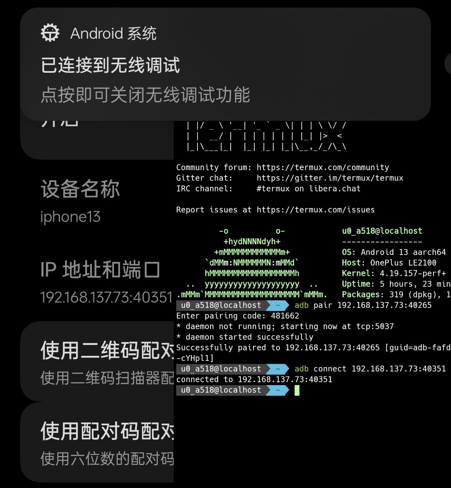

[TOC]

参考：https://www.sqlsec.com/2018/05/termux.html


# Android 与 Linux 的关系

| Android与Linux的区别 -> [https://lushunjian.gitee.io/2020/06/21/android-yu-linux-de-qu-bie/] <br>
| Android和Linux：你俩到底啥关系 -> [https://blog.csdn.net/weixin_51971301/article/details/123299534]


# termux获取存储访问权限

```shell
termux-setup-storage
```


# 文件管理器直接访问Termux的内部目录

| [https://www.bilibili.com/read/cv18985023/]


# termux中的特殊目录

```shell
echo $HOME
/data/data/com.termux/files/home

echo $PREFIX
/data/data/com.termux/files/usr

echo $TMPDIR
/data/data/com.termux/files/usr/tmp

echo $TMPPREFIX
/data/data/com.termux/files/usr/tmp/zsh
```


# termux中进行端口查看

- Android 10 以下的版本

Android 10 以下的版本是可以正常使用`netstat`命令的，这样可以方便的查看端口开放信息：

```shell
# check all ports
netstat -ano

# check port 3306
netstat -ano | grep 3306
```

- Android 10 及以上的版本

Android 10 及以上的 Termux 下无法正常使用`netstat`命令，可以通过使用`nmap`命令来扫描本地端口：

```shell
# install nmap
pkg install nmap -y # or pkg install nmap-ncat -y

# scan the local ports
nmap 127.0.0.1
```


# termux更换国内源

- 自动替换

```shell
sed -i 's@^\(deb.*stable main\)$@#\1\ndeb https://mirrors.tuna.tsinghua.edu.cn/termux/termux-packages-24 stable main@' $PREFIX/etc/apt/sources.list

sed -i 's@^\(deb.*games stable\)$@#\1\ndeb https://mirrors.tuna.tsinghua.edu.cn/termux/game-packages-24 games stable@' $PREFIX/etc/apt/sources.list.d/game.list

sed -i 's@^\(deb.*science stable\)$@#\1\ndeb https://mirrors.tuna.tsinghua.edu.cn/termux/science-packages-24 science stable@' $PREFIX/etc/apt/sources.list.d/science.list

pkg update
```

- 手动替换

修改`$PREFIX/etc/apt/sources.list`文件

```shell
# The termux repository mirror from TUNA:
deb https://mirrors.tuna.tsinghua.edu.cn/termux/termux-packages-24 stable main
```

修改`$PREFIX/etc/apt/sources.list.d/game.list`文件

```shell
# The termux repository mirror from TUNA:
deb https://mirrors.tuna.tsinghua.edu.cn/termux/game-packages-24 games stable
```

修改`$PREFIX/etc/apt/sources.list.d/science.list`文件

```shell
# The termux repository mirror from TUNA:
deb https://mirrors.tuna.tsinghua.edu.cn/termux/science-packages-24 science stable
```

然后执行`pkg update`命令即可。


# termux更换shell

若想要更改termux的默认shell，可以通过以下命令来实现：

```shell
chsh -s zsh
```

当然，也可以通过直接修改`$HOME/.termux`文件的`shell`字段来实现：


# 终端配色方案 oh-my-zsh

脚本项目地址：https://github.com/Cabbagec/termux-ohmyzsh/

```shell
# before you run this script, you should make sure that you have installed curl command
sh -c "$(curl -fsSL https://github.com/Cabbagec/termux-ohmyzsh/raw/master/install.sh)"  
```

**设置色彩样式**

输入`chcolor`命令更换色彩样式，或者执行`~/.termux/colors.sh`命令。

**设置字体**

输入`chfont`命令更换字体样式，或者执行`~/.termux/fonts.sh`命令。

**设置zsh的主题配色**

编辑`~/.zshrc`文件，更改`ZSH_THEME`的值为对应的主题名称即可。

若想要查看所有的主题，可以执行`ls $HOME/.oh-my-zsh/themes`命令。


# zsh 插件

- autosuggestions
  
根据历史命令自动补全命令，安装命令如下：

```shell
# 拷贝到 plugins 目录下
git clone https://github.com/zsh-users/zsh-autosuggestions $ZSH_CUSTOM/plugins/zsh-autosuggestions
```

编辑`~/.zshrc`文件，将`zsh-autosuggestions`插件添加到`plugins`中：

```shell
plugins=(other-plugins zsh-autosuggestions)
```


# 修改termux的启动问候语

用户可以通过修改`$PREFIX/etc/motd`文件来修改termux的启动问候语。

```shell
# the similar result can be generated by figlet command
 _____                              
|_   _|__ _ __ _ __ ___  _   ___  __
  | |/ _ \ '__| '_ ` _ \| | | \ \/ /
  | |  __/ |  | | | | | | |_| |>  < 
  |_|\___|_|  |_| |_| |_|\__,_/_/\_\
```


# 创建文件夹软连接

```shell
ln -s $HOME/storage/shared/Download $HOME/download
```


# 定制常用按键

在Termux v0.66的版本之后我们可以通过`~/.termux/termux.properties`文件来定制常用按键，例如：

```shell
extra-keys = [ \
 ['ESC','|','/','HOME','UP','END','PGUP','DEL'], \
 ['TAB','CTRL','ALT','LEFT','DOWN','RIGHT','PGDN','BKSP'] \
]
```

设置后效果如下：


完整的特殊按键表如图：


# 超级管理员身份

- 手机没有root：

利用`proot`可以为手机没有root的用户来模拟一个root的环境，这里主要是经典的Linux文件系统布局上的模拟。

```shell
pkg install proot -y
```

然后执行：

```shell
termux-chroot
```

即可模拟root环境，该环境模仿Termux中常规Linux文件系统，但是不是真正的root。

输入`exit`命令即可退出模拟的root环境。

- 手机已经root：

安装`tsu`，这是`su`的Termux版本，是一个真正的root权限

```shell
pkg install tsu -y
```

然后执行：

```shell
tsu
```

即可切换root用户，输入`exit`命令即可退出root用户。


## 关于`PRoot`

- **chroot**

在谈论`proot`之前，我们不妨先来了解一下与其相近的`chroot`命令.

| `chroot`的manual -> [https://man7.org/linux/man-pages/man2/chroot.2.html] <br>
| `chroot`的使用例 -> [https://wiki.gentoo.org/wiki/Chroot/zh-cn]

`chroot`是`change root`的缩写，它是起源于Unix系统的一个操作。它是一种修改当前进程及其子进程的可见根目录的操作。修改后，进程将不能访问该环境目录树以外的任何文件和命令，这种修改后的环境称为`chroot jail`（`chroot监狱`）。

| [https://wiki.archlinuxcn.org/wiki/Chroot] <br>
| [https://zh.wikipedia.org/zh-cn/Chroot]

简单来说，`chroot`命令相当于为一个进程创建了一个隔离的环境，可以将其看作是一种简易的容器技术。


若对容器技术的工作原理感兴趣，可以参考：

| 容器工作原理简述 -> [https://www.rondochen.com/how-containers-work/]

看一个example：

```shell
$ wget https://mirrors.tuna.tsinghua.edu.cn/ubuntu-cdimage/ubuntu-base/releases/20.04.3/release/ubuntu-base-20.04.3-base-amd64.tar.gz
$ tar zxvf ubuntu-base-20.04.3-base-amd64.tar.gz
$ sudo mount -o bind /proc proc
$ sudo mount -o bind /dev dev
$ sudo mount -o bind /etc/resolv.conf etc/resolv.conf
$ sudo chroot .
# cat /etc/lsb-release
DISTRIB_ID=Ubuntu
DISTRIB_RELEASE=20.04
DISTRIB_CODENAME=focal
DISTRIB_DESCRIPTION="Ubuntu 20.04.3 LTS"
```

此时，就进入了一个`Ubuntu 20.04`的环境，不过这是一个只进行了文件系统隔离的容器，没有做进程、网络、资源等隔离，安全性较差，对于本地使用还是可以的。

为了支持资源隔离，Linux提供了`namespace`技术。它可以令PID，IPC，Network等系统资源不再是全局性的，而是属于某个特定的Namespace。不同的Namespace下的进程只能访问当前Namespace内的资源，无法访问其他Namespace内的资源，从而实现了资源隔离。

| Linux容器——那些你不知道的事 -> [https://www.drunkdream.com/2021/09/22/linux-container/]


应用`chroot`，最显著的优点有实现兼容性与特权分离，从而提高了系统的安全性，便于软件的测试与开发。

Linux分为用户态和内核态，`chroot`是一个运行在内核态的程序，其实现原理简单来说是通过更改进程`task_struct`中的`root`指针，使得进程的根目录指向新的目录，从而实现不同的根目录查询。

若对`chroot`的实现细节感兴趣，可以参考：

| Linux系统的chroot实现原理 -> [https://huadeyu.tech/system/chroot-implement-detail.html] <br>
| linux 命令分析之 chroot 的原理 -> [https://blog.csdn.net/Longyu_wlz/article/details/109253298] <br>
| How to break out of a chroot() jail -> [http://www.unixwiz.net/techtips/mirror/chroot-break.html]


`chroot`运行在内核态，也就当然的，需要root权限。然而有时用户并没有root权限，比方说在没有进行root的Android手机上。这时候就需要`proot`了。


- **proot**

| `proot`的github -> [https://github.com/proot-me/proot] <br>
| termux维护的一个与安卓兼容的PRoot版本 -> [https://github.com/termux/proot]

> chroot, mount --bind, and binfmt_misc without privilege/setup for Linux

`proot`是一款用户空间的`chroot`、`mount --bind`、`binfmt_misc`实现。换句话说，`proot`是一款不需要root权限的程序。它可以在非root环境下代替`chroot`，因此在Android等不方便获取root权限的环境下应用比较广泛。

| PRoot -> [https://wiki.archlinuxcn.org/zh-hans/PRoot]

和`chroot`机制不同，`proot`的根还是在`\`。`proot`主要是使用`ptrace`的父子进程跟踪机制，劫持系统调用参数和返回值来伪造文件系统布局和用户/组ID，从而实现沙盒机制。`ptrace`允许程序在没有拿到系统权限（root）时，父进程观察并修改子进程的系统调用，但同时这种方式也会产生一定的性能损耗。

| PRoot沙箱机制浅析 -> [https://juejin.cn/post/7197337416096038967]

用法介绍：

```shell
unset LD_PRELOAD
proot -r ./rootfs -0 -w / -b /dev -b /proc -b /sys /bin/sh
```

其中：

- `-r` ./rootfs - 指定Linux发行版的根目录
- `-0` - 通知PRoot模拟一个在Linux发行版中始终可用的root用户，允许使用Linux发行版中的包管理器
- `-b` /dev -b /proc -b /sys - 使位于 /dev, /proc, /sys 的文件系统在rootfs中可见
- `-w` / - 设置工作目录为根目录
- /bin/sh - 在rootfs中启动的应用，通常是shell

| Termux 与 PRoot -> [http://www.topv1.com/termuxdoc/proot/]


看一段来自kali nethunter启动脚本的代码：

```shell
cmdline="proot \                                                
            --link2symlink \
            -0 \
            -r kali-arm64 \
            -b /dev \                                               
            -b /proc \                                              
            -b kali-arm64$home:/dev/shm \
            -b storage/downloads:/storage_downloads \
            -w $home \
               /usr/bin/env -i \
               HOME=$home \                                        
               PATH=/usr/local/sbin:/usr/local/bin:/bin:/usr/bin:/sbin:/usr/sbin \
               TERM=$TERM \                                        
               LANG=zh_CN.UTF-8 \
               LANGUAGE=zh_CN:en \
               LC_ALL=zh_CN.UTF-8 \
               $start"
```

这段代码的作用是启动一个`proot`环境，其中：

- `-r` kali-arm64 - 指定了Linux发行版的根目录为`kali-arm64`
- `-0` - 通知PRoot模拟一个在Linux发行版中始终可用的root用户，允许使用Linux发行版中的包管理器
- `-b` - 将一系列的目录绑定到`proot`环境中
- `-w` $home - 设置工作目录为`$home`
- /usr/bin/env -i ... - 设置了系统的环境变量


- **为什么要使用`proot`？**

在谈这个问题之前，我们不妨先来讨论下Termux与Linux之间的一些区别。

**Termux 不符合 FHS 标准**

`FHS`(`Filesystem Hierarchy Standard`)，即文件系统层次结构标准，定义了Linux系统中的主要目录及目录内容。这个标准是为了使得不同的Linux发行版能够在文件系统层次结构上保持一致，从而使得软件的移植更加容易。

| 文件系统层次结构标准 -> [https://zh.wikipedia.org/wiki/%E6%96%87%E4%BB%B6%E7%B3%BB%E7%BB%9F%E5%B1%82%E6%AC%A1%E7%BB%93%E6%9E%84%E6%A0%87%E5%87%86]

而Termux中的环境设置虽然类似于现代Linux发行版，但并不完全符合。例如，Termux中的`$PREFIX`目录并不是`/usr`目录，而是`/data/data/com.termux/files/usr`目录。这样的设置使得Termux中的软件无法直接在其他Linux发行版中运行。因此，所有的程序都必须做一定的适配然后重新编译以符合Termux的运行环境，否则有可能出现找不到配置文件或者数据文件导致的各种错误。

在运行脚本时，可能会出现由释伴(即`shebang`，例如 `#!/bin/sh`)导致的问题。为此，Termux提供了一个`termux-fix-shebang`脚本，运行这个脚本可以自动修改脚本的释伴(shebang)部分。新版本的Termux特别提供了一个`termux-exec`包，以允许使用标准的释伴(shebang)。

大部分的包都依赖`$PREFIX/lib`下的一些共享库。Android 7 之前，Termux 链接器通过`$LD_LIBRARY_PATH`来得到共享库的路径。在Android 7 和以后的版本，Termux 使用ELF文件头参数`DT_RUNPATH`来代替`LD_LIBRARY_PATH`。

**Termux 使用 Bionic libc**

为了得到对Android系统的最佳兼容性，Termux下所有的包都是通过`Android NDK`编译的。其生成的文件依赖于`Bionic libc`（`/system/lib`或`/system/lib64`下的libc.so、libm.so、libdl.so等）。

因为使用了Android提供的libc，并且不遵循文件系统结构标准，导致不能运行直接从Linux发行版中复制出来的包：

- 动态链接的程序不能运行，因为`/lib`和`/lib64`目录不存在并且`libc ABI`不匹配。
- 需要联网的静态链接的程序不饿能正常解析DNS，因为GNU libc默认不允许静态链接解析器。同时，`/etc/resolv.conf`文件也不存在。
- 在没有root过的Android 8和之后的版本上，由于`seccomp`过滤器的限制，静态链接的程序无法执行。

对部分术语进行解释：

- `Android NDK` - `Android Native Development Kit`，是一个交叉编译器，可以将C/C++代码编译为运行Android的ARM或x86的本地代码。NDK使用Clang来编译C/C++代码。Android NDK的构建系统是基于GNU Make的。Android NDK可以在Microsoft Windows、macOS和Linux上运行。
- 交叉编译器 - `Cross Compiler`，是指一个在某个系统平台下可以产生另一个系统平台的可执行文件的编译器。
- `Bionic libc` - Bionic库是有Google开发的一个C标准函式库（包括`libc`、`libdl`、`libm`与`libpthread`），是Android的基本库之一，是连接Android和Linux的桥梁。Bionic库中包含了很多基本系统功能接口，这些功能大部分来自Linux，但是和标准的Linux之间有很多细微差别。同时Bionic库中增加了一些新的模块，服务于Android的上层代码。相比于`glibc(GNU Libc)`，Bionic库更加轻量级，同时不用遵循`GNU GPL`协议，而是使用`BSD`协议。
- `ABI` - `Application Binary Interface`，即应用程序二进制接口，是一种特定于硬件和操作系统的二进制接口标准，用于在不同的软件模块之间传递参数和调用函数。ABI定义了函数调用的约定、数据类型的大小、布局和对齐方式、系统调用的调用号和参数等。ABI是二进制级别的接口，而API是源代码级别的接口。ABI是API的基础，API是ABI的上层。ABI是一种标准，API是一种规范。
- `seccomp` - `Secure Computing Mode`，是Linux Kernel从2.6.12版本开始支持的一种安全机制。主要用于限制程序使用某些系统调用，从而减少系统的暴露面，使程序进入安全状态。

| Android NDK -> [https://zh.wikipedia.org/wiki/Android_NDK] <br>
| Android NDK -> [https://developer.android.com/ndk?hl=zh-cn] <br>
| 交叉编译器 -> [https://zh.wikipedia.org/wiki/%E4%BA%A4%E5%8F%89%E7%B7%A8%E8%AD%AF%E5%99%A8] <br>
| Bionic wiki -> [https://zh.wikipedia.org/wiki/Bionic_(%E8%BB%9F%E9%AB%94)] <br>
| 深入Android系统：Bionic库 -> [https://juejin.cn/post/6857508056620941320] <br>
| ABI wiki -> [https://zh.wikipedia.org/wiki/%E5%BA%94%E7%94%A8%E4%BA%8C%E8%BF%9B%E5%88%B6%E6%8E%A5%E5%8F%A3] <br>
| SECure COMPuting with filters -> [https://www.kernel.org/doc/Documentation/prctl/seccomp_filter.txt] <br>
| Seccomp机制与seccomp notify介绍 -> [https://just4coding.com/2022/04/03/seccomp/]


而对于以上的所有问题，都可以通过PRoot安装一个Linux发行版的rootfs来绕过。对于Termux没有进行重新编译的软件，可以尝试通过PRoot来运行。

| Termux 与 Linux 的区别 -> [http://www.topv1.com/termuxdoc/differencesfromlinux/]


# Termux中安装Linux发行版

既然上文已经提到了`proot`，那么这里顺便介绍一下如何在Termux中安装Linux发行版。

## Kali Nethunter

- **安装Kali Nethunter**

Kali NetHunter 是基于 Kali Linux 的免费的、开源的 Android 移动设备渗透测试平台。

```shell

# 申请存储访问权限j
termux-setup-storage

# 安装 wget
pkg update && pkg install proot wget -y

# 下载安装脚本
wget -O install-nethunter-termux https://offs.ec/2MceZWr

# 给予脚本执行权限
chmod +x install-nethunter-termux

# 执行脚本
./install-nethunter-termux
```

安装成功后如图：


之后可以通过`nethunter`命令来启动Kali Nethunter。

基本使用命令：


启动后的效果：


- **启动 VNC 服务**

上面命令表中的 KeX 服务，实际上就是 VNC 服务，默认的端口是 `5901`。

```shell
nh kex & # before you run this command, you should make sure that you have installed dbus-x11 in nethunter
```


注销 VNC 服务后，在 Termux 中执行 `nh kex stop` 命令即可退出服务。

VNC 连接还需要设置密码，可以通过 `nh kex passwd` 命令来进行设置。之后便可通过VNC连接工具（如Kali官方的`NetHunter KeX`、或者`VNC Viewer`、`AVNC`等进行连接）


在nethunter中使用`vncserver`命令也可以启动VNC服务：

```shell
sudo apt install dbus-x11
vncserver            # default port is 5901, 
                     # if it is the first time to start vnc server, 
                     # it will ask you to set a password

# vncserver -list    # list all vnc servers
# vncserver -kill :1 # kill vnc server with session number 1
# vncserver :1       # start vnc server with session number 1
```


下面是实际安装过程中可能会出现的一些问题：

| [https://blog.csdn.net/weixin_44839457/article/details/134751516]

- **Kali Nethunter未配置DNS报错**


解决方法：

```shell
vim /etc/resolv.conf
```
然后修改`nameserver`与`search`字段如图所示：


- **Kali Nethunter的VNC连接失败**


解决方法：

```shell
apt install dbus-x11
```

- **Kali自带的FireFox报错**


解决方法：

打开火狐配置`about:config`，搜索`sandbox`更改如下配置后重启：


- **Termux的Kali默认没有Systemctl**

解决方法：

```shell
apt-get install -y systemd
apt-get install -y systemctl
```

- **Termux后台进程被phantom processes killer关闭**


解决方法：

- Android 12L or later

```shell
adb shell "settings put global settings_enable_monitor_phantom_procs false"

# if you want to enable it again
# adb shell "settings put global settings_enable_monitor_phantom_procs true"
```

- Android 12, no GMS
  
```shell
adb shell "/system/bin/device_config put activity_manager max_phantom_processes 2147483647" 

# if you want to enable it again
# adb shell "/system/bin/device_config put activity_manager max_phantom_processes 32"
```

- Android 12, GMS

```shell
./adb shell "/system/bin/device_config set_sync_disabled_for_tests persistent; /system/bin/device_config put activity_manager max_phantom_processes 2147483647"

# if you want to enable it again
# ./adb shell "/system/bin/device_config set_sync_disabled_for_tests persistent; /system/bin/device_config put activity_manager max_phantom_processes 32"
```

| ref:Phantom, Cached And Empty Processes -> [https://github.com/agnostic-apollo/Android-Docs/blob/master/en/docs/apps/processes/phantom-cached-and-empty-processes.md]

| ref:Termux防止杀后台 解决signal 9错误 -> [https://www.bilibili.com/read/cv20060713/]

- **如何让Termux中的Nethunter访问手机内部存储空间**

```shell
vim $PREFIX/bin/nh
```

为`proot`命令添加`-b`参数：

example:

```shell
# bind $HOME/storage/shared/downloads to /storage_downloads
cmdline="proot \                                                
            ...
            -b storage/downloads:/storage_downloads \
            ...
```

绑定后的效果：


- **Kali NetHunter更换系统语言**

```shell
# set system language
dpkg-reconfigrure locales

# set system timezone
locale-gen
```

然后在Termux中执行`vim $PREFIX/bin/nh`命令，添加系统启动的环境变量`LANG`、`LANGUAGE`、`LC_ALL`：

```shell
cmdline="proot \                                                
            ...
               /usr/bin/env -i \
               HOME=$home \                                        
               PATH=/usr/local/sbin:/usr/local/bin:/bin:/usr/bin:/sbin:/usr/sbin \
               TERM=$TERM \                                        
               LANG=zh_CN.UTF-8 \
               LANGUAGE=zh_CN:en \
               LC_ALL=zh_CN.UTF-8 \
               $start"
```

重新启动Kali NetHunter后的效果：


## 其它Linux发行版

可参考：

| Termux如何安装Debian系统(圖形界面＋中文化＋音訊＋一鍵啟動指令稿) -> [https://ivonblog.com/posts/termux-proot-distro-debian/] <br>
| termux-install-linux -> [https://github.com/sqlsec/termux-install-linux]

或者在F-Droid中下载`AnLinux`，使用其中提供的脚本进行安装


# 电脑ssh连接Termux

| 【Android】在电脑连接操控手机上的Termux终端实现步骤 -> [https://blog.csdn.net/zs1028/article/details/135568088] <br>
| termux-auth -> [https://github.com/termux/termux-auth]

**连接sshd**

```shell
# install openssh and termux-auth
# openssh - SSH client (remote login program)
# termux-auth - allow password authentication in openssh and dropbear, in termux
pkg install openssh termux-auth net-tools -y

# check the IP address of the phone
ifconfig -a

# check username
whoami
# check password (if your username if u0_a75)
passwd u0_a75

# start sshd
sshd -p 8022 # start sshd on port 8022
# check the status of sshd
ps -ef | grep sshd

# open Windows PowerShell, and then try to connect to your phone
# please make sure that your computer is able to access your phone
ssh -p 8022 u0_a75@192.168.XXX.XXX

# if you want to stop sshd
pkill sshd
```


连接成功后的效果：


**配置公钥**

如果Windows中没有文件`~/.ssh/id_rsa.pub`，那么可以通过以下命令来生成：

```shell
ssh -keygen
```

然后将`~/.ssh/id_rsa.pub`文件中的内容拷贝到手机的`~/.ssh/authorized_keys`文件中即可

```shell
# transfer the id_rsa.pub file to the phone
scp -P 8022 ~/.ssh/id_rsa.pub u0_a75@192.168.XXX.XXX:~/.ssh/

# copy the content of id_rsa.pub to authorized_keys
cat ~/.ssh/id_rsa.pub >> ~/.ssh/authorized_keys
```

接下来就可以顺利连接啦

如果要直接连接终端，可以修改`/etc/ssh/sshd_config`文件，将`PasswordAuthentication`字段的值改为`no`，然后重启sshd服务


# 用Termux进行本地adb

| 手机adb本机，Termux安装adb工具 -> [https://www.bilibili.com/read/cv15157405/]

```shell
# install adb
pkg install android-tools -y
```

```shell
# pair the wireless debugging
pkg pair [ip]:[port]
```


```shell
# connect the wireless debugging
pkg connect [ip]:[port]
```


```shell
# check the status of adb
adb devices
```


# Termux-x11

| termux-x11 github -> [https://github.com/termux/termux-x11]

**初步使用**

```shell
# Aplication runs only on Android 8+ devices. For this one you must enable 
# the `x11-repo` repository can be done by excuting pkg install x11-repo conmmand
pkg install x11-repo -y

# For X applicaitons to work, you must intall Termux-x11 companion package.
# You can do taht by downloading an artiffact from the GitHub release page
# and installing `termux-x11-*-debug.apk` (according to device `architecture`,
# universal if you are doubting) and *.deb (if you use termux with `pkg`) or
# `packages` artifact (do not try to install `shell-loader-nightly.apk` as
# Android applicaiton, it is not intended to be install nightly companion package
# from repositories with `pkg in x11-repo && pkg in termux-x11-nightly)
pkg install termux-x11 -y
# if you download *deb package
# please run `dpkg -i termux-x11_1.0_all.deb` to install it

# then install a desktop environment
pkg install xfce -y

export XDG_RUNTIME_DIR=${TMPDIR}
# You can start your desired graphical application by doing:
termux-x11 :1 &
env DISPLAY=:1 dbus-launch --exit-with-session xfce4-session
# or `termux-x11 :1 -xstartup "dbus-launch --exit-with-session xfce4-session"`
# if `dbus-lauch` does not work for some users so you can start session with
# `termux-x11 :1 -xstartup "xfce4-session"`
# You may replace `xfce4-session` if you use other than Xfce
```


最后打开termux-x11的应用，即可看到桌面环境：


**快捷启动**

```shell
echo "export XDG_RUNTIME_DIR=${TMPDIR}\ntermux-x11 :1 &\nenv DISPLAY=:1 dbus-launch --exit-with-session xfce4-session" > $PREFIX/bin/x11
chmod +x $PREFIX/bin/x11

# then you can start the X server by running 
x11
```

或者你可以通过制作脚本，通过Termux Widget插件来启动X11：
```shell
echo '#!/data/data/com.termux/files/usr/bin/sh\nexport XDG_RUNTIME_DIR=${TMPDIR}\ntermux-x11 :1 &\nenv DISPLAY=:1 dbus-launch --exit-with-session xfce4-session' > $HOME/.shortcuts/x11.sh
```


**一些术语解释**

- `D-Bus` : `Desktop-Bus` is a message bus system, a simple way for applications to talk to one another. In addition to interprocess communication, D-Bus helps coordinate process lifecycle; it makes it simple and reliable to code a "single instance" application or daemon, and to launch applications and daemons on demand when their services are needed. 简单来说，D-Bus是一个IPC（Inter-Process Commnunication）通信机制，用于Linux系统中进程间的数据传输和通信。D-Bus在Linux系统中尤其是桌面环境（如GNOME、KDE）中使用广泛。
- `X11` : 也称`X Window System`，是一种以位图（BitMap）方式显示的软件窗口系统。最初是1984年麻省理工学院的研究，之后变成UNIX、类UNIX、以及OpenVMS等操作系统所一致适用的标准化软件工具包及显示架构的运作协议。X窗口系统通过软件工具及架构协议来建立操作系统所用的图形用户界面，此后则逐渐扩展适用到各形各色的其他操作系统上。现在几乎所有的操作系统都能支持与使用X。更重要的是，今日知名的桌面环境——GNOME和KDE也都是以X窗口系统为基础建构成的。

| D-Bus -> [https://www.freedesktop.org/wiki/Software/dbus/] <br>
| D-Bus详解 -> [https://zhuanlan.zhihu.com/p/533845321] <br>
| X Window System -> [https://zh.wikipedia.org/wiki/X_Window_System]


# Termux插件

## Termux:API

| Termux:API -> [https://wiki.termux.com/wiki/Termux:API] <br>
| Termux-apiCommand -> [https://github.com/Mayat2715/Termux-apiCommand] <br>
| Termux-API 使用教程 -> [https://www.sqlsec.com/2018/05/termuxapi.html]

Download the Termux:API add-on from F-Droid or the Google Play Store. It is required for the API implementations to function.

**IMPORTANT:Do not mix installations of Termux and Addons between Google Play and F-Droid.** They are presented at these portals for your convenience. There are compatibility issues when mixing installations from these Internet portals. This is because each download website uses a specific key for keysigning Termux and Addons.

Installing termux-api package

```shell
pkg install termux-api -y
```

记得给Termux:API设置访问权限以及关闭电池优化。

更多的Termux:API命令可以参考官方Wiki。


## Termux:Boot

| Termux:Boot -> [https://wiki.termux.com/wiki/Termux:Boot]

1. Install the Termux:Boot app.

2. Go to Android settings and turn off battery optimizations for Termux and Termux:Boot applications.

3. Start the Termux:Boot app once by clicking on its launcher icon. This allows the app to be run at boot.

4. Create the ~/.termux/boot/ directory: Put scripts you want to execute inside the ~/.termux/boot/ directory. If there are multiple files, they will be executed in a sorted order.

5. It is helpful to run termux-wake-lock as first thing to prevent the device from sleeping.

Example: to start an sshd server and prevent the device from sleeping at boot, create the following file at ~/.termux/boot/start-sshd:

```shell
#!/data/data/com.termux/files/usr/bin/sh
termux-wake-lock
sshd
```

If you want Termux-services to start servvices on boot, you can use:

```shell
#!/data/data/com.termux/files/usr/bin/sh
termux-wake-lock
. $PREFIX/etc/profile
```


## Termux:Float

| Termux:Float -> [https://wiki.termux.com/wiki/Termux:Float]


## Termux:Styling

| Termux:Styling -> [https://wiki.termux.com/wiki/Termux:Styling]


## Termux:Tasker

| Termux:Tasker -> [https://wiki.termux.com/wiki/Termux:Tasker]


## Termux:Widget

| Termux:Widget -> [https://wiki.termux.com/wiki/Termux:Widget]

After installing the Termux:Widget, you can add a widget to your home screen to run a script with a single tap. 
The script must be located in ~/.shortcuts/.


# Termux中启动Shizuku

| Shizuku -> [https://shizuku.rikka.app/]

1. 安装引导启动Shizuku

2. 进入“在终端应用中使用Shizuku”


3. 导出`rish`脚本文件


4. 打开到处的脚本目录，编辑`rish`脚本文件，修改`RISH_APPLICTION_ID`字段如下：


5. 保存后，执行`rish`脚本文件即可


6. 输入`exit`即可退出


